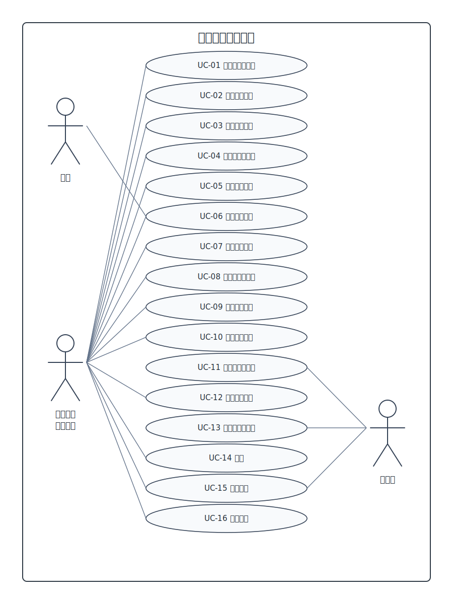

# 用例建模 — 校园互助服务平台

## 一、系统级用例图

> 用例图图片后续可按本轮范围调整重新绘制。当前文字用例以最新 P1 优先级为准。

### 用例列表

| 用例编号 | 用例名称 | 参与者 | 优先级 |
|---------|---------|--------|--------|
| UC-01 | 用户注册、登录与个人资料编辑 | 普通用户 | Must |
| UC-02 | 提交实名认证 | 普通用户 | Must |
| UC-03 | 管理员审核实名认证 | 管理员 | Must |
| UC-04 | 浏览代取需求大厅 | 普通用户、访客 | Must |
| UC-05 | 发布代取服务 | 普通用户 | Must |
| UC-06 | 接单并完成代取服务 | 普通用户 | Must |
| UC-07 | 查看我的代取记录 | 普通用户 | Must |
| UC-08 | 代取服务互评 | 普通用户 | Should |
| UC-09 | 查看站内通知 | 普通用户 | Should |
| UC-10 | 关键词搜索代取服务 | 普通用户、访客 | Could |
| UC-11 | 发布和浏览失物招领 | 普通用户 | Could |
| UC-12 | 发布和浏览二手交易 | 普通用户 | Could |
| UC-13 | 举报、封禁和申诉处理 | 普通用户、管理员 | Could |

---

## 二、核心用例详细描述

### 2.1 用例 UC-05：发布代取服务

| 项目 | 内容 |
|------|------|
| **用例名称** | 发布代取服务 |
| **参与者** | 普通用户（已完成学号实名认证） |
| **前置条件** | 1. 用户已登录系统 2. 用户已完成学号实名认证 |
| **后置条件** | 1. 无报酬服务提交成功后，状态为“待接单” 2. 有报酬服务提交成功后，先生成“待支付”服务和支付宝沙箱预付款入口，待支付时限为 3 分钟 3. 有报酬服务 3 分钟内支付成功后，状态变为“待接单” |

**基本流：**

| 步骤 | 操作 |
|------|------|
| 1 | 用户进入“发布代取服务”页面 |
| 2 | 用户填写取件地点、送达地点、物品描述、取件凭证、报酬类型、接单截止时间和校区 |
| 3 | 若选择有报酬服务，用户填写 1-200 元报酬金额 |
| 4 | 用户确认发布 |
| 5 | 若为有报酬服务，系统生成待支付服务并引导用户在 3 分钟内完成支付宝沙箱预付款 |
| 6 | 支付成功后，系统将服务状态设为待接单 |
| 7 | 若为无报酬服务，系统直接将服务状态设为待接单 |
| 8 | 待接单服务进入代取需求大厅展示 |

**替代流：**

| 步骤 | 分支 | 处理 |
|------|------|------|
| 2a | 用户填写信息不完整 | 系统提示必填项缺失，不提交 |
| 3a | 报酬金额超出范围 | 系统提示金额范围为 1-200 元，不提交 |
| 5a | 有报酬服务支付失败 | 服务保持待支付状态，发布者可继续支付或取消 |
| 5b | 待支付超过 3 分钟仍未完成支付 | 系统将服务状态改为已取消 |
| 4a | 用户取消发布 | 返回上一页，不保存服务 |

---

### 2.2 用例 UC-04：浏览代取需求大厅

| 项目 | 内容 |
|------|------|
| **用例名称** | 浏览代取需求大厅 |
| **参与者** | 普通用户、访客 |
| **前置条件** | 系统中存在待接单代取服务 |
| **后置条件** | 用户可查看符合条件的代取服务列表和详情 |

**基本流：**

| 步骤 | 操作 |
|------|------|
| 1 | 用户进入代取需求大厅 |
| 2 | 系统展示待接单代取服务列表 |
| 3 | 用户按校区筛选 |
| 4 | 用户按报酬类型筛选：全部、有报酬、无报酬 |
| 5 | 系统按发布时间倒序展示筛选结果 |
| 6 | 用户点击某条代取服务查看详情 |
| 7 | 系统展示服务详情，但不展示取件凭证 |

**替代流：**

| 步骤 | 分支 | 处理 |
|------|------|------|
| 2a | 无符合条件的服务 | 系统展示空状态提示 |
| 6a | 服务已被接走或取消 | 系统提示服务状态已变化，返回列表 |

---

### 2.3 用例 UC-06：接单并完成代取服务

| 项目 | 内容 |
|------|------|
| **用例名称** | 接单并完成代取服务 |
| **参与者** | 普通用户（发布方、接单方，均已完成学号实名认证） |
| **前置条件** | 1. 接单方已登录并通过实名认证 2. 存在待接单状态的代取服务 3. 接单方不是该服务发布者 |
| **后置条件** | 1. 接单成功后服务进入进行中状态 2. 接单方上传完成凭证后，发布方可确认完成 3. 发布方确认完成后服务进入已完成状态 4. 有报酬服务通过支付宝沙箱结算给接单方 |

**基本流：**

| 步骤 | 操作 |
|------|------|
| 1 | 接单方在代取需求大厅查看服务详情 |
| 2 | 接单方点击“接单” |
| 3 | 系统校验服务状态为待接单，且接单方不是发布者 |
| 4 | 系统将服务状态更新为进行中，并记录接单方 |
| 5 | 系统向接单方展示取件凭证 |
| 6 | 系统向发布方生成接单通知 |
| 7 | 接单方完成代取后上传完成凭证 |
| 8 | 系统向发布方生成完成凭证上传通知 |
| 9 | 发布方查看完成凭证并确认完成 |
| 10 | 系统将服务状态更新为已完成 |
| 11 | 有报酬服务触发支付宝沙箱结算；无报酬服务不进行资金处理 |
| 12 | 系统开放双方互评入口 |

**替代流：**

| 步骤 | 分支 | 处理 |
|------|------|------|
| 3a | 服务已被接走或取消 | 系统提示状态已变化，禁止接单 |
| 3b | 接单方是发布者 | 系统提示不能接自己的服务 |
| 7a | 未上传完成凭证 | 系统提示必须上传完成凭证 |
| 7b | 完成凭证格式或大小不符合要求 | 系统提示重新上传 |
| 9a | 发布方暂不确认完成 | 服务保持进行中状态 |

---

### 2.4 用例 UC-08：代取服务互评

| 项目 | 内容 |
|------|------|
| **用例名称** | 代取服务互评 |
| **参与者** | 普通用户（已完成代取服务的双方） |
| **前置条件** | 服务状态为已完成 |
| **后置条件** | 评价记录保存；系统根据被评价方在该代取服务中的角色，更新其作为发布方或作为接单方的对应好评率 |

**基本流：**

| 步骤 | 操作 |
|------|------|
| 1 | 用户进入待评价服务列表 |
| 2 | 用户选择已完成代取服务 |
| 3 | 用户选择好评、中评或差评 |
| 4 | 用户填写评价内容；差评必须填写理由 |
| 5 | 用户提交评价 |
| 6 | 系统保存评价，并根据被评价方在该代取服务中的角色更新其作为发布方或作为接单方的对应好评率 |
| 7 | 系统向被评价方生成收到评价通知 |

---

### 2.5 用例 UC-07：查看我的代取记录

| 项目 | 内容 |
|------|------|
| **用例名称** | 查看我的代取记录 |
| **参与者** | 普通用户 |
| **前置条件** | 用户已登录系统 |
| **后置条件** | 用户可查看与自己相关的代取发布和接单记录 |

**基本流：**

| 步骤 | 操作 |
|------|------|
| 1 | 用户进入“我的代取”页面 |
| 2 | 用户切换到“我的发布”查看自己发布的代取服务 |
| 3 | “我的发布”提供总览，并支持按状态查看记录：待支付、待接单、进行中、已完成、已取消 |
| 4 | 用户切换到“我的接单”查看自己承接的代取服务 |
| 5 | “我的接单”提供总览，并支持按状态查看记录：进行中、已完成、已取消 |
| 6 | 用户点击某条记录查看详情 |

---

## 三、用例与需求追踪

| 用例编号 | 用例名称 | 关联需求 |
|---------|---------|---------|
| UC-01 | 用户注册、登录与个人资料编辑 | FR-UM-01, FR-UM-02, FR-UM-03 |
| UC-02 | 提交实名认证 | FR-UM-04, FR-UM-05, FR-UM-07 |
| UC-03 | 管理员审核实名认证 | FR-UM-06, FR-UM-07 |
| UC-04 | 浏览代取需求大厅 | FR-HALL-01~06 |
| UC-05 | 发布代取服务 | FR-PU-01~04, FR-PU-09~11 |
| UC-06 | 接单并完成代取服务 | FR-PU-05~11 |
| UC-07 | 查看我的代取记录 | FR-PU-12 |
| UC-08 | 代取服务互评 | FR-CR-01~04 |
| UC-09 | 查看站内通知 | FR-NT-01, FR-NT-02 |
| UC-10 | 关键词搜索代取服务 | FR-HALL-07, FR-OP-01 |
| UC-11 | 发布和浏览失物招领 | FR-OP-02 |
| UC-12 | 发布和浏览二手交易 | FR-OP-03 |
| UC-13 | 举报、封禁和申诉处理 | FR-OP-04, FR-OP-05 |
