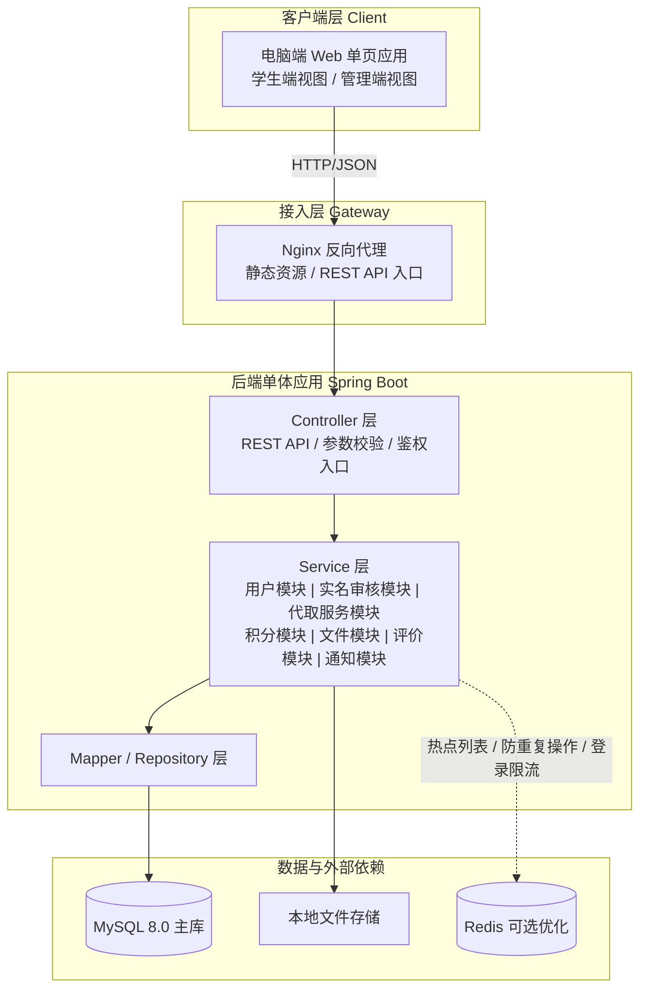
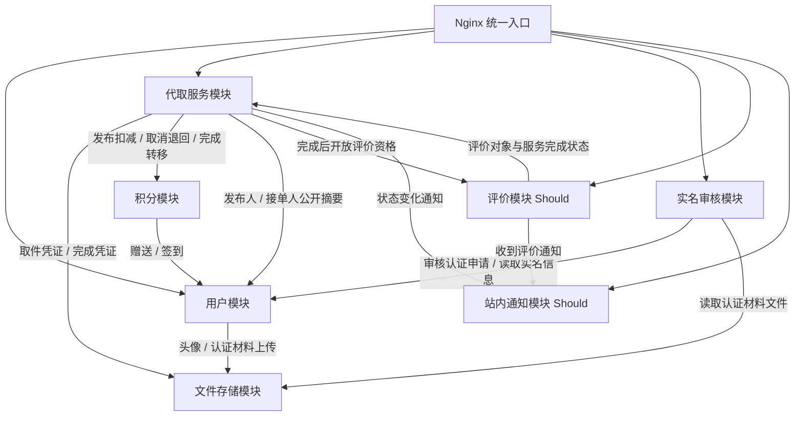
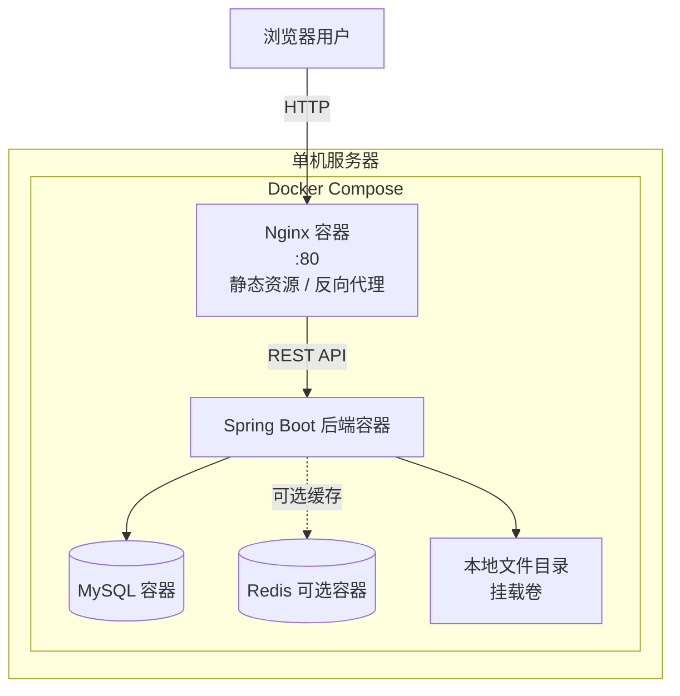

# 体系结构设计文档 — 校园互助服务平台

**版本：** 1.3
**日期：** 2026-07-01
**团队：** true就是队
**状态：** P4 终版回溯修订，按 P1 v2.1、P3 v3.0 和 P4 实际实现同步收敛

---

## 一、架构概览

### 1.1 选定架构风格

**前后端分离 + 后端单体分层架构**

### 1.2 架构风格论证

选择“前后端分离 + 后端单体分层”的理由：

| 维度 | 分析 |
|------|------|
| 团队规模 | 4 人团队，单体架构降低协作、调试和部署成本，避免微服务运维复杂性 |
| 开发周期 | 10 周 MVP，必须优先完成可信代取服务闭环，单体分层能最快落地 |
| 需求边界 | P1 v2.1 已将 Must 范围收缩为用户管理、实名认证审核、代取需求大厅、代取闭环和我的代取记录 |
| 质量属性 | 代取大厅 2 秒内加载、基础安全防护、关键操作日志和桌面端兼容均可由单体分层支撑 |
| 后期演进 | 评价、通知、失物招领、二手交易、私聊等可作为独立逻辑模块逐步扩展，不影响核心代取闭环 |
| 学习成本 | 团队已掌握 Spring Boot 分层架构和 MySQL，Vue 电脑端 Web 开发风险可控 |

---

## 二、架构候选方案对比

### 2.1 候选方案

| 对比维度 | 方案 A：前后端分离 + 单体分层 | 方案 B：微服务架构 |
|---------|---------------------------|-------------------|
| 开发复杂度 | 低。单一后端应用，模块间进程内调用，本地调试简单 | 高。需要服务拆分、服务发现、配置管理和跨服务联调 |
| 可维护性 | 中高。模块边界需要代码规范和评审约束 | 高。职责隔离清晰，但服务治理成本高 |
| 可扩展性 | 中。可先通过索引、分页、缓存和单机扩容满足 MVP | 高。可独立扩缩容，但当前没有强需求 |
| 性能 | 高。模块间无网络调用开销，代取大厅查询链路短 | 中。服务间 HTTP/RPC 调用增加延迟 |
| 团队学习成本 | 低。课堂内容和团队技术储备匹配 | 高。需要学习分布式事务、容器编排和服务治理 |
| 10 周内可行性 | 高。能把时间投入核心业务和测试 | 低。基础设施会明显压缩业务开发时间 |
| MVP 适用性 | 强。匹配“可信代取服务闭环”目标 | 弱。对当前范围属于过度设计 |

### 2.2 结论

**选择方案 A：前后端分离 + 后端单体分层架构。**

原因：
1. P1 v2.1 的 Must 需求集中在同一业务域：实名用户参与代取服务闭环，不存在必须拆分服务的组织或性能驱动力。
2. 积分扣减、取消退回、完成转移等流程需要清晰事务边界，单体内同步调用更易控制一致性。
3. 评价和站内通知是 Should 级能力，可在单体内作为轻量模块实现，不需要事件驱动或消息队列。
4. 失物招领、二手交易、私聊、举报/申诉已降为 Could，不应作为 MVP 架构复杂度来源。
5. 10 周内最关键的是可运行、可演示、可测试，而不是追求服务拆分的理论完整性。

### 2.3 模块协作方式说明

MVP 阶段采用同步内部调用作为主要协作方式。代取服务模块在发布有报酬服务时调用积分模块从发布方账户扣减积分；接单、上传完成凭证、确认完成、取消和超时取消均由代取服务模块维护状态流转。积分模块不负责维护完整代取服务业务对象，也不参与代取服务的业务状态流转。积分流水只保存积分变动类型、变动量、变动后余额和相关代取服务 ID 等追踪字段，这些字段仅用于账目溯源、日志追踪和异常排查，不作为积分模块理解或修改代取业务状态的依据。

不引入 RabbitMQ、Kafka 等消息队列。事件驱动虽然适合扩展通知、统计和异步处理，但会引入事件模型、监听关系、调试链路和一致性处理。对当前 4 人 10 周 MVP，收益不足以抵消复杂度。

---

## 三、“架构辩论赛”实验记录

### 3.1 实验设计

每位成员使用不同 Prompt 策略向 AI（DeepSeek）咨询架构建议，记录 AI 回答质量差异。

> 回溯说明：架构辩论赛发生在 P2 原始需求基线下，当时 Prompt 中仍包含 H5、找搭子、咨询问答、失物招领、二手交易和即时通讯等旧范围。P4 回溯时保留这些原始记录作为 AI 实验材料，但最终架构结论已按 P1 v2.1 收缩为电脑端 Web + 可信代取服务闭环。

### 3.2 成员 A：姚圳锴（需求负责人）— 直接提问

**Prompt 策略：** 不加约束，直接询问推荐架构。

**Prompt：**
> “我要做一个校园互助平台，包含跑腿代取、失物招领、找搭子、二手交易、咨询问答等功能，用户端是 H5 移动网页，推荐什么架构？”

**AI 回答摘要：**
AI 推荐微服务架构，理由是功能模块独立、可单独部署、技术栈灵活，并自动将多个业务板块映射为独立微服务。

**AI 输出质量：** 2/5

**问题分析：**
- 没有团队规模和开发周期约束时，AI 倾向于推荐“更完整”但不现实的方案。
- 将多个业务板块拆成多个微服务，对 4 人团队和 10 周 MVP 不可行。
- 回溯后 P1 已进一步收缩，直接提问得到的架构建议更加不适用。

### 3.3 成员 B：张皓（架构负责人）— 提供详细约束

**Prompt 策略：** 提供团队规模、周期、并发和功能范围后提问。

**AI 回答摘要：**
AI 推荐“前后端分离 + 后端分层架构（Controller-Service-Repository）”，并建议 Spring Boot + MySQL + Redis + WebSocket，指出 10 周内不应考虑微服务。

**AI 输出质量：** 4.5/5

**问题分析：**
- 加入“4 人、10 周、MVP、初期并发 200 人”等约束后，AI 建议明显更务实。
- AI 仍倾向于附带 Redis、WebSocket 等组件，需要人工继续判断哪些是 MVP 必选。

### 3.4 成员 C：谢易轩（开发负责人）— 要求对比方案

**Prompt 策略：** 要求 AI 对比单体分层和微服务。

**AI 回答摘要：**
AI 给出开发成本、部署复杂度、扩展性、团队要求、运维成本等维度对比，结论是小团队 MVP 应优先选择单体分层。

**AI 输出质量：** 4/5

**问题分析：**
- 对比结构清晰，有助于团队快速形成候选方案表。
- 但 AI 的对比仍偏通用，需要人工补充“10 周内可行性”和“当前 P1 优先级”维度。

### 3.5 成员 D：毛嘉和（测试负责人）— 角色扮演

**Prompt 策略：** 让 AI 扮演架构师给出完整方案。

**AI 回答摘要：**
AI 给出“分层架构 + 事件驱动补充”的混合方案，并推荐 Redis、RabbitMQ、WebSocket 等组件。

**AI 输出质量：** 3.5/5

**问题分析：**
- 角色扮演让 AI 更追求“专业完整”，容易引入过度设计。
- RabbitMQ、事件驱动和 WebSocket 对最新 P1 v2.1 的 Must 范围并非必要。

### 3.6 辩论总结

| 成员 | Prompt 策略 | AI 推荐方案 | 是否采纳 | 原因 |
|------|-----------|-----------|---------|------|
| 姚圳锴 | 直接提问 | 微服务 | 否 | 缺少约束，明显过度设计 |
| 张皓 | 提供详细约束 | 单体分层 | 是 | 与团队规模、周期和 MVP 目标匹配 |
| 谢易轩 | 要求对比 | 条件推荐单体 | 是 | 对比维度清晰，结论合理 |
| 毛嘉和 | 角色扮演 | 分层 + 事件驱动 | 部分采纳 | 分层结论可用，事件驱动和中间件不进入 MVP |

最终选择：**前后端分离 + 后端单体分层架构**。

核心认知：AI 输出质量主要取决于约束是否充分。直接询问容易得到理想化方案；提供团队规模、时间、优先级和不做范围后，AI 更容易给出可落地方案。

---

## 四、模块划分

### 4.1 模块依赖图

基于 P1 v2.1，MVP 核心只围绕“可信代取服务闭环”划分模块。评价和站内通知作为 Should 模块保留接口位置；失物招领、二手交易、私聊、举报/申诉等不进入核心模块划分。

### 4.2 模块职责边界

| 模块 | 优先级 | 职责 | 关联需求 |
|------|--------|------|---------|
| 用户模块 | Must | 用户名密码注册登录、密码加密存储、个人资料维护、认证状态维护、公开用户摘要、未认证访问限制 | FR-UM-01~03, FR-UM-07~08 |
| 实名审核模块 | Must | 管理员查看实名认证申请、读取实名信息和认证材料、审核通过或驳回、记录审核结果；不负责普通发布内容审核 | FR-UM-04~07 |
| 代取服务模块 | Must | 代取需求大厅、详情查看、发布代取、待接单/进行中/已完成/已取消状态流转、接单、完成凭证、确认完成、取消、超时取消、我的发布和我的接单记录 | FR-HALL-01~06, FR-PU-01~12 |
| 积分模块 | Must | 平台内虚拟积分管理，包括认证赠送（100积分）、每日签到（+5积分）、有报酬发布扣减、取消退回、完成转移；积分余额存于用户表，积分流水记录金额、变动量、变动后余额和相关代取服务 ID；积分为平台内虚拟资产，不可充值提现；积分流水仅用于账目溯源和异常排查，不维护代取业务状态 | FR-PU-03, FR-PU-08~10, FR-UM-05 |
| 文件存储模块 | Must | 图片格式校验、大小校验、本地保存、文件元数据记录和文件内容读取；文件元数据可记录上传者、文件类别、MIME 类型、文件大小、存储路径、创建时间等基础追踪信息；追踪元数据仅用于审计、排错、文件清理和文件追踪，不用于判断业务访问权限 | FR-UM-02~04, FR-HALL-02, FR-PU-01, FR-PU-06~07 |
| 评价模块 | Should | 代取完成后双方互评、好评/中评/差评、差评理由；分别维护用户作为发布方和作为接单方收到的评价统计，MVP 展示区分“作为发布方好评率”和“作为接单方好评率”，不合并为单一好评率 | FR-CR-01~04 |
| 站内通知模块 | Should | 保存认证结果、接单、完成凭证上传、确认完成、收到评价等通知记录，维护已读/未读状态；提供未读数量查询和通知列表按需查询，支持前端主动刷新与 30 秒低频轮询未读数量 | FR-NT-01~02 |

文件存储模块不负责判断“某个用户是否有权查看某个取件凭证、认证材料或完成凭证”。具体业务用途、业务归属和访问权限仍由用户模块、实名审核模块或代取服务模块维护；业务模块必须先完成鉴权，再调用文件存储模块读取文件内容。前端不得绕过业务模块直接访问受保护文件。

### 4.3 可选与不做范围归档

| 范围 | P1 优先级 | P2 处理方式 |
|------|-----------|-------------|
| 关键词搜索 | Could | 可作为代取服务模块的列表查询扩展，不影响核心大厅筛选 |
| 失物招领 | Could | 不进入 MVP 核心模块；后续可新增轻量发布模块 |
| 二手交易 | Could | 不进入 MVP 核心模块；后续可新增轻量发布模块，不接入平台支付 |
| 举报、封禁、申诉 | Could | 不进入当前管理模块核心职责；后续按治理能力扩展 |
| 私聊与聊天记录 | Could | 不进入当前 MVP 架构设计；后续如优先级变化再单独立项评估 |
| 真实线上支付、论坛、找搭子、学习辅导、智能推荐、微服务、事件驱动/MQ | Won't | 不进入 P2 当前架构设计 |

### 4.4 模块间接口约定

| 调用模块 | 被调用模块 | 调用方式 | 业务场景/触发条件 | 接口输入与返回 |
|----------|------------|---------|------------------|------------------|
| 代取服务模块 / 评价模块 | 用户模块 | 同步内部调用 | 展示发布方、接单方或被评价方的公开摘要；公开评价摘要允许区分作为发布方和作为接单方的好评率 | `getUserSummary(userId) -> UserSummaryDTO { userId, nickname, ratingSummary? }` |
| 用户模块 | 文件存储模块 | 同步内部调用 | 上传头像和实名认证材料；用户模块先完成资料访问权限校验，再读取头像或认证材料文件内容 | `uploadImage(file, uploader, fileCategory) -> FileId`；`loadFile(fileId) -> FileContent` |
| 代取服务模块 | 文件存储模块 | 同步内部调用 | 保存取件凭证和完成凭证；代取服务模块先校验发布方/接单方身份和服务状态，再读取受保护凭证文件内容 | `uploadImage(file, uploader, fileCategory) -> FileId`；`loadFile(fileId) -> FileContent` |
| 用户模块 | 实名审核模块 | 同步内部调用 | 用户模块保存实名信息和认证材料后创建审核记录 | `createVerificationReview(userId) -> reviewId` |
| 实名审核模块 | 用户模块 | 同步内部调用 | 管理员查看实名认证申请中的实名字段，审核通过或驳回实名认证申请 | `queryVerificationUserInfo(userId) -> VerificationUserInfoDTO`；`updateUserAuthStatus(userId, authStatus, reason?) -> authStatus` |
| 实名审核模块 | 文件存储模块 | 同步内部调用 | 管理员通过审核模块查看认证材料，审核模块完成管理员鉴权后按用户模块提供的 fileId 读取文件内容 | `loadFile(fileId) -> FileContent` |
| 代取服务模块 | 积分模块 | 同步内部调用 | 发布有报酬代取服务时从发布方账户扣减报酬积分；积分流水只保存业务追踪字段，不维护代取业务状态 | `spendForPublish(userId, amount, pickupId) -> void` |
| 代取服务模块 | 积分模块 | 同步内部调用 | 取消待接单有偿代取时退回发布方积分；代取状态仍由代取服务模块维护 | `refundForCancel(userId, amount, pickupId) -> void` |
| 代取服务模块 | 积分模块 | 同步内部调用 | 发布方确认完成后，有报酬服务将积分转入接单方账户；积分变动结果不由积分模块直接改写代取状态 | `transferOnComplete(payerId, receiverId, amount, pickupId) -> void` |
| 用户模块 | 积分模块 | 同步内部调用 | 实名认证通过后赠送初始积分（每学号仅一次，当前 MVP 为 100） | `grantInitialPoints(userId) -> void` |
| 用户模块 / 前端 | 积分模块 | 同步内部调用 / REST 查询 | 每日首次签到赠送积分（+5），当日已签到返回业务冲突 | `checkIn(userId) -> CheckInResult`；`GET /users/me/check-in` |
| 评价模块 | 代取服务模块 | 同步内部调用 | 评价提交前校验服务已完成且评价人属于发布方或接单方，并确认被评价方在该服务中的角色 | `queryPickupEvaluationContext(pickupId) -> PickupEvaluationContextDTO { publisherId, acceptorId, pickupStatus }` |
| 评价模块 | 代取服务模块 | 同步内部调用 | 评价创建成功后，由代取服务记录该服务关联的评价 ID；评价模块按发布方/接单方角色更新被评价方对应统计 | `recordPickupEvaluation(pickupId, evaluationId) -> void` |
| 用户模块 / 代取服务模块 / 评价模块 | 站内通知模块 | 同步内部调用 | 认证审核结果、接单、完成凭证上传、确认完成和收到评价时生成通知记录 | `createNotice(userId, type, content) -> noticeId` |
| 前端应用 | 站内通知模块 | REST 查询 | 登录成功后、进入首页、完成关键业务操作后主动查询未读数量；用户保持登录状态时每 30 秒查询一次未读数量 | `queryUnreadNoticeCount() -> unreadCount` |
| 前端应用 | 站内通知模块 | REST 查询 | 通知列表不持续轮询，仅在用户进入通知页或手动刷新时查询 | `queryNoticeList(...) -> NoticeList` |

### 4.5 关键状态规则

| 状态 | 进入条件 | 可执行操作 | 下一状态 |
|------|---------|-----------|---------|
| 待接单 | 无报酬发布成功，或有报酬发布成功且从发布方账户扣减积分成功 | 其他认证用户接单；发布方取消；系统检查接单截止时间 | 接单进入进行中；取消或截止超时进入已取消 |
| 进行中 | 认证用户接单成功 | 接单方上传完成凭证；发布方查看凭证并确认完成 | 确认完成进入已完成 |
| 已完成 | 发布方确认完成 | 有报酬服务触发积分转移（从发布方转入接单方）；开放评价入口 | 终态 |
| 已取消 | 发布方取消或接单截止超时 | 有报酬且处于待接单阶段时退回发布方积分 | 终态 |

### 4.6 超时处理机制

MVP 阶段代取服务超时取消采用定时任务扫描 + 业务访问时惰性校验结合实现。后端定时任务每 1 分钟扫描待接单服务：待接单服务超过接单截止时间仍无人接单时，状态更新为已取消。用户查看列表、查看详情、接单或取消服务时，后端也必须先校验该服务是否已经超时；如果已超时，先更新状态为已取消，再返回最新状态。

| 服务状态 | 超时取消规则 |
|---------|-------------|
| 待接单 | 超过接单截止时间仍无人接单，改为已取消；如为有报酬服务，则由代取服务模块触发积分模块退回发布方积分 |
| 进行中 | 不做自动超时取消，保持进行中，等待发布方确认完成 |
| 已完成、已取消 | 终态，不再扫描处理 |

---

## 五、质量属性与非功能需求闭环

| P1 非功能需求 | 架构支撑措施 | 风险与约束 |
|--------------|--------------|------------|
| NFR-PF-01：代取需求大厅首屏加载不超过 2 秒 | 代取服务模块提供分页列表接口，只返回大厅必要字段；MySQL 为状态、校区、报酬类型、发布时间建立索引；前端首屏只请求待接单列表 | Redis 仅作为热点列表缓存的后续优化，MVP 优先依赖分页、索引和字段裁剪 |
| NFR-PF-02：筛选和倒序列表响应不超过 2 秒 | 校区、报酬类型和发布时间倒序由代取服务模块统一查询；避免跨模块聚合搜索 | 关键词搜索为 Could，不作为性能闭环的必选目标 |
| NFR-SE-01：密码加密存储 | 用户模块集中处理注册登录，密码只保存哈希结果，不保存明文 | 哈希算法和参数在 P3/P4 实现阶段落地 |
| NFR-SE-02：实名信息不公开 | 用户模块只对普通业务模块暴露公开摘要；学号、姓名、认证材料仅实名审核模块和管理员可见 | 管理端必须通过管理员角色校验访问 |
| NFR-SE-03：基础安全防护 | JWT 拦截器校验登录态、角色、认证状态；后端统一参数校验；MyBatis Plus/Mapper 参数绑定降低 SQL 注入风险；文件模块限制格式和大小 | 图形验证码、限流等作为后续增强，不进入 MVP 必选架构 |
| NFR-US-01~03：关键流程易用和错误提示 | 前端使用 Element Plus 表单、弹窗、上传和 Axios 错误拦截；后端返回统一错误码和错误信息 | 具体交互文案由 P3/P4 页面和接口实现细化 |
| NFR-MA-01：编码规范和核心注释 | 后端按 Controller-Service-Mapper 分层，按逻辑模块组织包结构；前端按页面、组件、状态和请求封装分层 | 模块边界需通过代码审查维护 |
| NFR-MA-02：关键操作日志 | 登录、实名认证审核、发布代取、积分变动、接单、上传完成凭证、确认完成、取消、评价和通知等关键操作记录日志 | MVP 可采用数据库审计表或应用日志文件，优先保证可追溯 |
| NFR-CO-01~02：桌面浏览器兼容 | 前端采用电脑端 Web SPA + Element Plus，目标 Chrome、Edge、Safari 近两个主版本，适配 1366x768 及以上分辨率 | 不以移动 H5 或小程序为当前适配目标 |

---

## 六、技术选型

### 6.1 技术栈总览

| 层次 | 选择 | 选择理由 |
|------|------|---------|
| 前端框架 | Vue 3 | 构建电脑端浏览器单页应用，团队技术储备可控 |
| 前端语言 | JavaScript | 降低 TypeScript 学习和调试成本，符合 10 周 MVP 约束 |
| 构建工具 | Vite | Vue 3 新项目主流方案，本地开发和打包配置简单 |
| UI 组件库 | Element Plus | 适合桌面端表单、表格、筛选、详情、弹窗、分页和上传场景 |
| 前端路由 | Vue Router | 管理需求大厅、详情页、发布页、我的代取、评价和管理端页面 |
| 状态管理 | Pinia | 管理登录用户、认证状态、角色权限、代取筛选条件和当前记录状态 |
| HTTP 请求 | Axios | 统一封装 REST API、Token 携带、请求/响应拦截、错误提示和登录过期跳转 |
| 页面形态 | SPA | 与前后端分离匹配，后端只提供 RESTful API |
| 后端框架 | Spring Boot 3.5.x + Java 17 LTS | 生态成熟，适合 Controller-Service-Mapper 分层和 REST API 开发 |
| 认证方式 | JWT Token | 适合前后端分离；登录后由前端统一携带 Token 访问受保护接口 |
| 数据访问 | MyBatis Plus | 简化 MySQL CRUD、分页和条件查询，同时保留手写 SQL 能力 |
| 主数据库 | MySQL 8.0 | 用户、实名审核、代取服务、积分流水、评价、通知均为结构化数据 |
| 缓存 | Redis 7.0（可选） | 可用于热点代取列表、签到防重复操作、登录限流等后续优化；不作为 MVP 必选 |
| 文件存储 | 本地文件存储 | 头像、认证材料、取件凭证、完成凭证保存到服务器本地目录，MySQL 仅保存文件路径、MIME 类型、大小等本地文件元数据 |
| 积分体系 | 平台内虚拟积分 | 积分为平台内虚拟资产，不可充值提现；有报酬代取以积分计价，发布时扣减发布方、取消时退回、完成时转入接单方；认证赠送、每日签到提供积分获取 |
| 部署方式 | Docker Compose + 单机服务器 | 统一 Nginx、Spring Boot、MySQL 等运行环境，降低联调和部署成本 |

### 6.2 技术选型理由

**为什么选电脑端 Web + Vue 3 + Element Plus？**
- P1 v2.1 明确系统以电脑端浏览器为主要运行环境。
- 学生端和管理端都需要表单、列表、筛选、详情、弹窗、分页和上传，Element Plus 比移动端组件库更匹配。
- 一个 Vue SPA 可复用登录态、路由守卫、权限判断、请求封装和基础组件。
- 使用 JavaScript 可以减少学习成本，避免类型系统引入额外调试负担。

**为什么选 Spring Boot + MyBatis Plus + MySQL？**
- 核心业务是典型关系型数据和状态流转，MySQL 事务、唯一约束和索引足以支撑 MVP。
- MyBatis Plus 对团队已有 SQL 经验更友好，适合快速实现 CRUD、分页和条件查询。
- Spring Boot 分层架构与课程内容和团队经验匹配，便于 P3/P4 落地。

**为什么 Redis 只是可选？**
- 最新 P1 没有要求高并发扩容、智能推荐、搜索历史或在线状态。
- 代取大厅性能可先通过分页、索引和字段裁剪满足。
- 若后期压测发现瓶颈，再引入 Redis 做热点列表缓存、支付防重复操作或登录限流。

**为什么不引入 WebSocket/MQ？**
- 私聊已降为 Could，不是当前 MVP 必选能力。
- MVP 阶段站内通知采用数据库通知记录 + 前端主动刷新 + 30 秒低频轮询未读数量。前端在登录成功后、进入首页、进入通知页、完成关键业务操作后主动查询未读通知数量；用户保持登录状态时，每 30 秒查询一次未读通知数量。
- 通知列表不持续轮询，仅在用户进入通知页或手动刷新时查询。本阶段不实现 WebSocket 实时推送，不引入消息队列。
- MQ 会增加部署、调试和一致性处理成本，当前收益不足。

---

## 七、部署架构

---

## 八、未选方案归档

| 方案 | 不选原因 |
|------|---------|
| 微服务架构 | 10 周内基础设施成本过高，4 人团队难以维护多服务；P1 v2.1 Must 范围没有拆分驱动力 |
| 事件驱动 + MQ | 通知和评价可同步记录，当前不需要异步事件链路；MQ 增加部署和调试成本 |
| 独立 IM / WebSocket 长连接 | 私聊为 Could，不是 MVP 必选；站内通知采用数据库记录 + 主动刷新 + 30 秒低频轮询未读数量实现 |
| 移动端 H5 + Vant | 与电脑端 Web 产品形态不一致，增加移动端适配成本 |
| uni-app / 微信小程序 | 当前不是多端项目，跨端能力收益不足，学习和审核成本更高 |
| MongoDB / Elasticsearch | 当前数据量和查询复杂度可由 MySQL 支撑，多数据库会增加运维复杂度 |
| 真实线上支付 | P1 明确 Won't，本次仅使用平台内虚拟积分验证代取报酬流转流程 |
| 普通发布内容审核、论坛、找搭子、学习辅导、智能推荐 | P1 明确 Won't，不进入当前架构 |
