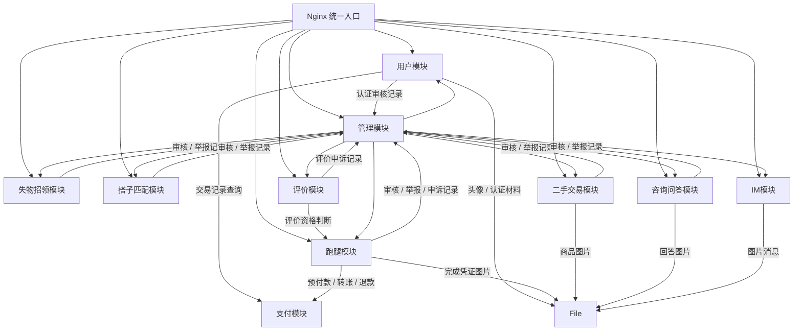

# 体系结构设计文档 — 校园互助服务平台

**版本：** 1.0
**日期：** 2026-04-30
**团队：** true就是队

---

## 一、架构概览

### 1.1 选定架构风格

**前后端分离 + 后端单体分层架构**

```
┌───────────────────────────────────────────────────────────────┐
│                     客户端层 (Client)                          │
│                                                               │
│   ┌───────────────────────────────────────────────────────┐   │
│   │      电脑端 Web 单页应用（学生端视图 / 管理端视图）      │   │
│   └──────────────────────────┬────────────────────────────┘   │
│                              │ HTTP/JSON                       │
├──────────────────────────────┼────────────────────────────────┤
│                     表示层 (API Layer)                         │
│                              ▼                                │
│   ┌────────────────────────────────────────────────────────┐ │
│   │               Nginx 反向代理                              │ │
│   │               RESTful API (统一入口)                     │ │
│   └────────────────────────┬───────────────────────────────┘ │
│                            │                                  │
├────────────────────────────┼──────────────────────────────────┤
│                 业务层 (Business Layer)                         │
│                            ▼                                  │
│   用户模块 | 跑腿模块 | 支付模块 | 评价模块 | IM模块 | 管理模块       │
│   失物招领 | 搭子匹配 | 二手交易 | 咨询问答 | 文件存储       │
│                            │                                  │
├────────────────────────────┼──────────────────────────────────┤
│             数据层 (Data Layer)                                │
│                            ▼                                  │
│   ┌────────────────────┐       ┌────────────────────┐        │
│   │   MySQL (主库)      │       │ Redis (可选优化)    │        │
│   └────────────────────┘       └────────────────────┘        │
└───────────────────────────────────────────────────────────────┘
```

### 1.2 架构风格论证

选择"前后端分离 + 后端单体分层"的理由：

| 维度 | 分析 |
|------|------|
| **团队规模** | 4人团队，单体架构降低协作成本，避免微服务的运维复杂性 |
| **开发周期** | 10周MVP，分层架构开发效率最高，无需处理服务间通信 |
| **需求明确度** | P1阶段已完成完整SRS（30+功能需求），模块边界清晰，分层架构可良好映射 |
| **后期演进** | 分层架构的模块内聚设计允许未来按需拆分为微服务 |
| **学习成本** | 团队整体不熟悉前端技术栈，但在可选前端方案中对Vue了解最多，且开发负责人对电脑端Web开发有一定了解；分层架构和Vue单页应用都属于学习成本相对可控的方案 |

---

## 二、架构候选方案对比

### 2.1 候选方案

| 对比维度 | 方案A：前后端分离 + 单体分层 | 方案B：微服务架构 |
|---------|---------------------------|-------------------|
| **开发复杂度** | 低。单一代码库，统一技术栈，本地调试简单 | 高。多服务独立开发，需处理服务发现、配置中心、链路追踪 |
| **可维护性** | 中。代码量增长后模块边界可能模糊，需靠规范约束 | 高。每个服务独立、职责清晰，但运维复杂度高 |
| **可扩展性** | 中。可通过水平扩展实例 + 读写分离应对；模块可后续拆分为服务 | 高。每个服务独立扩缩容，但MVP阶段无此需求 |
| **性能** | 高。进程内调用，无网络开销 | 中。服务间RPC/HTTP调用增加延迟 |
| **团队学习成本** | 低。课堂重点讲授，团队已掌握 | 高。需学习Docker/K8s、服务治理、分布式事务 |
| **10周内可行性** | **高**。可第3周开始编码 | **低**。基础设施搭建需2-3周，压缩业务开发时间 |
| **部署运维** | 简单。单个JAR/容器部署 | 复杂。需容器编排、CI/CD多服务流水线 |
| **MVP适用性** | **强**。快速验证核心业务 | 弱。过度设计，MVP阶段收益为负 |

### 2.2 结论

**选择方案A**（前后端分离 + 后端单体分层架构）。原因：

1. 4人团队在10周内完成MVP，微服务的基础设施开销会占用30%以上的开发时间
2. P1阶段定义的30+功能需求都在同一业务域内，不存在多团队并行开发的强隔离需求
3. 分层架构通过良好的模块划分（见第四节），可以在用户量增长后按需将热点模块（如跑腿模块、IM模块）独立拆分
4. 课堂重点讲授的分层/MVC架构模式团队最熟悉，降低技术风险
5. 模块间采用显式内部接口协作，便于当前团队理解、测试和排错

### 2.3 模块协作方式说明

本项目在单体分层架构内采用显式内部接口协作。各逻辑模块通过清晰的内部接口、DTO/Command和状态触发规则完成协作，调用关系在模块依赖图和接口表中明确表达，便于开发、测试和排错。

事件驱动属于隐式调用风格，模块通过发布和订阅事件解耦，扩展性更强，例如跑腿任务完成后可以扩展评价、通知、统计等后续处理。但该方式会引入事件模型、监听关系、调试链路和一致性处理；若引入RabbitMQ、Kafka等消息队列，还会增加部署、监控和运维成本。结合4人团队、10周MVP和团队技术储备，当前阶段不把事件驱动作为主要模块协作方式。

---

## 三、"架构辩论赛"实验记录

### 3.1 实验设计

每位成员使用不同的Prompt策略向AI（DeepSeek）咨询架构建议，记录AI回答质量差异。

### 3.2 成员A：姚圳锴（需求负责人）— 直接提问

**Prompt策略：** 不加任何上下文，直接问推荐方案

**Prompt：**
> "我要做一个校园互助平台，包含跑腿代取、失物招领、找搭子、二手交易、咨询问答等功能，用户端是H5移动网页，推荐什么架构？"

**AI回答摘要：**
AI推荐了"微服务架构"，理由是功能模块独立、可单独部署、技术栈灵活。AI自动将每个功能板块（跑腿、失物、搭子、二手、问答）映射为独立微服务。

**AI输出质量：** 2/5

**问题分析：**
- AI没有询问团队规模和开发周期，直接给出"最完备"的方案
- 将5个业务板块拆分为5个微服务，对4人团队完全不现实
- 未考虑MVP阶段的投入产出比
- 缺乏"够用就好"的工程判断
- 未针对H5移动网页的前端架构给出具体建议

---

### 3.3 成员B：张皓（架构负责人）— 提供详细约束

**Prompt策略：** 先提供完整的项目约束，再问推荐方案

**Prompt：**
> "我需要为一个校园互助平台做技术选型。以下是约束条件：
> - 团队4人（都是大二/大三学生）
> - 开发周期10周
> - MVP功能：用户认证、跑腿代取、失物招领、找搭子、二手交易、咨询问答、即时通讯、信用评价、后台管理
> - 目标用户为校内学生，初期并发量约200人
> - 不接入真实支付生产环境；有报酬跑腿任务使用支付宝沙箱验证预付款、转账和退款流程，不涉及真实资金流转
> - 用户端为H5移动网页，管理端为Web后台
>
> 请推荐合适的架构方案，并说明理由。"

**AI回答摘要：**
AI推荐"前后端分离 + 后端分层架构（Controller-Service-Repository）"。给出了具体技术栈建议（Spring Boot + MySQL + Redis + WebSocket），前端建议Vue 3 + Vant构建H5移动网页，并指出10周内不要考虑微服务。还提到了模块化设计、代码内聚等建议。

**AI输出质量：** 4.5/5

**问题分析：**
- 有约束条件后，AI给出了非常务实的建议
- AI没有盲目推荐微服务，明显是因为"4人10周"约束起作用
- 技术栈选型合理，WebSocket用于IM是正确建议

---

### 3.4 成员C：谢易轩（开发负责人）— 要求对比方案

**Prompt策略：** 要求AI主动对比多种方案的优劣

**Prompt：**
> "校园互助平台（用户端H5移动网页、用户认证、任务发布接单、即时通讯、评价系统），请对比单体分层架构和微服务架构的优劣，并给出推荐。"

**AI回答摘要：**
AI给出了详细的对比表，从开发成本、部署复杂度、扩展性、团队要求、运维成本5个维度比较。结论是：如果团队≤5人且MVP为先，选单体分层；如果团队≥10人且有DevOps能力，选微服务。

**AI输出质量：** 4/5

**问题分析：**
- 对比结构完整，覆盖了关键维度
- AI正确地给出了条件性推荐而非绝对结论
- 但缺少"从单体到微服务的演进路径"这一维度
- 没有提到领域驱动设计(DDD)在模块划分中的作用

---

### 3.5 成员D：毛嘉和（测试负责人）— 角色扮演

**Prompt策略：** 让AI扮演架构师角色进行分析

**Prompt：**
> "你现在是一名有10年经验的软件架构师。请为一个校园互助平台设计架构方案。用户端为H5移动网页。平台功能包括跑腿代取、失物招领、找搭子、二手交易、咨询问答。请从架构风格、技术栈、模块划分、质量属性四个方面给出建议。"

**AI回答摘要：**
AI扮演架构师，给出了"分层架构 + 事件驱动补充"的混合方案。建议核心业务流程（发布-接单-完成）使用分层架构，通知推送和支付宝沙箱支付状态变更使用事件驱动。技术栈推荐Spring Boot + MySQL + Redis + RabbitMQ + WebSocket。

**AI输出质量：** 3.5/5

**问题分析：**
- "架构师角色"让AI更关注完整性而非可行性
- 引入了RabbitMQ消息队列，对MVP来说过度设计
- 事件驱动建议有一定价值（支付宝沙箱支付状态变更适合事件驱动），但引入MQ增加了运维复杂度
- 优点是提到了质量属性（可测试性、可维护性），契合测试负责人视角

---

### 3.6 辩论总结

| 成员 | Prompt策略 | AI推荐方案 | 是否采纳 | 原因 |
|------|-----------|-----------|---------|------|
| 姚圳锴（需求负责人） | 直接提问 | 微服务 | ❌ | 缺乏约束条件，推荐不切实际；未考虑H5前端方案 |
| 张皓（架构负责人） | 提供详细约束 | 单体分层 | ✅ | 约束充分，方案务实可行 |
| 谢易轩（开发负责人） | 要求对比 | 条件推荐 | ✅ | 对比清晰，结论合理 |
| 毛嘉和（测试负责人） | 角色扮演 | 分层+事件驱动 | ⚠️部分 | 事件驱动建议有价值但MQ过度 |

**最终投票结果：** 全员一致选择**前后端分离 + 后端单体分层架构**。

**核心认知：**
- Prompt中是否包含**团队规模和开发周期**，是AI给出可行方案与理想方案的分水岭
- 直接提问获得的方案不可直接采用，必须加上约束条件
- AI倾向于推荐"技术最先进"而非"当前最合适"的方案
- 当约束充分时，AI的对比分析能力很强，可以节省大量调研时间
- 前端技术选型（H5 vs 小程序）同样需要在Prompt中明确，否则AI会默认推荐跨平台方案

**P4回溯说明：** 架构辩论赛发生在P2原始需求基线下，当时用户端形态仍按H5移动网页讨论。P4回溯评审后，产品形态调整为电脑端Web单页应用，因此前端技术选型已在第六节和ADR-002中修订。该调整不影响架构辩论赛关于“单体分层优于微服务、避免过度引入中间件”的核心结论。

---

## 四、模块划分

### 4.1 模块职责边界

基于P1阶段的需求规格说明书，将系统划分为以下11个逻辑模块。这里的模块表示单体后端内部的业务/支撑能力边界，用于说明职责、依赖关系和模块间接口。



认证边界：用户模块处理注册、登录、实名认证资料提交、认证状态、账号状态和个人资料维护；登录成功后签发JWT。公开浏览接口按板块进入对应核心业务模块；受保护接口由JWT拦截器校验登录状态和账号状态，并将`currentUserId`、`role`、`authStatus`、`accountStatus`放入请求上下文，各业务模块从上下文获取当前用户身份后执行业务规则。后台管理接口需校验`role=ADMIN`，管理操作使用请求上下文中的管理员身份记录处理人。

需求大厅作为前端页面组织方式实现：前端在同一大厅页面内按板块切换，并分别调用跑腿、失物招领、搭子匹配、二手交易和咨询问答模块的公开列表接口；各核心业务模块负责本板块的校区筛选、关键词搜索、发布时间排序和公开内容状态过滤。

### 4.2 模块详细说明

| 模块 | 职责 | 关联需求 |
|------|------|---------|
| **用户模块** | 注册、登录、认证状态维护、账号状态维护、个人资料、用户中心聚合查询 | FR-UM-01~03, FR-UM-05, FR-AD-01 |
| **跑腿模块** | 跑腿任务发布（含报酬设置、校区、有效期）、接单、状态流转、完成凭证、确认完成、取消/异常处理协作、触发报酬结算 | FR-ER-01~05 |
| **支付模块** | 支付宝沙箱预付款、转账、退款、交易记录存储与查询、防重复支付/退款 | FR-UM-04, FR-ER-01, FR-ER-03 |
| **失物招领模块** | 失物/招领信息发布、筛选、标记已解决 | FR-LF-01~04 |
| **搭子匹配模块** | 搭子招募发布、兴趣标签、报名、活动管理 | FR-MT-01~04 |
| **二手交易模块** | 商品发布、浏览、标记已出 | FR-SH-01~03 |
| **咨询问答模块** | 问题发布、回答、最佳答案采纳 | FR-QA-01~04 |
| **评价模块** | 交易互评、好评率计算、评价记录查询 | FR-CR-01~03 |
| **IM模块** | 站内一对一文字/图片消息、私聊状态规则、聊天记录存储 | FR-IM-01~05 |
| **管理模块** | 实名认证审核、账号封禁、内容审核、举报/申诉处理、任务异常申诉处理、聊天记录查看、处理结果触发跑腿状态调整及后续支付协作 | FR-UM-05, FR-AD-01~03, FR-CR-04~05, FR-TM-04 |
| **文件存储模块** | 图片上传、JPG/PNG格式校验、5MB大小校验、本地保存、文件标识与本地路径映射维护、文件内容读取 | FR-UM-03, FR-UM-05, FR-ER-04, FR-SH-01, FR-QA-02, FR-IM-04 |

### 4.3 模块间接口约定

| 调用模块 | 被调用模块 | 调用方式 | 业务场景/触发条件 | 接口输入与返回 |
|----------|------------|---------|------------------|------------------|
| 需展示用户摘要的模块 | 用户模块 | 同步内部调用 | 展示发布人、联系人等公开用户摘要 | `getUserSummary(userId) -> UserSummaryDTO { userId, nickname, avatarUrl }` |
| 用户模块 | 评价模块 | 同步查询 | 个人主页聚合展示好评率和历史评价 | `queryUserRatingSummary(userId) -> UserRatingSummaryDTO { positiveRate, ratingCount }`；`queryUserEvaluations(userId, pageQuery) -> PageResult<EvaluationRecordDTO>` |
| 跑腿模块 | 支付模块 | 业务流程协作 | 发布有报酬任务时先生成内部待支付任务记录，并创建支付宝沙箱预付款入口；跑腿模块使用`paymentId`跟踪该任务对应的支付记录；支付成功后预付款暂存平台沙箱账户，任务进入审核中状态；任务取消/审核驳回时退款；任务确认完成时结算报酬 | `createPrepay(payerId, amount) -> PrepayResultDTO { paymentId, payEntry }`；`queryPaymentStatus(paymentId) -> paymentStatus`；`refundPayment(paymentId) -> paymentStatus`；`settlePayment(paymentId, receiverId) -> paymentStatus` |
| 用户模块 | 支付模块 | 同步查询 | “我的交易”查询支付、转账、退款记录 | `queryTransactions(userId, pageQuery) -> PageResult<PaymentRecordDTO> { paymentId, type, amount, status, createdAt }` |
| 评价模块 | 跑腿模块 | 同步查询 | 查询跑腿任务评价上下文，用于评价入口展示和评价提交时的资格校验 | `queryTaskEvaluationContext(taskId) -> TaskEvaluationContextDTO { publisherId, receiverId, taskStatus }` |
| 用户模块 / 跑腿模块 / 二手交易模块 / 咨询问答模块 / IM模块 | 文件存储模块 | 同步内部调用 | 上传头像、认证材料、完成凭证、商品图、回答图和私聊图片；前端通过对应业务模块获取文件，业务模块完成权限校验后再调用文件模块读取内容 | `uploadImage(file) -> FileId`；`loadFile(fileId) -> FileContent { bytes, mimeType }` |
| 用户模块 | 管理模块 | 实名认证申请协作 | 用户模块保存实名信息和认证材料标识后，向管理模块创建认证审核记录 | `createVerificationReview(userId) -> managementRecordId` |
| 管理模块 | 用户模块 | 用户管理协作 | 管理员查看用户列表和账号状态；封禁操作来自审核、举报或申诉等明确处理结论，封禁来源由管理模块记录 | `queryUsersForAdmin(userQuery) -> PageResult<UserAdminDTO>`；`banUser(userId) -> accountStatus` |
| 管理模块 | 用户模块 | 实名认证审核协作 | 管理模块维护认证申请和审核记录；审核通过或驳回后同步用户认证状态 | `updateUserAuthStatus(userId, authStatus) -> authStatus` |
| 跑腿模块 / 失物招领模块 / 搭子匹配模块 / 二手交易模块 / 咨询问答模块 | 管理模块 | 内容审核记录协作 | 业务模块创建审核中内容后，向管理模块创建内容审核记录；管理模块只记录处理对象标识，不复制业务内容 | `createContentReview(targetType, targetId) -> managementRecordId` |
| 管理模块 | 跑腿模块 / 失物招领模块 / 搭子匹配模块 / 二手交易模块 / 咨询问答模块 | 内容审核结果协作 | 管理员处理内容审核记录后，管理模块调用对应业务模块更新内容状态 | `updateContentReviewStatus(targetId, reviewResult) -> contentStatus` |
| 跑腿模块 / 失物招领模块 / 搭子匹配模块 / 二手交易模块 / 咨询问答模块 | 管理模块 | 内容举报记录协作 | 用户举报已发布内容或公开回答后，业务模块向管理模块创建内容举报记录；举报原因由管理模块记录 | `createContentReport(targetType, targetId, reason) -> managementRecordId` |
| 评价模块 | 管理模块 | 评价申诉记录协作 | 用户举报或申诉评价后，评价模块向管理模块创建评价申诉记录；申诉原因由管理模块记录 | `createEvaluationAppeal(evaluationId, reason) -> managementRecordId` |
| 跑腿模块 | 管理模块 | 任务异常申诉记录协作 | 用户提交跑腿任务异常申诉后，跑腿模块向管理模块创建任务异常申诉记录；申诉原因由管理模块记录 | `createErrandAppeal(taskId, reason) -> managementRecordId` |
| 管理模块 | 跑腿模块 / 失物招领模块 / 搭子匹配模块 / 二手交易模块 / 咨询问答模块 | 举报处理结果协作 | 管理员处理内容或公开回答举报后，管理模块调用对应业务模块更新目标状态 | `updateReportedContentStatus(targetId, handleResult) -> contentStatus` |
| 管理模块 | 评价模块 | 评价申诉结果协作 | 管理员处理评价举报/申诉后，管理模块调用评价模块更新评价状态；评价模块负责重算好评率 | `updateEvaluationStatus(evaluationId, handleResult) -> evaluationStatus` |
| 管理模块 | 跑腿模块 / IM模块 | 任务异常申诉处理 | 管理员处理跑腿任务异常申诉时读取任务、凭证和聊天记录；处理完成后交给跑腿模块更新任务状态并触发退款或结算 | `handleErrandAppealResult(taskId, handleResult) -> AppealHandleResultDTO { taskStatus, paymentStatus }`；`queryAppealChatRecords(taskId) -> 聊天记录` |

---

## 五、质量属性与非功能需求闭环

本节将P1阶段的关键非功能需求映射到架构设计措施，确保性能、安全、可维护性和兼容性要求在P2阶段有明确承接。

| P1非功能需求 | 架构支撑措施 | 风险与约束 |
|--------------|--------------|------------|
| `NFR-PF-01` 需求大厅首屏加载不超过2秒 | 需求大厅由前端按板块调用各核心业务模块的公开列表接口；列表接口默认分页返回，首屏只加载当前板块必要字段；MySQL为校区、状态、发布时间等常用筛选字段建立索引；Redis可作为热点列表缓存优化 | Redis属于可选优化，MVP阶段应优先通过分页、索引和字段裁剪满足首屏性能 |
| `NFR-PF-02` 板块切换、校区筛选、关键词搜索不超过2秒 | 各核心业务模块负责本板块的筛选、搜索和排序，避免跨模块聚合查询；前端使用Vue Router和组件状态保留页面上下文，切换板块时只请求目标板块数据 | 关键词搜索以MySQL条件查询为基础，复杂全文检索不作为MVP架构依赖 |
| `NFR-PF-03` 支持200名已登录用户同时在线 | 后端采用单体分层架构，模块间为进程内调用；Nginx统一入口转发HTTP和WebSocket请求；MySQL作为主库，Redis可用于在线状态、防重复操作和热点缓存 | 200在线是MVP容量目标；超过该目标后再评估缓存、读写分离或热点模块拆分 |
| `NFR-SE-01` 密码加密存储 | 用户模块负责注册、登录和账号状态维护；密码只保存哈希结果，不保存明文；登录成功后签发JWT | 具体哈希算法和参数在实现阶段统一配置，但架构上由用户模块集中负责 |
| `NFR-SE-02` 敏感信息脱敏展示 | 用户模块对外提供公开用户摘要，业务模块只获取展示所需的`nickname`、`avatarUrl`等字段；学号、认证材料等敏感信息不向普通业务展示；管理端通过管理流程查看必要信息 | 管理端访问依赖后台管理入口的管理员角色校验 |
| `NFR-SE-03` 防SQL注入、XSS、CSRF等基础安全防护 | MyBatis Plus和Mapper参数绑定降低SQL注入风险；后端统一进行参数校验；前端页面展示用户输入内容时进行转义；受保护接口通过JWT拦截器校验登录状态和账号状态 | 文件上传、富文本或图片说明等入口需要严格限制格式、大小和可展示内容 |
| `NFR-US-01~03` 关键流程可用性与错误提示 | 前端采用Vue 3、Element Plus和Axios统一组织表单、弹窗、分页、上传、错误提示和登录过期处理；后端接口返回明确业务错误码和错误信息 | 交互步骤和提示文案由前端页面设计落实，架构上保证统一组件和统一请求封装 |
| `NFR-MA-01` 编码规范和核心注释 | 后端按Controller-Service-Mapper分层，按逻辑模块组织包结构；模块间通过明确内部接口协作；前端按页面、组件、状态和请求封装分层 | 模块边界需要通过代码审查和接口约定持续维护 |
| `NFR-MA-02` 关键操作日志保存不少于30天 | 用户、跑腿、支付、评价、管理和IM等模块在登录、发布、接单、支付、退款、评价、审核、封禁、申诉处理等关键业务点记录操作日志；管理操作使用请求上下文中的管理员身份记录处理人 | 日志可采用数据库审计表或应用日志文件，MVP阶段优先保证关键操作可追溯 |
| `NFR-CO-01~02` 主流桌面浏览器和1366×768以上分辨率 | 前端明确采用电脑端Web单页应用，Element Plus适配桌面端表单、表格和管理界面；目标浏览器为Chrome、Edge、Safari近两个主版本 | 不以移动端H5和微信小程序作为当前产品形态，避免额外适配成本 |

---

## 六、技术选型

### 6.1 技术栈总览

| 层次 | 选择 | 选择理由 |
|------|------|---------|
| **前端框架** | Vue 3 | 面向电脑端浏览器构建单页应用；团队已确定基于Vue技术栈 |
| **前端语言** | JavaScript | 团队前端经验有限，使用JavaScript更符合当前技术储备和MVP交付约束 |
| **前端构建工具** | Vite | 用于创建、运行和打包Vue 3项目，提供本地开发服务器和热更新能力 |
| **前端UI组件库** | Element Plus | 适合桌面端业务系统，表单、表格、弹窗、分页、上传等组件成熟，可同时支撑学生端和管理端页面 |
| **前端路由** | Vue Router | 管理需求大厅、详情页、个人中心、私聊和后台管理等页面路由 |
| **前端状态管理** | Pinia | 管理登录用户、认证状态、角色权限、当前校区、未读消息等跨页面共享状态 |
| **HTTP请求库** | Axios | 统一封装RESTful API调用、Token携带、请求/响应拦截、错误提示和登录过期跳转 |
| **页面形态** | SPA（单页应用） | 与前后端分离架构匹配，页面切换由前端路由完成，后端提供RESTful API |
| **后端框架** | Spring Boot 3.5.x + Java 17 LTS | 3.5.x属于Spring Boot 3后期稳定版本，生态成熟、资料丰富；Java 17为LTS版本，满足Spring Boot 3最低要求且部署风险较低 |
| **认证方式** | JWT Token | 用户模块登录成功后签发Token，前端通过Axios统一携带Token访问受保护接口，适合前后端分离的REST接口 |
| **数据访问框架** | MyBatis Plus | 简化MySQL单表CRUD、分页和条件查询，团队可直接编写SQL/Mapper控制复杂查询 |
| **数据库（主库）** | MySQL 8.0 | 关系型数据需求为主（用户、订单、评价），MySQL是团队最熟悉的数据库 |
| **缓存（可选优化）** | Redis 7.0 | 可用于热点列表缓存、临时状态、防重复操作和在线状态管理 |
| **即时通讯** | WebSocket (Spring WebSocket) | 用于站内一对一文字/图片消息推送；图片本体由本地文件存储保存，消息记录保存图片文件标识；相比前端轮询，WebSocket能减少无效请求并提升消息实时性 |
| **文件存储** | 本地文件存储（MVP） | 图片上传（商品图、凭证图、头像、认证材料）直接保存到服务器本地目录，MySQL保存文件路径和元数据 |
| **部署方式** | Docker Compose + 单机服务器部署 | Docker Compose可同时用于本地联调和单机服务器部署，统一Nginx、Spring Boot后端、MySQL等组件的运行环境，降低环境不一致和部署迁移成本 |

### 6.2 技术选型理由详解

**为什么选电脑端 Web + Vue 3 + Element Plus？**
- P1回溯评审后，产品形态已收敛为面向电脑端浏览器的校园互助Web平台。主要原因是在4人团队、10周MVP和团队前端经验有限的约束下，电脑端网页相比移动端H5和微信小程序更易上手、调试和交付；开发负责人已有一定电脑端网页开发经验，可以降低实现风险
- 学生端和管理端都需要大量表单、列表、筛选、详情、弹窗、分页、上传等界面，Element Plus比移动端组件库更匹配
- 采用一个Vue单页应用，通过路由和权限区分学生端视图与管理端视图，可以复用登录态、权限判断、请求封装和基础组件
- 使用JavaScript降低团队学习成本和实现风险，更符合4人团队10周MVP约束
- Vue Router、Pinia和Axios分别负责页面路由、跨页面状态和API请求封装，技术边界清晰，便于详细设计落地

**为什么选Vite作为前端构建工具？**
- Vite适合Vue 3新项目，能够提供项目创建、本地开发服务器、热更新和生产环境打包能力
- 相比Webpack和Rollup直接配置，Vite开箱即用程度更高，能降低团队前端构建配置的学习成本
- 不选Vue CLI：Vue CLI已不适合作为新Vue 3项目的首选脚手架，当前Vue生态更推荐Vite方案
- 不选Webpack：能力强但配置复杂，对本项目MVP来说偏重
- 不选Rollup：更适合库打包，直接用于完整前端应用需要额外配置
- 不选Parcel：虽然上手简单，但在Vue 3项目中的主流程度、模板和团队可查资料不如Vite

**为什么不选其他前端方案？**
- 不选移动端H5 + Vant：需要额外处理移动端适配、触控交互和不同手机浏览器兼容问题；Vant也主要面向移动端场景，和当前电脑端浏览器平台不匹配
- 不选uni-app：当前不是多端项目，跨端能力收益有限，反而增加框架学习和调试成本
- 不选微信小程序：需要学习小程序专属语法、组件体系、平台能力和审核流程，与团队已有电脑端网页经验不匹配
- 不选SSR/SSG：本项目主要是登录后的业务系统，SEO不是核心目标，服务端渲染或静态生成会增加不必要复杂度
- 不选传统后端模板渲染：会提高前后端耦合度，不符合前后端分离和RESTful API的总体架构

**为什么选Spring Boot？**
- 分层架构（Controller-Service-Repository）是Spring Boot的标准实践
- 团队在课程中已系统学习，学习基础较好
- Spring生态提供了Web、校验、WebSocket等组件，能够支撑REST接口、参数校验和实时通信
- 用户认证采用JWT Token，由后端登录接口签发，前端通过Axios统一携带Token访问受保护接口
- 10周内能快速出活，社区资源丰富，遇到问题容易搜索解决

**为什么选MyBatis Plus？**
- 项目主数据库为MySQL，业务数据以用户、任务、订单、评价、聊天记录等结构化表为主，MyBatis Plus适合快速完成常规CRUD、分页和条件查询
- 团队对SQL和MySQL更熟悉，MyBatis Plus允许在简单场景使用内置方法，在复杂查询场景保留手写SQL/Mapper的控制能力
- 团队此前没有Spring Data JPA实践经验。相比Spring Data JPA，MyBatis Plus对SQL执行过程更直观，学习成本更低，更符合团队当前技术储备和MVP交付压力

**Redis作为可选优化的使用场景**
- 各板块公开列表缓存
- 验证码/Token临时状态
- 支付宝沙箱防重复支付/退款
- WebSocket在线状态管理

---

## 七、部署架构

```
┌──────────────────────────────────────────────┐
│             单机服务器部署                      │
│                                              │
│  ┌────────────────────────────────────────┐  │
│  │           Docker Compose               │  │
│  │                                        │  │
│  │   ┌──────────┐     ┌──────────┐       │  │
│  │   │  Nginx   │     │  Spring  │       │  │
│  │   │  容器    │─────│  Boot    │       │  │
│  │   │   :80    │     │  容器    │       │  │
│  │   └──────────┘     └────┬─────┘       │  │
│  │                         │              │  │
│  │            ┌────────────┼────────┐     │  │
│  │            ▼            ▼        ▼     │  │
│  │     ┌──────────┐  ┌──────────┐        │  │
│  │     │  MySQL   │  │ Redis    │        │  │
│  │     │  容器    │  │ 可选容器  │        │  │
│  │     └──────────┘  └──────────┘        │  │
│  └────────────────────────────────────────┘  │
└──────────────────────────────────────────────┘
```

---

## 八、未选方案的归档

| 方案 | 不选原因 |
|------|---------|
| 微服务架构 | 10周内基础设施成本过高，4人团队难以维护多服务 |
| 微信小程序 | 与电脑端Web产品形态不一致；受平台审核限制，迭代不够灵活；需要学习wxml/wxss专属语法 |
| 纯MVC（不分离前后端） | 后端模板渲染会增加前后端耦合度，不利于通过RESTful API支撑学生端视图和管理端视图 |
| Serverless | 校园场景并发规律性强（课间高峰），Serverless冷启动影响体验；WebSocket长连接支持有限 |
| Python Django单体 | 团队Java基础更扎实，Python学习成本抵消了Django的快速开发优势 |
