# 核心类图设计 — 校园互助服务平台

**版本：** 3.1  
**日期：** 2026-07-01  
**团队：** true就是队  
**状态：** P4 终版回溯修订，按 P1 v2.1、P2 v1.3 和 P4 实际实现同步收敛

---

## 设计范围说明

本文档用于表达校园互助服务平台在 P3 详细设计阶段的核心类、类之间关系、关键属性和关键方法。它不是后续编码阶段的完整类清单，而是面向作业要求和 MVP 实现边界的核心设计视图。

本次回溯以最新文档为基线：

1. P1 v2.1：Must 范围聚焦用户管理、实名认证审核、代取需求大厅、代取服务闭环、平台积分报酬、文件上传和我的代取记录。
2. P2 v1.2：采用前后端分离 + 后端单体分层架构，后端模块间采用同步内部调用。
3. 评价体系和站内通知为 Should，保留类与接口位置，但不作为代取闭环的阻断能力。
4. 失物招领、二手交易、私聊、举报/申诉为 Could，不进入本版核心类图主线。
5. 论坛、找搭子、咨询问答、真实线上支付、微服务、事件驱动和 MQ 为 Won't，不在 P3 类设计中建模。

---

## 一、核心类图设计

### 1.1 核心领域类关系图


> Mermaid 源码：[core-domain-class.mmd](asset/core-domain-class.mmd)

### 1.2 核心服务与模块协作类图



> Mermaid 源码：[service-collaboration-class.mmd](asset/service-collaboration-class.mmd)

### 1.3 核心类详细定义

#### 方法可见性约定

| 类型 | 调用方 | 作用 |
|------|--------|------|
| 领域类方法 | 仅 Service 层内部调用 | 维护领域对象自身状态和少量展示规则，不作为 Controller 或其他模块入口 |
| 服务类方法 | Controller 层或其他业务模块调用 | 表达完整业务用例，负责权限校验、状态校验和跨模块协作 |

后续表格中的 `mark...`、`record...` 等领域类方法均为内部状态变更方法，`can...`、`is...` 等领域类方法用于表达对象自身规则；`publish...`、`accept...`、`confirm...`、`query...` 等服务类方法才是业务入口。

#### User（用户）

| 属性 | 类型 | 说明 |
|------|------|------|
| id | Long | 主键，自增 |
| username | String | 登录账号，平台内唯一 |
| passwordHash | String | BCrypt 等算法生成的密码哈希，禁止明文存储 |
| studentId | String | 学号，认证后保存，普通用户页面不公开 |
| realName | String | 真实姓名，仅用于实名认证和管理员审核 |
| nickname | String | 公开展示昵称，可修改，可重复 |
| avatarFileId | Long | 头像文件标识 |
| verificationFileId | Long | 实名认证材料照片文件标识；MVP 支持一张校园卡或学生证照片 |
| college | String | 学院，选填 |
| contact | String | 联系方式，选填；未填写时不展示 |
| authStatus | AuthStatus(Enum) | 未认证/审核中/已通过/已驳回 |
| role | UserRole(Enum) | 普通用户/管理员 |
| pointBalance | Long | 平台积分余额，纯虚拟、不可充值提现 |
| lastCheckInDate | LocalDate | 最近一次签到日期，用于每日签到去重 |
| createdAt | LocalDateTime | 注册时间 |

| 方法 | 说明 |
|------|------|
| markAuthSubmitted(studentId, realName, verificationFileId) | 保存实名信息和认证材料，进入审核中 |
| markAuthApproved() | 认证状态变为已通过 |
| markAuthRejected(reason) | 认证状态变为已驳回 |
| updateProfile(nickname, avatarFileId, college, contact) | 更新公开资料 |
| canParticipatePickup() | 判断用户认证状态是否允许参与代取服务；供服务层内部校验使用 |
| deductPoints(amount) | 从积分余额中扣减；余额不足时由服务层拦截，供发布有报酬代取使用 |
| addPoints(amount) | 向积分余额中增加；供签到、认证赠送、取消退回、完成入账使用 |

#### CurrentUserContext（当前用户上下文）

| 属性 | 类型 | 说明 |
|------|------|------|
| currentUserId | Long | 当前登录用户 ID |
| role | UserRole(Enum) | 当前用户角色 |
| authStatus | AuthStatus(Enum) | 当前用户认证状态 |

> JWT 拦截器解析 Token 后生成 `CurrentUserContext`。业务服务只从上下文读取身份，不直接信任前端传入的用户 ID。

#### UserSummary（公开用户摘要）

| 属性 | 类型 | 说明 |
|------|------|------|
| userId | Long | 用户 ID |
| nickname | String | 公开昵称 |
| ratingSummary | RatingSummary | 评价统计摘要，可为空，来自评价模块 |

> 其他业务模块展示发布者、接单方或被评价方时，只使用 `UserSummary`，不得暴露学号、姓名、认证材料和文件标识。文件模块不对前端暴露通用读取接口；头像图片由前端按 `userId` 调用用户模块头像业务接口读取，用户模块完成业务权限判断后再调用 `FileStorageService.loadFile(fileId)`。

#### VerificationReview（实名认证审核记录）

| 属性 | 类型 | 说明 |
|------|------|------|
| id | Long | 审核记录主键 |
| userId | Long | 申请认证的用户 ID |
| status | ReviewStatus(Enum) | 待审核/已通过/已驳回 |
| reviewerId | Long | 处理管理员 ID |
| rejectReason | String | 驳回原因 |
| createdAt | LocalDateTime | 创建时间 |
| reviewedAt | LocalDateTime | 审核时间 |

> 实名信息和认证材料归用户模块维护，`VerificationReview` 只保存审核流程元数据。管理员查看审核详情时，实名认证审核服务通过 `UserService` 读取用户模块中的 `studentId`、`realName` 和 `verificationFileId`，再由用户模块按权限读取认证材料文件。

| 方法 | 说明 |
|------|------|
| markApproved(reviewerId) | 记录审核通过结果 |
| markRejected(reviewerId, reason) | 记录审核驳回结果 |

#### PickupRequest（代取服务请求）

| 属性 | 类型 | 说明 |
|------|------|------|
| id | Long | 代取服务主键 |
| publisherId | Long | 发布方用户 ID |
| acceptorId | Long | 接单方用户 ID，未接单时为空 |
| campus | String | 校区，用于大厅筛选 |
| pickupLocation | String | 取件地点 |
| deliveryLocation | String | 送达地点 |
| itemDescription | String | 物品描述 |
| pickupCredentialFileId | Long | 取件凭证图片文件标识，接单前不公开 |
| rewardType | RewardType(Enum) | 有报酬/无报酬 |
| rewardAmount | BigDecimal | 有报酬服务必填，范围 1-200 元；无报酬服务为空 |
| status | PickupStatus(Enum) | 待接单/进行中/已完成/已取消 |
| acceptDeadline | LocalDateTime | 接单截止时间 |
| acceptedAt | LocalDateTime | 接单时间 |
| completionProofFileId | Long | 完成凭证图片文件标识，接单方上传；MVP 阶段限定为一张图片 |
| completedAt | LocalDateTime | 完成时间 |
| cancelReason | String | 取消原因 |
| createdAt | LocalDateTime | 发布时间 |

| 方法 | 说明 |
|------|------|
| markWaitingAccept() | 发布成功后进入待接单（无报酬直接进入；有报酬在扣减发布方积分后进入） |
| markAccepted(acceptorId) | 记录接单方并进入进行中 |
| recordCompletionProof(fileId) | 保存单张完成凭证图片标识 |
| markCompleted() | 发布方确认完成后进入已完成 |
| markCancelled(reason) | 服务取消或超时后进入已取消 |
| canViewPickupCredential(userId) | 仅接单方在接单成功后可查看取件凭证 |
| isHallVisible() | 仅待接单状态可进入代取需求大厅 |
| isPublisher(userId) | 判断用户是否为该代取服务发布方；供服务层内部校验使用 |
| isAcceptor(userId) | 判断用户是否为该代取服务接单方；供服务层内部校验使用 |

> 代取服务不保存评价 ID 列表。评价通过 `Evaluation.businessType + Evaluation.businessId` 查询，当前 MVP 中 `businessType` 固定为 `PICKUP_REQUEST`，`businessId` 对应代取服务 ID。MVP 阶段完成凭证限定为一张图片；后续若需要多张完成凭证，可扩展为完成凭证关联表，但本阶段不建模。

#### PickupSummary（代取服务摘要）

| 属性 | 类型 | 说明 |
|------|------|------|
| pickupId | Long | 代取服务 ID |
| campus | String | 服务所在校区 |
| pickupLocation | String | 取件地点 |
| deliveryLocation | String | 送达地点 |
| itemDescriptionPreview | String | 物品描述预览 |
| rewardType | RewardType(Enum) | 有报酬/无报酬 |
| rewardAmount | BigDecimal | 报酬金额；无报酬服务为空 |
| status | PickupStatus(Enum) | 当前代取服务状态 |
| createdAt | LocalDateTime | 发布时间 |
| completedAt | LocalDateTime | 服务完成时间；未完成服务为空 |

> `PickupSummary` 是代取服务的通用展示摘要，主要用于“我的发布”“我的接单”记录总览，也可被评价详情复用为关联服务背景。它不暴露取件凭证、完成凭证、积分流水和参与者隐私字段。

#### PointTransaction（积分流水）

| 属性 | 类型 | 说明 |
|------|------|------|
| id | Long | 流水主键 |
| userId | Long | 流水所属用户 ID |
| type | PointTransactionType(Enum) | 流水类型：认证赠送/签到/发布扣减/取消退回/完成入账 |
| amount | Long | 积分变动量，正数入账，负数出账 |
| balanceAfter | Long | 本次变动后的积分余额，冗余记录便于直接展示 |
| relatedPickupId | Long | 关联代取服务 ID，仅代取相关流水有值；非代取流水为空 |
| createdAt | LocalDateTime | 创建时间 |

> 积分流水只记录稳定的成功变动；积分余额存于 `User.pointBalance`，每次流水写入时由积分服务在同一事务内同步更新余额并写入 `balanceAfter`。积分为平台内虚拟资产，不可充值提现，因此不涉及第三方交易号、商户订单号等支付字段。认证赠送每个学号仅一次、每日签到每日仅一次由业务层去重；积分不足导致的发布失败不写流水。`PointTransactionType` 取值固定为 `EARN_VERIFICATION`、`EARN_CHECK_IN`、`SPEND_PUBLISH`、`REFUND_CANCEL`、`INCOME_COMPLETE`。

#### StoredFile（文件资源）

| 属性 | 类型 | 说明 |
|------|------|------|
| fileId | Long | 文件标识 |
| uploaderId | Long | 上传者用户 ID，仅用于上传记录追踪、审计排查和孤立文件清理 |
| fileUsage | FileUsage(Enum) | 文件用途标记，可取 `AVATAR`、`VERIFICATION_MATERIAL`、`PICKUP_CREDENTIAL`、`COMPLETION_PROOF` |
| storagePath | String | 服务器本地存储路径 |
| mimeType | String | 文件类型 |
| size | Long | 文件大小 |
| createdAt | LocalDateTime | 上传时间 |

> `StoredFile` 保存文件元数据和上传溯源信息。`uploaderId` 与 `fileUsage` 仅用于上传记录追踪、审计排查和孤立文件清理，不表示最终业务归属。头像、认证材料、取件凭证和完成凭证等业务归属仍由对应业务对象通过 `fileId` 引用表达。业务模块必须先完成权限和状态校验，再调用 `FileStorageService.loadFile(fileId)` 读取文件。

#### Evaluation（评价，Should）

| 属性 | 类型 | 说明 |
|------|------|------|
| id | Long | 评价主键 |
| reviewerId | Long | 评价者 ID |
| revieweeId | Long | 被评价者 ID |
| businessType | BusinessType(Enum) | 评价所属业务类型，当前 MVP 固定为 `PICKUP_REQUEST` |
| businessId | Long | 业务对象 ID，当前 MVP 对应代取服务 ID |
| revieweeRoleInBusiness | PickupParticipantRole(Enum) | 被评价者在该业务中的角色，当前 MVP 可取 `PUBLISHER` / `ACCEPTOR` |
| ratingLevel | RatingLevel(Enum) | 好评/中评/差评 |
| content | String | 评价内容；差评必填 |
| createdAt | LocalDateTime | 创建时间 |

> 评价记录保存通用业务关联字段，避免后续扩展业务时在评价表中写死 `pickupId`。当前 MVP 可通过 `businessType + businessId + reviewerId` 唯一约束避免同一个业务对象中同一评价者重复评价。

#### RatingSummary（评价统计摘要，Should）

| 属性 | 类型 | 说明 |
|------|------|------|
| userId | Long | 被统计用户 ID |
| publisherRoleSummary | RatingRoleSummary | 用户作为发布方时收到的评价统计 |
| acceptorRoleSummary | RatingRoleSummary | 用户作为接单方时收到的评价统计 |

#### RatingRoleSummary（按被评价者业务角色统计，Should）

| 属性 | 类型 | 说明 |
|------|------|------|
| revieweeRoleInBusiness | PickupParticipantRole(Enum) | 被评价者在业务中的角色，当前 MVP 可取 `PUBLISHER` / `ACCEPTOR` |
| positiveCount | Integer | 用户以该业务角色收到的好评数量 |
| neutralCount | Integer | 用户以该业务角色收到的中评数量 |
| negativeCount | Integer | 用户以该业务角色收到的差评数量 |
| totalCount | Integer | 用户以该业务角色收到的评价总数 |
| positiveRate | BigDecimal | 用户以该业务角色收到评价的好评率，计算公式为好评数 / 评价总数 |

#### EvaluationHistorySummary（历史评价总览项，Should）

| 属性 | 类型 | 说明 |
|------|------|------|
| evaluationId | Long | 评价 ID |
| revieweeRoleInBusiness | PickupParticipantRole(Enum) | 被评价者在该业务中的角色，当前 MVP 可取 `PUBLISHER` / `ACCEPTOR` |
| ratingLevel | RatingLevel(Enum) | 好评/中评/差评 |
| contentPreview | String | 评价内容预览 |
| createdAt | LocalDateTime | 评价时间 |

#### EvaluationDetail（评价详情，Should）

| 属性 | 类型 | 说明 |
|------|------|------|
| evaluationId | Long | 评价 ID |
| reviewerNickname | String | 评价者昵称 |
| revieweeRoleInBusiness | PickupParticipantRole(Enum) | 被评价者在该业务中的角色，当前 MVP 可取 `PUBLISHER` / `ACCEPTOR` |
| pickupSummary | PickupSummary | 关联代取服务摘要 |
| ratingLevel | RatingLevel(Enum) | 好评/中评/差评 |
| content | String | 完整评价内容 |
| createdAt | LocalDateTime | 评价时间 |

#### NotificationRecord（站内通知，Should）

| 属性 | 类型 | 说明 |
|------|------|------|
| id | Long | 通知主键 |
| receiverId | Long | 接收用户 ID |
| type | NotificationType(Enum) | 认证结果/接单/完成凭证/确认完成/收到评价 |
| content | String | 通知内容摘要 |
| read | Boolean | 是否已读 |
| createdAt | LocalDateTime | 创建时间 |
| readAt | LocalDateTime | 阅读时间 |

| 方法 | 说明 |
|------|------|
| markRead() | 标记为已读 |

### 1.4 核心业务服务类

#### AuthService（认证服务）

| 方法 | 说明 |
|------|------|
| register(username, password) | 用户名密码注册，校验用户名唯一，保存密码哈希 |
| login(username, password) | 用户名密码登录，用户存在且密码正确时签发 JWT |
| parseToken(token) | 解析 JWT 并生成 `CurrentUserContext` |

#### UserService（用户服务）

| 方法 | 说明 |
|------|------|
| getCurrentUser(userId) | 查询当前用户完整信息 |
| getUserSummary(userId) | 返回公开用户摘要，不包含实名信息 |
| loadAvatar(userId) | 通过用户模块读取头像文件；内部根据 `avatarFileId` 调用文件存储模块 |
| updateProfile(userId, command) | 编辑头像、昵称、学院和联系方式 |
| submitVerification(userId, studentId, realName, materialFileId) | 保存实名信息和认证材料，并创建仅关联 `userId` 的实名认证审核记录 |
| updateUserAuthStatus(userId, authStatus, reason) | 管理员审核后回写用户认证状态 |
| ensureCertified(userId) | 校验用户是否已认证且账号正常 |

#### VerificationReviewService（实名认证审核服务）

| 方法 | 说明 |
|------|------|
| createVerificationReview(userId) | 用户提交认证后创建待审核记录；审核记录不复制实名字段和材料文件标识 |
| queryPendingReviews(pageQuery) | 管理员分页查询待审核实名认证申请 |
| approveReview(reviewId, adminId) | 审核通过，回写用户认证状态，并创建通知 |
| rejectReview(reviewId, adminId, reason) | 审核驳回，回写用户认证状态和原因，并创建通知 |

#### PickupService（代取服务）

`PickupService` 负责身份、权限、状态校验、积分、文件和通知等模块协作。代取服务状态较少，且业务动作已经由服务方法明确表达，因此不额外引入状态模式；各方法内部按 `PickupStatus` 进行必要状态校验。

| 方法 | 说明 |
|------|------|
| publishPickup(command, currentUserId) | 发布代取服务；认证用户才能发布。有报酬服务调用 `PointService.spendForPublish` 扣减发布方积分后进入待接单（余额不足则发布失败）；无报酬服务直接进入待接单 |
| queryHall(campus, rewardType, pageQuery) | 查询代取需求大厅，只返回待接单服务，支持校区和报酬类型筛选，按发布时间倒序 |
| queryDetail(pickupId, currentUserId) | 查询详情；接单前不返回取件凭证 |
| acceptPickup(pickupId, acceptorId) | 认证用户接单；接单方不得是发布方；成功后进入进行中 |
| uploadCompletionProof(pickupId, acceptorId, fileId) | 接单方上传单张完成凭证；MVP 阶段完成凭证限定为一张图片 |
| confirmComplete(pickupId, publisherId) | 发布方确认完成；有报酬服务调用 `PointService.transferOnComplete` 将积分转给接单方，无报酬服务不处理积分 |
| cancelPickup(pickupId, publisherId, reason) | 发布方取消待接单服务；有报酬服务调用 `PointService.refundForCancel` 退回发布方积分 |
| expireOpenPickups(now) | 扫描超过接单截止时间仍无人接单的服务并取消 |
| queryMyPublished(userId, status, pageQuery) | 查询我的发布，支持总览和按状态分类，返回 `PickupSummary` 列表 |
| queryMyAccepted(userId, status, pageQuery) | 查询我的接单，支持总览和按状态分类，返回 `PickupSummary` 列表 |
| queryPickupEvaluationContext(pickupId) | 向评价模块提供发布方、接单方和服务状态 |

> 代取服务不保存评价 ID 列表。评价查询、评价统计、评价详情展示和重复评价校验均通过 `Evaluation.businessType + Evaluation.businessId` 定位业务对象；当前 MVP 中 `businessType=PICKUP_REQUEST`，`businessId` 为代取服务 ID。

#### PointService（积分服务）

`PointService` 维护用户积分余额和积分流水，是平台内虚拟积分的唯一入口。积分不可充值提现，不依赖任何第三方支付网关。所有积分变动与对应业务状态变更（认证、签到、代取发布/取消/完成）在同一事务内完成，并写入 `point_transactions` 流水。

| 方法 | 说明 |
|------|------|
| grantInitialPoints(userId) | 实名认证通过后赠送初始积分（当前 MVP 为 100），每个学号仅一次，由业务层去重 |
| checkIn(userId) | 每日首次签到赠送积分（当前 MVP 为 5），按 `users.last_check_in_date` 去重；当日已签到返回业务冲突 |
| getBalance(userId) | 查询用户当前积分余额 |
| spendForPublish(userId, amount, pickupId) | 发布有报酬代取时扣减发布方积分；余额不足抛业务异常，写 `SPEND_PUBLISH` 流水 |
| refundForCancel(userId, amount, pickupId) | 取消有报酬代取时退回发布方积分，写 `REFUND_CANCEL` 流水 |
| transferOnComplete(payerId, receiverId, amount, pickupId) | 确认完成时将积分从发布方转入接单方，写双方流水（`SPEND` 已在发布时记，完成记 `INCOME_COMPLETE`） |
| queryTransactions(userId, type, pageQuery) | 分页查询用户积分流水，可按流水类型筛选 |

> 积分余额存于 `User.pointBalance`，`PointService` 在每次变动时同步更新余额并写入 `PointTransaction.balanceAfter`。积分赠送、签到的去重和发布扣减的余额校验均在业务层完成；积分不足、当日重复签到等失败不写流水，由业务层返回业务错误。`PointService` 不理解代取业务状态，代取状态仍由 `PickupService` / `PickupRequest` 维护，`relatedPickupId` 仅用于流水溯源。

#### FileStorageService（文件存储服务）

| 方法 | 说明 |
|------|------|
| uploadImage(file, uploaderId, fileUsage) | 校验 JPG/PNG 和大小限制，保存本地文件，记录上传者和文件用途溯源信息，并返回文件标识 |
| loadFile(fileId) | 根据文件标识读取文件内容和 MIME 类型 |
| validateImage(file) | 校验图片格式和大小 |

> 图片上传处理流程可由第 3.1 节的模板方法结构实现。业务模块必须先完成权限和状态校验，再选择头像、认证材料、取件凭证或完成凭证对应的上传处理器；文件模块保存上传溯源信息，但不判断用户是否有权查看或使用某个业务文件。

#### EvaluationService（评价服务，Should）

| 方法 | 说明 |
|------|------|
| queryEvaluationEligibility(pickupId, reviewerId) | 查询当前用户对某代取服务是否可评价 |
| submitEvaluation(pickupId, reviewerId, revieweeId, ratingLevel, content) | 提交评价；后端重新校验服务已完成、评价者和被评价者均属于该服务，根据被评价者在该代取服务中的身份写入 `revieweeRoleInBusiness`，并校验同一个业务对象中同一评价者不可重复评价；创建评价后可生成收到评价通知 |
| queryUserRatingSummary(userId) | 按被评价用户在代取服务中的角色，分别统计其作为发布方和作为接单方收到评价的好评率、好评数、中评数、差评数和评价总数 |
| queryUserEvaluations(userId, revieweeRoleInBusiness, pageQuery) | 分页查询用户收到的历史评价总览，可按被评价者在业务中的角色筛选展示，返回 `EvaluationHistorySummary` 列表 |
| queryEvaluationDetail(evaluationId) | 查询单条评价详情，返回内嵌 `PickupSummary` 的 `EvaluationDetail` |

> 当前 MVP 可通过 `businessType + businessId + reviewerId` 唯一约束避免重复评价，不再要求代取服务记录评价 ID。

#### NotificationService（站内通知服务，Should）

| 方法 | 说明 |
|------|------|
| createNotice(receiverId, type, content) | 在认证结果、接单、完成凭证、确认完成和收到评价时创建通知 |
| queryMyNotices(userId, pageQuery) | 分页查询我的通知 |
| countUnread(userId) | 查询未读通知数量 |
| markRead(noticeId, userId) | 标记指定通知为已读 |

### 1.5 可选功能扩展说明

| 功能 | P1 优先级 | 类设计处理方式 |
|------|-----------|----------------|
| 关键词搜索 | Could | 可在 `PickupService.queryHall` 中增加 keyword 条件，不改变核心类结构 |
| 失物招领 | Could | 后续可新增 `LostFoundItem` 和 `LostFoundService`，但不进入当前核心类图主线 |
| 二手交易 | Could | 后续可新增 `SecondhandItem` 和 `SecondhandService`，不接入平台积分结算 |
| 私聊 | Could | 后续可新增 `Conversation`、`Message` 和 `ConversationService`；当前通知不使用 WebSocket |
| 举报、封禁、评价撤回、评价申诉、代取异常申诉 | Could | 后续可新增管理记录模型或评价状态字段；当前 Must 管理能力仅保留实名认证审核 |

---

## 二、SOLID 检查实验

### 2.1 实验流程

1. 向 AI 提供 P1 需求文档和 P2 架构设计，让其生成完整类图。
2. 团队对照 SOLID 原则逐条审查 AI 生成的设计。
3. 根据最新 P1 v2.1 和 P2 v1.2 重新修正类边界。

### 2.2 SOLID 逐条检查清单

| SOLID 原则 | 检查问题 | AI 设计是否违反 | 违反说明 | 修正方案 |
|-----------|---------|--------------|---------|---------|
| S - 单一职责 | 是否存在一个类同时处理多类业务？ | 是 | AI 初稿使用通用 `Task` 承载代取、失物招领、二手交易、找搭子、问答等业务，导致一个类同时承担服务履约、内容展示、交易和社交职责 | 删除全局 `Task` 基类。本版只保留 Must 的 `PickupRequest`；Could 功能以后独立建模 |
| S - 单一职责 | 用户类是否混入支付或评价统计逻辑？ | 是 | AI 初稿让 `User` 直接计算报酬、冻结资金和好评率，导致身份信息与业务统计耦合 | `User` 只负责身份、资料、认证状态和积分余额的领域方法；积分流转编排交给 `PointService`，评价统计交给 `EvaluationService` |
| O - 开闭原则 | 新增业务类型是否需要修改既有核心类？ | 是 | AI 初稿用 `type` 字段和大量 switch 区分业务类型，新增类型要改公共类和服务分支 | 当前核心类只建模代取；后续新增失物招领、二手交易时新增独立领域类和服务，不修改代取状态逻辑 |
| L - 里氏替换 | 子类能否自然替换父类？ | 是 | AI 初稿让不同业务继承同一个 `Task`，但许多字段只对某个子类有效，产生大量空字段和非法行为 | 不再强行抽象跨业务父类。`PickupRequest` 独立表达代取履约闭环 |
| I - 接口隔离 | 是否存在过胖服务接口？ | 是 | AI 初稿设计 `IPlatformService` 或 `ITaskService`，同时包含注册、发布、接单、评价、聊天、举报等方法 | 按模块拆为 `AuthService`、`UserService`、`PickupService`、`PointService`、`FileStorageService`、`EvaluationService`、`NotificationService` |
| D - 依赖倒转 | 业务服务是否直接依赖第三方或底层实现？ | 是 | AI 初稿让代取服务直接调用第三方 SDK 和本地文件路径，业务流程依赖低层细节 | 文件读取通过 `FileStorageService` 接口；报酬流转收口到 `PointService`，代取服务只依赖该接口、不直接操作积分余额或流水表 |
| D - 依赖倒转 | 高层模块是否直接理解低层数据表结构？ | 是 | AI 初稿在资金记录中保存具体 `taskId/orderId` 并让资金模块理解业务对象 | 积分模块只维护余额和流水，`PointTransaction.relatedPickupId` 仅作流水溯源，不反向约束代取请求；代取状态由 `PickupService` / `PickupRequest` 维护 |

### 2.3 修正统计

| 统计项 | 数量 |
|--------|------|
| AI 原始设计中的核心类数 | 12 |
| 违反 SOLID 原则的类或接口 | 6 |
| 发现的问题点 | 7 |
| 已修正 | 7 |

### 2.4 重点问题分析

**最严重问题：** AI 倾向于把旧范围下的所有校园互助功能合并成一个“万能任务模型”，并用 `type` 字段区分业务。

```java
// AI 原始设计倾向：违反 SRP/OCP/LSP
class Task {
    TaskType type;              // PICKUP, LOST_FOUND, SECONDHAND, MATCH, QA...
    BigDecimal rewardAmount;    // 仅代取有效
    String pickupLocation;      // 仅代取有效
    BigDecimal price;           // 仅二手有效
    Integer maxParticipants;    // 仅找搭子有效
    String questionCategory;    // 仅问答有效
}
```

人工修正后的设计不再追求“一个父类覆盖所有业务”。P1 v2.1 的 Must 范围只有代取闭环，因此核心类图直接围绕 `PickupRequest` 展开；评价和通知作为 Should 模块保留接口位置；Could 功能作为未来扩展独立建模。

---

## 三、设计模式应用

### 3.1 模板方法模式 — 图片上传处理流程

**应用场景：** MVP 中存在多个图片上传场景，包括头像、实名认证材料、取件凭证和完成凭证。它们都需要执行类似流程：校验格式、校验大小、生成存储路径、保存本地文件、写入文件元数据、返回 `fileId`；不同图片类别在大小限制、保存目录、文件类别标记等方面可能不同。


> Mermaid 源码：[file-upload-template-class.mmd](asset/file-upload-template-class.mmd)

**为什么用：**

1. `upload(file, uploaderId, fileUsage)` 作为模板方法，定义固定上传流程：格式校验、大小校验、路径生成、本地保存、元数据记录和返回文件标识。
2. 子类只处理文件类别、大小限制、存储路径规则等差异，避免把头像、认证材料、取件凭证和完成凭证的差异写成重复流程。
3. `saveMetadata(file, path, uploaderId, fileUsage)` 写入文件元数据时也会记录 `uploaderId` 和 `fileUsage`，用于上传记录追踪、审计排查和孤立文件清理。
4. 业务权限不放在上传处理器里判断。用户模块、实名认证审核模块、代取服务模块必须先完成业务权限和状态校验，再调用图片上传流程。
5. 文件模块仍只负责格式大小校验、本地保存、元数据记录、上传溯源记录和文件读取，不负责判断用户是否有权查看或使用某个业务文件。

**不用会怎样：**

图片上传流程会散落在用户、实名认证审核和代取服务代码中。不同场景容易出现校验规则不一致、路径规则重复、元数据写入遗漏等问题，也会诱导文件模块承担业务权限判断，破坏模块边界。

### 3.2 模板方法模式 — 积分变动处理流程

**应用场景：** 积分体系存在多种变动场景：实名认证赠送、每日签到、发布扣减、取消退回、完成转移。它们都遵循同一骨架：前置校验（余额是否充足、是否重复）、计算变动量、更新 `User.pointBalance`、写入 `point_transactions` 流水并记录 `balanceAfter`；差异仅在前置校验规则、流水类型 `PointTransactionType` 和金额正负。

> 说明：早期设计在此处采用适配器模式封装支付宝沙箱（`PaymentGateway` / `AlipaySandboxPaymentGateway`）。因 MVP 范围将有报酬代取的报酬从真实货币改为平台内虚拟积分，资金流转完全在平台内完成、不再依赖任何第三方支付网关，适配器模式随支付模块一并移除。积分变动改由平台内统一的模板方法处理。

**类结构：**



> Mermaid 源码：[point-transaction-template-class.mmd](asset/point-transaction-template-class.mmd)

**为什么用：**

1. `applyChange(userId, type, amount, relatedPickupId)` 作为内部模板，固定「读取用户 → 校验 → 改余额 → 写流水（含 `balanceAfter`）」骨架，保证每次积分变动都同步更新余额并留痕。
2. 各公开方法只表达自身的前置校验差异：`spendForPublish` 校验余额充足、`checkIn` 校验当日未签到、`grantInitialPoints` 校验该学号未赠送过，再复用同一变动骨架。
3. 余额更新与流水写入在同一事务内完成，避免「改了余额没留流水」或「记了流水没改余额」的不一致。
4. 符合单一职责：积分变动逻辑收口在 `PointService`，代取、用户等模块只调用其语义方法，不直接操作 `pointBalance` 或流水表。

**不用会怎样：**

积分的读余额、校验、改余额、写流水会散落在用户模块和代取模块中，容易出现余额与流水不一致、漏写 `balanceAfter`、重复赠送或重复签到等问题，破坏积分账目的可追溯性。

## 四、与最新需求的追踪关系

| P1 需求 | 类设计覆盖 |
|---------|------------|
| FR-UM-01 | `AuthService.register/login`、`User.username/passwordHash` |
| FR-UM-02 | `UserService.updateProfile`、`User.avatarFileId/college/contact` |
| FR-UM-03 | `UserSummary` 隔离公开字段；实名信息仅用户模块和实名认证审核流程可访问 |
| FR-UM-04~07 | `User.submitVerification`、`VerificationReviewService`、`User.authStatus` |
| FR-UM-08 | `UserService.ensureCertified`、`CurrentUserContext` |
| 积分赠送与签到 | `PointService.grantInitialPoints`（认证赠送 100，每学号一次）、`PointService.checkIn`（每日签到 +5）、`User.pointBalance/lastCheckInDate` |
| FR-HALL-01~06 | `PickupService.queryHall`、`PickupRequest.isHallVisible`、`PickupStatus.WAITING_ACCEPT` |
| FR-PU-01~02 | `PickupRequest` 字段和 `publishPickup` 校验 |
| FR-PU-03~04 | `PointService.spendForPublish(userId, amount, pickupId)`、`User.deductPoints`、`PickupRequest.markWaitingAccept` |
| FR-PU-05~06 | `PickupService.acceptPickup`、`PickupRequest.canViewPickupCredential` |
| FR-PU-07~08 | `uploadCompletionProof(pickupId, acceptorId, fileId)`、`PickupRequest.completionProofFileId`、`confirmComplete`、`PointService.transferOnComplete` |
| FR-PU-09~11 | `PickupStatus` 状态校验、`cancelPickup`、`PointService.refundForCancel`、`expireOpenPickups` |
| FR-PU-12 | `PickupSummary`、`queryMyPublished`、`queryMyAccepted` |
| FR-CR-01~04 | `Evaluation.businessType/businessId/revieweeRoleInBusiness`、`RatingSummary.publisherRoleSummary/acceptorRoleSummary`、`RatingRoleSummary.revieweeRoleInBusiness`、`EvaluationHistorySummary`、`EvaluationDetail`、`EvaluationService`，作为 Should 模块；`EvaluationDetail` 复用 `PickupSummary` 展示关联服务背景 |
| FR-NT-01~02 | `NotificationRecord`、`NotificationService`，作为 Should 模块 |
