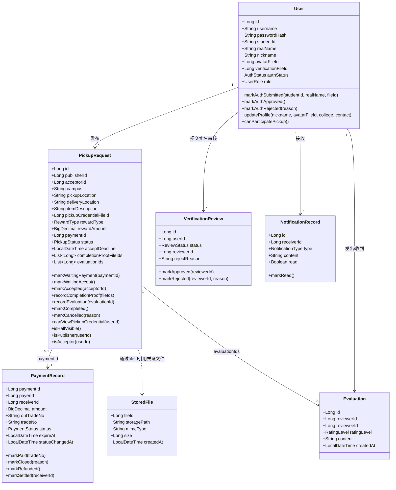
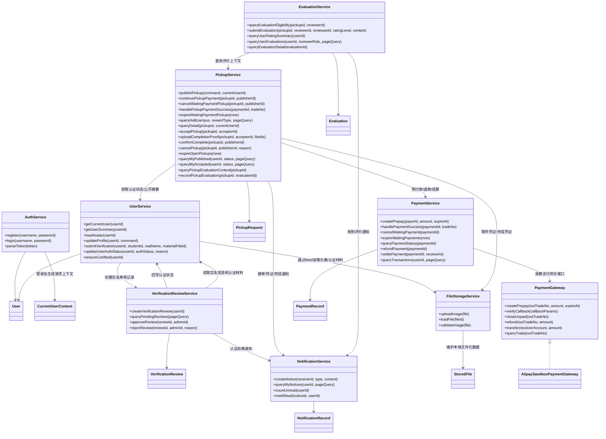
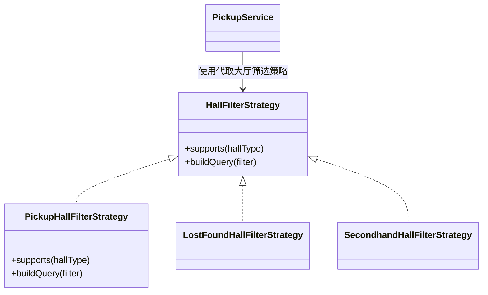
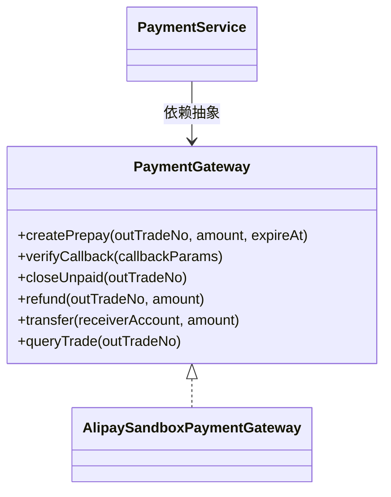

# 核心类图设计 — 校园互助服务平台

**版本：** 3.0  
**日期：** 2026-06-02  
**团队：** true就是队  
**状态：** P4 回溯修订，按 P1 v2.1 与 P2 v1.2 同步收缩

---

## 设计范围说明

本文档用于表达校园互助服务平台在 P3 详细设计阶段的核心类、类之间关系、关键属性和关键方法。它不是后续编码阶段的完整类清单，而是面向作业要求和 MVP 实现边界的核心设计视图。

本次回溯以最新文档为基线：

1. P1 v2.1：Must 范围聚焦用户管理、实名认证审核、代取需求大厅、代取服务闭环、支付宝沙箱支付、文件上传和我的代取记录。
2. P2 v1.2：采用前后端分离 + 后端单体分层架构，后端模块间采用同步内部调用。
3. 评价体系和站内通知为 Should，保留类与接口位置，但不作为代取闭环的阻断能力。
4. 失物招领、二手交易、私聊、举报/申诉为 Could，不进入本版核心类图主线。
5. 论坛、找搭子、咨询问答、真实线上支付、微服务、事件驱动和 MQ 为 Won't，不在 P3 类设计中建模。

---

## 一、核心类图设计

### 1.1 核心领域类关系图



### 1.2 核心服务与模块协作类图



### 1.3 核心类详细定义

#### 方法可见性约定

| 类型 | 调用方 | 作用 |
|------|--------|------|
| 领域类方法 | 仅 Service 层内部调用 | 维护领域对象自身状态和少量展示规则，不作为 Controller 或其他模块入口 |
| 服务类方法 | Controller 层或其他业务模块调用 | 表达完整业务用例，负责权限校验、状态校验和跨模块协作 |

后续表格中的 `mark...`、`record...` 等领域类方法均为内部状态变更方法，`can...`、`is...` 等领域类方法用于表达对象自身规则；`publish...`、`accept...`、`confirm...`、`query...` 等服务类方法才是业务入口。

#### User（用户）

| 属性 | 类型 | 说明 |
|------|------|------|
| id | Long | 主键，自增 |
| username | String | 登录账号，平台内唯一 |
| passwordHash | String | BCrypt 等算法生成的密码哈希，禁止明文存储 |
| studentId | String | 学号，认证后保存，普通用户页面不公开 |
| realName | String | 真实姓名，仅用于实名认证和管理员审核 |
| nickname | String | 公开展示昵称，可修改，可重复 |
| avatarFileId | Long | 头像文件标识 |
| verificationFileId | Long | 实名认证材料照片文件标识；MVP 支持一张校园卡或学生证照片 |
| college | String | 学院，选填 |
| contact | String | 联系方式，选填；未填写时不展示 |
| authStatus | AuthStatus(Enum) | 未认证/审核中/已通过/已驳回 |
| role | UserRole(Enum) | 普通用户/管理员 |
| createdAt | LocalDateTime | 注册时间 |

| 方法 | 说明 |
|------|------|
| markAuthSubmitted(studentId, realName, verificationFileId) | 保存实名信息和认证材料，进入审核中 |
| markAuthApproved() | 认证状态变为已通过 |
| markAuthRejected(reason) | 认证状态变为已驳回 |
| updateProfile(nickname, avatarFileId, college, contact) | 更新公开资料 |
| canParticipatePickup() | 判断用户认证状态是否允许参与代取服务；供服务层内部校验使用 |

#### CurrentUserContext（当前用户上下文）

| 属性 | 类型 | 说明 |
|------|------|------|
| currentUserId | Long | 当前登录用户 ID |
| role | UserRole(Enum) | 当前用户角色 |
| authStatus | AuthStatus(Enum) | 当前用户认证状态 |

> JWT 拦截器解析 Token 后生成 `CurrentUserContext`。业务服务只从上下文读取身份，不直接信任前端传入的用户 ID。

#### UserSummary（公开用户摘要）

| 属性 | 类型 | 说明 |
|------|------|------|
| userId | Long | 用户 ID |
| nickname | String | 公开昵称 |
| ratingSummary | RatingSummary | 评价统计摘要，可为空，来自评价模块 |

> 其他业务模块展示发布者、接单方或被评价方时，只使用 `UserSummary`，不得暴露学号、姓名、认证材料和文件标识。文件模块不对前端暴露通用读取接口；头像图片由前端按 `userId` 调用用户模块头像业务接口读取，用户模块完成业务权限判断后再调用 `FileStorageService.loadFile(fileId)`。

#### VerificationReview（实名认证审核记录）

| 属性 | 类型 | 说明 |
|------|------|------|
| id | Long | 审核记录主键 |
| userId | Long | 申请认证的用户 ID |
| status | ReviewStatus(Enum) | 待审核/已通过/已驳回 |
| reviewerId | Long | 处理管理员 ID |
| rejectReason | String | 驳回原因 |
| createdAt | LocalDateTime | 创建时间 |
| reviewedAt | LocalDateTime | 审核时间 |

> 实名信息和认证材料归用户模块维护，`VerificationReview` 只保存审核流程元数据。管理员查看审核详情时，实名认证审核服务通过 `UserService` 读取用户模块中的 `studentId`、`realName` 和 `verificationFileId`，再由用户模块按权限读取认证材料文件。

| 方法 | 说明 |
|------|------|
| markApproved(reviewerId) | 记录审核通过结果 |
| markRejected(reviewerId, reason) | 记录审核驳回结果 |

#### PickupRequest（代取服务请求）

| 属性 | 类型 | 说明 |
|------|------|------|
| id | Long | 代取服务主键 |
| publisherId | Long | 发布方用户 ID |
| acceptorId | Long | 接单方用户 ID，未接单时为空 |
| campus | String | 校区，用于大厅筛选 |
| pickupLocation | String | 取件地点 |
| deliveryLocation | String | 送达地点 |
| itemDescription | String | 物品描述 |
| pickupCredentialFileId | Long | 取件凭证图片文件标识，接单前不公开 |
| rewardType | RewardType(Enum) | 有报酬/无报酬 |
| rewardAmount | BigDecimal | 有报酬服务必填，范围 1-200 元；无报酬服务为空 |
| paymentId | Long | 支付记录标识，无报酬服务为空 |
| status | PickupStatus(Enum) | 待支付/待接单/进行中/已完成/已取消 |
| acceptDeadline | LocalDateTime | 接单截止时间 |
| acceptedAt | LocalDateTime | 接单时间 |
| completionProofFileIds | List<Long> | 完成凭证图片文件标识，接单方上传 |
| evaluationIds | List<Long> | 该代取服务关联的评价记录 ID，最多两条 |
| completedAt | LocalDateTime | 完成时间 |
| cancelReason | String | 取消原因 |
| createdAt | LocalDateTime | 发布时间 |

| 方法 | 说明 |
|------|------|
| markWaitingPayment(paymentId) | 有报酬服务发布后进入待支付；支付过期时间由支付记录维护 |
| markWaitingAccept() | 无报酬服务发布成功或有报酬服务支付成功后进入待接单 |
| markAccepted(acceptorId) | 记录接单方并进入进行中 |
| recordCompletionProof(fileIds) | 保存完成凭证图片标识 |
| recordEvaluation(evaluationId) | 记录该代取服务关联的一条评价 ID |
| markCompleted() | 发布方确认完成后进入已完成 |
| markCancelled(reason) | 服务取消或超时后进入已取消 |
| canViewPickupCredential(userId) | 仅接单方在接单成功后可查看取件凭证 |
| isHallVisible() | 仅待接单状态可进入代取需求大厅 |
| isPublisher(userId) | 判断用户是否为该代取服务发布方；供服务层内部校验使用 |
| isAcceptor(userId) | 判断用户是否为该代取服务接单方；供服务层内部校验使用 |

#### PaymentRecord（支付记录）

| 属性 | 类型 | 说明 |
|------|------|------|
| paymentId | Long | 支付记录主键 |
| payerId | Long | 付款方，即代取发布方 |
| receiverId | Long | 收款方，即接单方；结算前可为空 |
| amount | BigDecimal | 支付金额 |
| outTradeNo | String | 平台生成的商户订单号 |
| tradeNo | String | 支付宝沙箱交易号 |
| status | PaymentStatus(Enum) | 内部设计状态：待支付/已支付/已关闭/已退款/已结算 |
| expireAt | LocalDateTime | 支付有效期截止时间 |
| closeReason | String | 关闭原因，例如发布方取消或支付超时 |
| statusChangedAt | LocalDateTime | 最近一次支付状态变更时间 |
| createdAt | LocalDateTime | 创建时间 |

| 方法 | 说明 |
|------|------|
| markPaid(tradeNo) | 标记预付款已支付 |
| markClosed(reason) | 待支付记录未完成付款时关闭；覆盖发布方取消和支付超时两种来源 |
| markRefunded() | 服务取消且已预付款时标记退款 |
| markSettled(receiverId) | 发布方确认完成后标记结算 |

> `PaymentStatus` 不是 P1 直接规定的业务状态，而是 P3 根据 P1/P2 中“预付款、关闭未支付、退款、结算”这些支付动作派生出的内部实现状态。支付接口调用失败、回调验签失败或第三方异常不作为支付记录的稳定业务状态保存，按错误码和关键操作日志处理。P1 明确规定的代取业务状态仍以 `PickupStatus` 为准。支付模块不保存 `pickupRequestId`，业务对象与支付记录的关联由 `PickupRequest.paymentId` 维护，避免支付模块反向依赖具体业务类型。待支付过期时间只保存在支付记录 `expireAt` 中，代取服务不重复保存；退款和结算时间如需展示，可使用 `statusChangedAt` 或关键操作日志追溯。

#### StoredFile（文件资源）

| 属性 | 类型 | 说明 |
|------|------|------|
| fileId | Long | 文件标识 |
| storagePath | String | 服务器本地存储路径 |
| mimeType | String | 文件类型 |
| size | Long | 文件大小 |
| createdAt | LocalDateTime | 上传时间 |

> `StoredFile` 是文件元数据记录，不承担业务方法。文件模块的方法由 `FileStorageService` 提供。文件模块只负责本地存储元数据、格式大小校验和文件内容读取，不保存上传者、业务用途或业务归属。头像、认证材料、取件凭证和完成凭证等归属关系由对应业务对象保存文件标识来表达。业务模块必须先鉴权，再调用 `FileStorageService.loadFile(fileId)`。

#### Evaluation（评价，Should）

| 属性 | 类型 | 说明 |
|------|------|------|
| id | Long | 评价主键 |
| reviewerId | Long | 评价者 ID |
| revieweeId | Long | 被评价者 ID |
| ratingLevel | RatingLevel(Enum) | 好评/中评/差评 |
| content | String | 评价内容；差评必填 |
| createdAt | LocalDateTime | 创建时间 |

> 评价记录只保存评价双方、评价等级和内容，不直接保存被评价服务 ID。代取服务通过 `PickupRequest.evaluationIds` 维护与评价记录的关联。

#### RatingSummary（评价统计摘要，Should）

| 属性 | 类型 | 说明 |
|------|------|------|
| userId | Long | 被统计用户 ID |
| publisherReviewerSummary | RatingRoleSummary | 来自发布方的评价统计 |
| acceptorReviewerSummary | RatingRoleSummary | 来自接单方的评价统计 |

#### RatingRoleSummary（按评价者角色统计，Should）

| 属性 | 类型 | 说明 |
|------|------|------|
| reviewerRole | PickupParticipantRole(Enum) | 评价者在代取服务中的角色：发布方/接单方 |
| positiveCount | Integer | 该角色给出的好评数量 |
| neutralCount | Integer | 该角色给出的中评数量 |
| negativeCount | Integer | 该角色给出的差评数量 |
| totalCount | Integer | 该角色给出的评价总数 |
| positiveRate | BigDecimal | 该角色评价的好评率，计算公式为好评数 / 评价总数 |

#### EvaluationHistorySummary（历史评价总览项，Should）

| 属性 | 类型 | 说明 |
|------|------|------|
| evaluationId | Long | 评价 ID |
| reviewerRoleInPickup | PickupParticipantRole(Enum) | 评价者在该代取服务中的角色：发布方/接单方 |
| ratingLevel | RatingLevel(Enum) | 好评/中评/差评 |
| contentPreview | String | 评价内容预览 |
| createdAt | LocalDateTime | 评价时间 |

#### EvaluationDetail（评价详情，Should）

| 属性 | 类型 | 说明 |
|------|------|------|
| evaluationId | Long | 评价 ID |
| reviewerNickname | String | 评价者昵称 |
| reviewerRoleInPickup | PickupParticipantRole(Enum) | 评价者在该代取服务中的角色：发布方/接单方 |
| pickupSummary | String | 关联代取服务摘要，例如取件地点到送达地点 |
| ratingLevel | RatingLevel(Enum) | 好评/中评/差评 |
| content | String | 完整评价内容 |
| createdAt | LocalDateTime | 评价时间 |

#### NotificationRecord（站内通知，Should）

| 属性 | 类型 | 说明 |
|------|------|------|
| id | Long | 通知主键 |
| receiverId | Long | 接收用户 ID |
| type | NotificationType(Enum) | 认证结果/接单/完成凭证/确认完成/收到评价 |
| content | String | 通知内容摘要 |
| read | Boolean | 是否已读 |
| createdAt | LocalDateTime | 创建时间 |
| readAt | LocalDateTime | 阅读时间 |

| 方法 | 说明 |
|------|------|
| markRead() | 标记为已读 |

### 1.4 核心业务服务类

#### AuthService（认证服务）

| 方法 | 说明 |
|------|------|
| register(username, password) | 用户名密码注册，校验用户名唯一，保存密码哈希 |
| login(username, password) | 用户名密码登录，用户存在且密码正确时签发 JWT |
| parseToken(token) | 解析 JWT 并生成 `CurrentUserContext` |

#### UserService（用户服务）

| 方法 | 说明 |
|------|------|
| getCurrentUser(userId) | 查询当前用户完整信息 |
| getUserSummary(userId) | 返回公开用户摘要，不包含实名信息 |
| loadAvatar(userId) | 通过用户模块读取头像文件；内部根据 `avatarFileId` 调用文件存储模块 |
| updateProfile(userId, command) | 编辑头像、昵称、学院和联系方式 |
| submitVerification(userId, studentId, realName, materialFileId) | 保存实名信息和认证材料，并创建仅关联 `userId` 的实名认证审核记录 |
| updateUserAuthStatus(userId, authStatus, reason) | 管理员审核后回写用户认证状态 |
| ensureCertified(userId) | 校验用户是否已认证且账号正常 |

#### VerificationReviewService（实名认证审核服务）

| 方法 | 说明 |
|------|------|
| createVerificationReview(userId) | 用户提交认证后创建待审核记录；审核记录不复制实名字段和材料文件标识 |
| queryPendingReviews(pageQuery) | 管理员分页查询待审核实名认证申请 |
| approveReview(reviewId, adminId) | 审核通过，回写用户认证状态，并创建通知 |
| rejectReview(reviewId, adminId, reason) | 审核驳回，回写用户认证状态和原因，并创建通知 |

#### PickupService（代取服务）

`PickupService` 负责身份、权限、状态校验、支付、文件和通知等模块协作。代取服务状态较少，且业务动作已经由服务方法明确表达，因此不额外引入状态模式；各方法内部按 `PickupStatus` 进行必要状态校验。

| 方法 | 说明 |
|------|------|
| publishPickup(command, currentUserId) | 发布代取服务；认证用户才能发布。有报酬服务创建待支付锁单和预付款入口；无报酬服务直接进入待接单 |
| continuePickupPayment(pickupId, publisherId) | 发布方在待支付状态继续支付，返回支付入口 |
| cancelWaitingPaymentPickup(pickupId, publisherId) | 发布方取消待支付服务，关闭未支付记录，不触发退款 |
| handlePickupPaymentSuccess(paymentId, tradeNo) | 支付成功后将对应代取服务推进到待接单 |
| expireWaitingPaymentPickups(now) | 扫描 3 分钟待支付超时服务并取消 |
| queryHall(campus, rewardType, pageQuery) | 查询代取需求大厅，只返回待接单服务，支持校区和报酬类型筛选，按发布时间倒序 |
| queryDetail(pickupId, currentUserId) | 查询详情；接单前不返回取件凭证 |
| acceptPickup(pickupId, acceptorId) | 认证用户接单；接单方不得是发布方；成功后进入进行中 |
| uploadCompletionProof(pickupId, acceptorId, fileIds) | 接单方上传完成凭证 |
| confirmComplete(pickupId, publisherId) | 发布方确认完成；有报酬服务触发结算，无报酬服务不处理资金 |
| cancelPickup(pickupId, publisherId, reason) | 发布方取消待支付或待接单服务；已预付款时触发退款 |
| expireOpenPickups(now) | 扫描超过接单截止时间仍无人接单的服务并取消 |
| queryMyPublished(userId, status, pageQuery) | 查询我的发布，支持按状态分类 |
| queryMyAccepted(userId, status, pageQuery) | 查询我的接单，支持按状态分类 |
| queryPickupEvaluationContext(pickupId) | 向评价模块提供发布方、接单方和服务状态 |
| recordPickupEvaluation(pickupId, evaluationId) | 评价提交成功后，记录代取服务关联的评价 ID |

#### PaymentService（支付服务）

`PaymentService` 只维护平台内部支付记录和支付状态，不理解具体业务对象。外部支付细节由 `PaymentGateway` 适配，MVP 实现为 `AlipaySandboxPaymentGateway`。

| 方法 | 说明 |
|------|------|
| createPrepay(payerId, amount, expireAt) | 创建支付宝沙箱预付款入口，返回 `paymentId`、支付入口和过期时间 |
| handlePaymentSuccess(paymentId, tradeNo) | 处理支付宝沙箱支付成功通知，标记支付记录已支付 |
| cancelWaitingPayment(paymentId) | 关闭尚未支付的支付记录 |
| expireWaitingPayments(now) | 关闭超时仍未支付的支付记录，关闭原因记录为支付超时 |
| queryPaymentStatus(paymentId) | 查询支付记录状态 |
| refundPayment(paymentId) | 已预付款服务取消时执行退款 |
| settlePayment(paymentId, receiverId) | 发布方确认完成后向接单方结算 |
| queryTransactions(userId, pageQuery) | 查询用户支付、退款和结算记录 |

#### FileStorageService（文件存储服务）

| 方法 | 说明 |
|------|------|
| uploadImage(file) | 校验 JPG/PNG 和大小限制，保存本地文件并返回文件标识 |
| loadFile(fileId) | 根据文件标识读取文件内容和 MIME 类型 |
| validateImage(file) | 校验图片格式和大小 |

#### EvaluationService（评价服务，Should）

| 方法 | 说明 |
|------|------|
| queryEvaluationEligibility(pickupId, reviewerId) | 查询当前用户对某代取服务是否可评价 |
| submitEvaluation(pickupId, reviewerId, revieweeId, ratingLevel, content) | 提交评价；后端重新校验服务已完成、双方属于该服务且未重复评价；创建评价后调用代取服务记录评价 ID |
| queryUserRatingSummary(userId) | 分别计算来自发布方和来自接单方的好评率、好评数、中评数、差评数和评价总数 |
| queryUserEvaluations(userId, reviewerRole, pageQuery) | 分页查询用户收到的历史评价总览，可按评价者是发布方或接单方筛选展示，返回 `EvaluationHistorySummary` 列表 |
| queryEvaluationDetail(evaluationId) | 查询单条评价详情，返回 `EvaluationDetail` |

#### NotificationService（站内通知服务，Should）

| 方法 | 说明 |
|------|------|
| createNotice(receiverId, type, content) | 在认证结果、接单、完成凭证、确认完成和收到评价时创建通知 |
| queryMyNotices(userId, pageQuery) | 分页查询我的通知 |
| countUnread(userId) | 查询未读通知数量 |
| markRead(noticeId, userId) | 标记指定通知为已读 |

### 1.5 可选功能扩展说明

| 功能 | P1 优先级 | 类设计处理方式 |
|------|-----------|----------------|
| 关键词搜索 | Could | 可在 `PickupService.queryHall` 中增加 keyword 条件，不改变核心类结构 |
| 失物招领 | Could | 后续可新增 `LostFoundItem` 和 `LostFoundService`，但不进入当前核心类图主线 |
| 二手交易 | Could | 后续可新增 `SecondhandItem` 和 `SecondhandService`，不接入平台支付 |
| 私聊 | Could | 后续可新增 `Conversation`、`Message` 和 `ConversationService`；当前通知不使用 WebSocket |
| 举报、封禁、评价撤回、评价申诉、代取异常申诉 | Could | 后续可新增管理记录模型或评价状态字段；当前 Must 管理能力仅保留实名认证审核 |

---

## 二、SOLID 检查实验

### 2.1 实验流程

1. 向 AI 提供 P1 需求文档和 P2 架构设计，让其生成完整类图。
2. 团队对照 SOLID 原则逐条审查 AI 生成的设计。
3. 根据最新 P1 v2.1 和 P2 v1.2 重新修正类边界。

### 2.2 SOLID 逐条检查清单

| SOLID 原则 | 检查问题 | AI 设计是否违反 | 违反说明 | 修正方案 |
|-----------|---------|--------------|---------|---------|
| S - 单一职责 | 是否存在一个类同时处理多类业务？ | 是 | AI 初稿使用通用 `Task` 承载代取、失物招领、二手交易、找搭子、问答等业务，导致一个类同时承担服务履约、内容展示、交易和社交职责 | 删除全局 `Task` 基类。本版只保留 Must 的 `PickupRequest`；Could 功能以后独立建模 |
| S - 单一职责 | 用户类是否混入支付或评价统计逻辑？ | 是 | AI 初稿让 `User` 直接计算报酬、冻结资金和好评率，导致身份信息与业务统计耦合 | `User` 只负责身份、资料和认证状态；支付交给 `PaymentService`，评价统计交给 `EvaluationService` |
| O - 开闭原则 | 新增业务类型是否需要修改既有核心类？ | 是 | AI 初稿用 `type` 字段和大量 switch 区分业务类型，新增类型要改公共类和服务分支 | 当前核心类只建模代取；后续新增失物招领、二手交易时新增独立领域类和服务，不修改代取状态逻辑 |
| L - 里氏替换 | 子类能否自然替换父类？ | 是 | AI 初稿让不同业务继承同一个 `Task`，但许多字段只对某个子类有效，产生大量空字段和非法行为 | 不再强行抽象跨业务父类。`PickupRequest` 独立表达代取履约闭环 |
| I - 接口隔离 | 是否存在过胖服务接口？ | 是 | AI 初稿设计 `IPlatformService` 或 `ITaskService`，同时包含注册、发布、接单、评价、聊天、举报等方法 | 按模块拆为 `AuthService`、`UserService`、`PickupService`、`PaymentService`、`FileStorageService`、`EvaluationService`、`NotificationService` |
| D - 依赖倒转 | 业务服务是否直接依赖第三方或底层实现？ | 是 | AI 初稿让代取服务直接调用支付宝 SDK 和本地文件路径，业务流程依赖低层细节 | `PaymentService` 依赖 `PaymentGateway` 抽象，由 `AlipaySandboxPaymentGateway` 适配；文件读取通过 `FileStorageService` 接口 |
| D - 依赖倒转 | 高层模块是否直接理解低层数据表结构？ | 是 | AI 初稿在支付记录中保存具体 `taskId/orderId` 并让支付模块理解业务对象 | 支付模块只维护支付记录，`PickupRequest.paymentId` 维护业务到支付的关联 |

### 2.3 修正统计

| 统计项 | 数量 |
|--------|------|
| AI 原始设计中的核心类数 | 12 |
| 违反 SOLID 原则的类或接口 | 6 |
| 发现的问题点 | 7 |
| 已修正 | 7 |

### 2.4 重点问题分析

**最严重问题：** AI 倾向于把旧范围下的所有校园互助功能合并成一个“万能任务模型”，并用 `type` 字段区分业务。

```java
// AI 原始设计倾向：违反 SRP/OCP/LSP
class Task {
    TaskType type;              // PICKUP, LOST_FOUND, SECONDHAND, MATCH, QA...
    BigDecimal rewardAmount;    // 仅代取有效
    String pickupLocation;      // 仅代取有效
    BigDecimal price;           // 仅二手有效
    Integer maxParticipants;    // 仅找搭子有效
    String questionCategory;    // 仅问答有效
}
```

人工修正后的设计不再追求“一个父类覆盖所有业务”。P1 v2.1 的 Must 范围只有代取闭环，因此核心类图直接围绕 `PickupRequest` 展开；评价和通知作为 Should 模块保留接口位置；Could 功能作为未来扩展独立建模。

---

## 三、设计模式应用

### 3.1 策略模式 — 大厅列表筛选规则

**应用场景：** 代取需求大厅当前支持校区筛选、报酬类型筛选和发布时间倒序。后续如果增加关键词搜索，或失物招领、二手交易重新进入范围，不同大厅的筛选条件会不同。可以把“如何把查询条件转换为列表过滤规则”抽成策略，避免在列表查询方法中堆大量条件分支。



**为什么用：**

1. 当前只需要 `PickupHallFilterStrategy`，负责待接单代取服务的校区、报酬类型和发布时间倒序规则。
2. 后续增加关键词搜索时，可以扩展代取筛选策略，不影响发布、接单和支付流程。
3. 后续如果新增失物招领或二手交易大厅，可以新增对应策略，而不是在同一个列表查询方法里写业务类型分支。

**不用会怎样：**

大厅列表查询会逐渐堆积 `if hallType == ...`、`if rewardType == ...`、`if keyword != null` 等分支，后续新增大厅类型时容易影响已有代取列表逻辑。

### 3.2 适配器模式 — 支付宝沙箱支付适配

**应用场景：** MVP 使用支付宝沙箱验证有报酬代取服务的预付款、退款和结算流程。支付宝 SDK 的参数、回调验签、返回码和异常形式都属于外部系统细节，业务层不应直接依赖。

**类结构：**



**为什么用：**

1. `PaymentService` 只表达平台内部支付语义：创建预付款、支付成功、关闭待支付、退款、结算和查询。
2. `AlipaySandboxPaymentGateway` 负责把支付宝沙箱 SDK 的输入输出转换成平台内部结构。
3. 后续从支付宝沙箱切换到模拟支付或正式支付宝时，只需要替换 `PaymentGateway` 实现。
4. 符合依赖倒转原则：业务层依赖支付网关抽象，而不是第三方 SDK 具体类。

**不用会怎样：**

支付宝 SDK 调用、回调验签和返回码判断会散落在 `PaymentService` 或 `PickupService` 中。第三方接口变化时会直接影响核心业务流程，测试范围明显扩大。

## 四、与最新需求的追踪关系

| P1 需求 | 类设计覆盖 |
|---------|------------|
| FR-UM-01 | `AuthService.register/login`、`User.username/passwordHash` |
| FR-UM-02 | `UserService.updateProfile`、`User.avatarFileId/college/contact` |
| FR-UM-03 | `UserSummary` 隔离公开字段；实名信息仅用户模块和实名认证审核流程可访问 |
| FR-UM-04~07 | `User.submitVerification`、`VerificationReviewService`、`User.authStatus` |
| FR-UM-08 | `UserService.ensureCertified`、`CurrentUserContext` |
| FR-HALL-01~06 | `PickupService.queryHall`、`PickupRequest.isHallVisible`、`PickupStatus.WAITING_ACCEPT` |
| FR-PU-01~02 | `PickupRequest` 字段和 `publishPickup` 校验 |
| FR-PU-03~04 | `PaymentService.createPrepay`、`PickupRequest.markWaitingAccept` |
| FR-PU-05~06 | `PickupService.acceptPickup`、`PickupRequest.canViewPickupCredential` |
| FR-PU-07~08 | `uploadCompletionProof`、`confirmComplete`、`PaymentService.settlePayment` |
| FR-PU-09~11 | `PickupStatus` 状态校验、`cancelPickup`、`expireWaitingPaymentPickups`、`expireOpenPickups` |
| FR-PU-12 | `queryMyPublished`、`queryMyAccepted` |
| FR-CR-01~04 | `Evaluation`、`RatingSummary`、`RatingRoleSummary`、`EvaluationHistorySummary`、`EvaluationDetail`、`EvaluationService`，作为 Should 模块 |
| FR-NT-01~02 | `NotificationRecord`、`NotificationService`，作为 Should 模块 |
