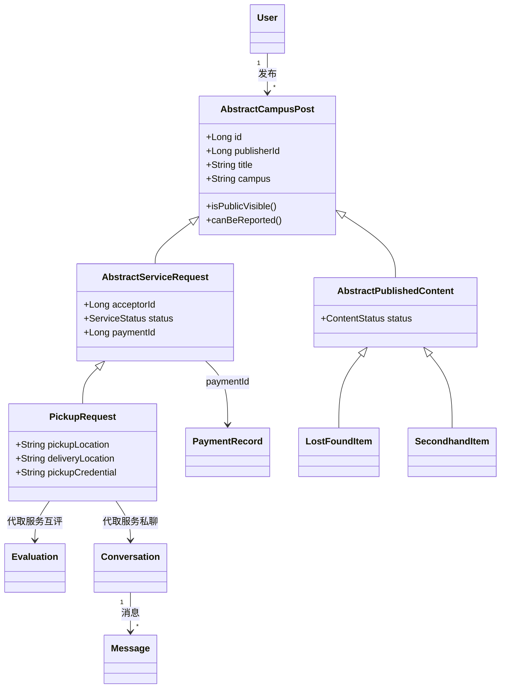
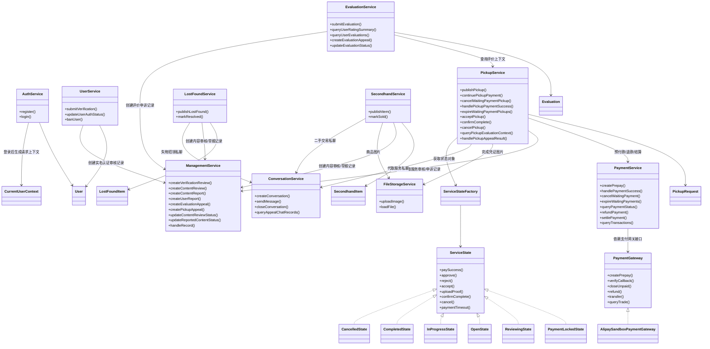
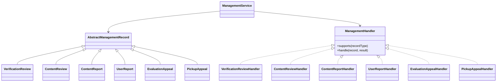

# 核心类图设计 — 校园互助服务平台

**版本：** 2.1
**日期：** 2026-06-01
**团队：** true就是队

---

## 设计范围说明

本文档的类图用于表达校园互助服务平台在详细设计阶段的核心类、类之间的关系、关键属性和关键方法，不等同于后续编码阶段的完整类清单。

结合 P2 已确定的单体分层架构，本文档重点描述三类设计对象：

1. 承载业务数据和状态的核心领域类。
2. 承载主要业务流程的服务类。
3. 表达模块协作边界的接口或值对象。

---

## 一、核心类图设计

### 1.1 核心领域类关系图



### 1.2 核心服务与模块协作类图



管理模块内部使用 `ManagementHandler` 处理器分发不同管理记录：



### 1.3 核心类详细定义

#### User（用户）

| 属性 | 类型 | 说明 |
|------|------|------|
| id | Long | 主键，自增 |
| username | String | 登录账号，平台内唯一，不作为公开展示名 |
| password | String | BCrypt加密存储 |
| studentId | String | 学号（脱敏显示，不公开） |
| realName | String | 真实姓名 |
| nickname | String | 公开展示昵称，可修改，可重复 |
| avatarFileId | Long | 头像文件标识 |
| verificationFileId | Long | 实名认证材料照片文件标识；MVP阶段仅支持上传一张校园卡/学生证照片 |
| bio | String | 个性签名 |
| authStatus | AuthStatus(Enum) | 未认证/审核中/已通过/已驳回 |
| accountStatus | AccountStatus(Enum) | 正常/已封禁 |
| role | Enum | 普通用户/管理员 |
| createdAt | LocalDateTime | 注册时间 |

| 方法 | 说明 |
|------|------|
| markAuthSubmitted(studentId, realName, verificationFileId) | 记录学号、姓名和单张实名认证材料照片，并进入审核中状态 |
| markAuthApproved() | 将实名认证状态标记为已通过 |
| markAuthRejected(reason) | 将实名认证状态标记为已驳回 |
| ban(reason) | 将账号状态标记为已封禁 |
| updateProfile(nickname, avatarFileId, bio) | 编辑个人资料 |

#### CurrentUserContext（当前用户上下文）

| 属性 | 类型 | 说明 |
|------|------|------|
| currentUserId | Long | 当前登录用户ID |
| role | Enum | 当前用户角色 |
| authStatus | AuthStatus(Enum) | 当前用户认证状态 |
| accountStatus | AccountStatus(Enum) | 当前用户账号状态 |

#### AuthService（认证服务）

| 方法 | 说明 |
|------|------|
| register(username, password) | 用户名和密码注册；MVP阶段不接入短信验证码，图形验证码作为后续安全增强 |
| login(username, password) | 用户名和密码登录，成功后签发JWT |

#### UserService（用户服务）

| 方法 | 说明 |
|------|------|
| submitVerification(userId, studentId, realName, verificationFileId) | 用户提交学号、姓名和单张实名认证材料照片，并调用管理模块创建认证审核记录 |
| updateUserAuthStatus(userId, authStatus) | 管理模块处理认证审核后回写用户认证状态 |
| banUser(userId, reason) | 管理模块根据处理结论封禁账号 |
| updateProfile(userId, nickname, avatarFileId, bio) | 用户编辑个人资料 |
| reportUser(targetUserId, reporterId, reason) | 用户举报可疑账号，并调用管理模块创建用户举报记录 |

#### AbstractCampusPost（校园发布项抽象类）

| 属性 | 类型 | 说明 |
|------|------|------|
| id | Long | 发布项主键 |
| publisherId | Long | 发布者用户ID |
| title | String | 列表和详情页展示标题 |
| description | String | 内容描述 |
| campus | String | 校区，用于板块内筛选 |
| createdAt | LocalDateTime | 创建时间 |
| updatedAt | LocalDateTime | 更新时间 |

| 方法 | 说明 |
|------|------|
| isPublicVisible() | 判断发布项是否可在对应板块公开展示 |
| canBeReported() | 判断发布项是否允许被举报 |

#### AbstractServiceRequest（服务请求抽象类 extends AbstractCampusPost）

| 属性 | 类型 | 说明 |
|------|------|------|
| acceptorId | Long | 接单方用户ID，未接单时为空 |
| rewardType | Enum | 报酬类型：有报酬/无报酬 |
| rewardAmount | BigDecimal | 报酬金额，有报酬服务必填，金额范围1-200元；无报酬服务为空 |
| paymentId | Long | 支付记录标识，无报酬服务为空 |
| status | ServiceStatus(Enum) | 待支付/审核中/待接单/进行中/已完成/已取消 |
| paymentExpireAt | LocalDateTime | 待支付状态的支付过期时间，仅有报酬服务使用 |
| acceptDeadline | LocalDateTime | 接单截止时间 |
| acceptedAt | LocalDateTime | 接单时间 |
| completedAt | LocalDateTime | 完成时间 |
| proofFileIds | List\<Long\> | 完成凭证图片文件标识 |

| 方法 | 说明 |
|------|------|
| markPaymentLocked(paymentId, expireAt) | 将有报酬服务请求标记为待支付，记录支付记录标识和支付过期时间 |
| markReviewing() | 将服务请求标记为审核中 |
| markOpen() | 将审核通过的服务请求标记为待接单 |
| markRejected(reason) | 将审核驳回的服务请求标记为已取消 |
| markAccepted(acceptorId) | 记录接单方并将服务请求标记为进行中 |
| recordCompletionProof(fileIds) | 保存完成凭证图片标识 |
| markCompleted() | 将服务请求标记为已完成 |
| markCancelled(reason) | 将服务请求标记为已取消 |
| markPaymentTimeoutCancelled() | 待支付超时未完成支付时，将服务请求标记为已取消 |

> MVP阶段不单独建立接单历史类。当前接单关系由 `acceptorId`、`acceptedAt` 和 `status` 表达；接单、取消接单等历史先通过操作日志和代取服务异常申诉记录追溯。后续如需要统计接单取消率或做风控，再扩展 `ServiceAcceptance` 等接单记录模型。

#### PickupRequest（代取服务请求 extends AbstractServiceRequest）

| 属性 | 类型 | 说明 |
|------|------|------|
| pickupLocation | String | 取件地点 |
| deliveryLocation | String | 送达地点 |
| itemDescription | String | 物品描述 |
| pickupCredential | String | 取件凭证，列表和接单前详情不可见，接单成功后仅接单方可见 |

| 方法 | 说明 |
|------|------|
| canViewPickupCredential(userId) | 判断用户是否为当前接单方，决定是否可查看取件凭证 |

#### ServiceState（代取服务状态接口）

> 状态模式仅用于代取服务 `ServiceStatus`。认证、普通互助内容、评价、私聊和支付记录等状态仍使用普通枚举，因为这些状态的行为差异较少，引入状态类会造成过度设计。`AbstractServiceRequest.status` 仍作为持久化状态字段，运行时由 `ServiceStateFactory` 根据该枚举获取对应状态对象。

| 方法 | 说明 |
|------|------|
| paySuccess(request) | 处理待支付服务支付成功后的状态推进；仅 `PaymentLockedState` 允许 |
| approve(request) | 管理员审核通过；仅 `ReviewingState` 允许 |
| reject(request, reason) | 管理员审核驳回；仅 `ReviewingState` 允许 |
| accept(request, acceptorId) | 用户接单；仅 `OpenState` 允许 |
| uploadProof(request, fileIds) | 接单方上传完成凭证；仅 `InProgressState` 允许 |
| confirmComplete(request) | 发布方确认完成；仅 `InProgressState` 且已上传凭证时允许 |
| cancel(request, reason) | 按当前状态执行取消；待支付、审核中、待接单允许发布者取消，进行中取消需走异常申诉或接单方取消接单规则 |
| paymentTimeout(request) | 待支付超时取消；仅 `PaymentLockedState` 允许 |

#### ServiceStateFactory（代取服务状态工厂）

| 方法 | 说明 |
|------|------|
| getState(status) | 根据 `ServiceStatus` 返回对应 `ServiceState`：`PaymentLockedState`、`ReviewingState`、`OpenState`、`InProgressState`、`CompletedState`、`CancelledState` |

#### 代取服务状态实现类

| 类 | 适用状态 | 主要职责 |
|------|------|------|
| PaymentLockedState | 待支付 | 允许继续支付、支付成功进入审核中、发布者取消、支付超时取消；不允许接单和公开展示 |
| ReviewingState | 审核中 | 允许管理员审核通过进入待接单、审核驳回进入已取消、发布者取消；不允许接单 |
| OpenState | 待接单 | 允许其他认证用户接单进入进行中、发布者取消、接单截止超时取消 |
| InProgressState | 进行中 | 允许接单方上传完成凭证、发布方确认完成、接单方取消接单退回待接单、双方发起异常申诉 |
| CompletedState | 已完成 | 禁止取消、接单和继续发送私聊；允许评价入口展示 |
| CancelledState | 已取消 | 禁止继续业务操作；不在公开列表展示 |

#### AbstractPublishedContent（普通发布内容抽象类）

| 属性 | 类型 | 说明 |
|------|------|------|
| status | ContentStatus(Enum) | 审核中/已发布/已结束/已驳回/已删除 |

| 方法 | 说明 |
|------|------|
| markReviewing() | 将内容标记为审核中 |
| markPublished() | 将审核通过的内容标记为已发布 |
| markRejected(reason) | 将审核驳回的内容标记为已驳回 |
| withdraw() | 发布者撤回内容，进入已删除状态 |
| markEnded() | 发布者结束内容，进入已结束状态 |

#### LostFoundItem（失物招领 extends AbstractPublishedContent）

| 属性 | 类型 | 说明 |
|------|------|------|
| type | Enum | 失物/招领 |
| itemName | String | 物品名称 |
| location | String | 地点 |
| occurredAt | LocalDateTime | 丢失/捡到时间 |
| contactPhone | String | 发布者选填的公开手机号 |

| 方法 | 说明 |
|------|------|
| markResolved() | 找到或归还后标记为已结束 |

#### SecondhandItem（二手商品 extends AbstractPublishedContent）

| 属性 | 类型 | 说明 |
|------|------|------|
| name | String | 商品名称 |
| price | BigDecimal | 价格 |
| imageFileIds | List\<Long\> | 商品图片文件标识 |
| tradeLocation | String | 交易地点 |

| 方法 | 说明 |
|------|------|
| markSold() | 商品售出后标记为已结束 |

### 1.4 核心业务服务类

#### PickupService（代取服务）

`PickupService` 负责身份、权限、支付、审核记录等模块协作；代取服务状态相关的允许操作和状态转换由 `ServiceStateFactory.getState(pickup.status)` 返回的 `ServiceState` 实现类处理。

| 方法 | 说明 |
|------|------|
| publishPickup(command, currentUserId) | 发布代取服务；校验发布者认证状态和取件凭证，创建 `PickupRequest`。有报酬服务先调用 `markPaymentLocked(paymentId, expireAt)` 创建发布者可见的待支付锁单和预付款入口，不进入需求大厅和内容审核；支付成功后调用 `markReviewing()` 并创建内容审核记录。无报酬服务不创建支付记录，直接进入审核中并创建内容审核记录 |
| continuePickupPayment(pickupId, publisherId) | 发布者在待支付状态下继续支付；校验发布者身份后，由 `PaymentLockedState` 判断状态合法性并返回原预付款入口或重新生成有效支付入口 |
| cancelWaitingPaymentPickup(pickupId, publisherId, reason) | 发布者在待支付状态下手动取消有报酬代取服务；由 `PaymentLockedState.cancel()` 推进为已取消，并调用 `PaymentService.cancelWaitingPayment(paymentId)`，不触发退款 |
| handlePickupPaymentSuccess(paymentId, tradeNo) | 支付模块确认预付款成功后回调代取服务；由 `PaymentLockedState.paySuccess()` 将代取服务从待支付推进到审核中，并创建内容审核记录 |
| expireWaitingPaymentPickups(now) | 定时扫描待支付且超过支付有效期的代取服务；由 `PaymentLockedState.paymentTimeout()` 将服务标记为已取消 |
| approvePickup(pickupId, adminId) | 管理员审核通过后，由 `ReviewingState.approve()` 将服务标记为待接单 |
| rejectPickup(pickupId, reason, adminId) | 管理员审核驳回后，由 `ReviewingState.reject()` 将服务标记为已取消，有报酬服务触发退款协作 |
| acceptPickup(pickupId, acceptorId) | 校验接单方身份后，由 `OpenState.accept()` 判断服务是否处于待接单并记录接单方 |
| uploadCompletionProof(pickupId, acceptorId, fileIds) | 校验接单方身份后，由 `InProgressState.uploadProof()` 判断状态合法性并记录完成凭证 |
| confirmComplete(pickupId, publisherId) | 校验发布方身份后，由 `InProgressState.confirmComplete()` 判断状态和完成凭证，有报酬服务触发结算协作 |
| cancelPickup(pickupId, publisherId, reason) | 校验发布者身份后，由当前 `ServiceState.cancel()` 按状态执行取消规则，有报酬服务按是否已支付决定是否退款 |
| queryPickupEvaluationContext(pickupId) | 向评价模块提供代取服务发布方、接单方和服务状态 |
| handlePickupAppealResult(pickupId, handleResult) | 管理模块处理代取服务异常申诉后，更新服务状态并触发退款或结算协作 |

#### LostFoundService（失物招领服务）

| 方法 | 说明 |
|------|------|
| publishLostFound(command, currentUserId) | 发布失物或招领信息；创建 `LostFoundItem`，标记为审核中，并调用管理模块创建内容审核记录 |
| approveContent(itemId, adminId) | 审核通过后调用 `markPublished()` |
| rejectContent(itemId, reason, adminId) | 审核驳回后调用 `markRejected(reason)` |
| withdrawContent(itemId, publisherId) | 发布者撤回内容 |
| markResolved(itemId, publisherId) | 发布者标记已解决，内容进入已结束状态 |
| updateContentReviewStatus(itemId, reviewResult) | 管理模块处理审核记录后回写内容状态 |
| updateReportedContentStatus(itemId, handleResult) | 管理模块处理举报后回写内容状态 |

#### SecondhandService（二手交易服务）

| 方法 | 说明 |
|------|------|
| publishItem(command, currentUserId) | 发布二手商品；校验价格和图片数量，创建 `SecondhandItem`，标记为审核中，并调用管理模块创建内容审核记录 |
| approveContent(itemId, adminId) | 审核通过后调用 `markPublished()` |
| rejectContent(itemId, reason, adminId) | 审核驳回后调用 `markRejected(reason)` |
| withdrawContent(itemId, sellerId) | 卖家撤回商品信息 |
| markSold(itemId, sellerId) | 卖家标记商品已出，内容进入已结束状态 |
| updateContentReviewStatus(itemId, reviewResult) | 管理模块处理审核记录后回写内容状态 |
| updateReportedContentStatus(itemId, handleResult) | 管理模块处理举报后回写内容状态 |

#### EvaluationService（评价服务）

| 方法 | 说明 |
|------|------|
| submitEvaluation(pickupId, reviewerId, revieweeId, ratingLevel, content) | 提交代取服务评价；校验服务已完成、评价双方属于该服务且未重复评价 |
| withdrawEvaluation(evaluationId, reviewerId) | 评价者撤回自己发出的评价 |
| queryUserRatingSummary(userId) | 查询用户好评率和评价数量，供用户模块展示个人主页 |
| queryUserEvaluations(userId, pageQuery) | 分页查询用户收到的历史评价记录 |
| createEvaluationAppeal(evaluationId, appellantId, reason) | 用户对评价发起举报/申诉，并调用管理模块创建评价申诉记录 |
| updateEvaluationStatus(evaluationId, handleResult) | 管理模块处理评价申诉后回写评价状态 |

#### PaymentService（支付服务）

`PaymentService` 只编排平台内部支付记录和业务语义，不直接依赖支付宝沙箱SDK。外部支付接口由 `PaymentGateway` 适配，MVP阶段实现类为 `AlipaySandboxPaymentGateway`。

| 方法 | 说明 |
|------|------|
| createPrepay(payerId, amount) | 创建支付宝沙箱预付款入口，返回 `paymentId`、支付入口和支付过期时间 |
| handlePaymentSuccess(paymentId, tradeNo) | 处理支付宝沙箱支付成功通知，校验支付记录仍处于待支付且未过期后调用 `PaymentRecord.markPaid(tradeNo)` |
| cancelWaitingPayment(paymentId) | 发布者取消待支付服务时关闭待支付记录，尚未完成预付款，不触发退款 |
| expireWaitingPayments(now) | 扫描超过支付有效期且仍为待支付的支付记录，调用 `PaymentRecord.markExpired()`，供代取服务模块同步取消锁单 |
| queryPaymentStatus(paymentId) | 查询支付记录当前状态 |
| refundPayment(paymentId) | 执行退款并更新支付状态 |
| settlePayment(paymentId, receiverId) | 执行结算并更新支付状态 |
| queryTransactions(userId, pageQuery) | 查询用户支付、转账、退款记录 |

#### PaymentGateway（支付网关接口）

| 方法 | 说明 |
|------|------|
| createPrepay(outTradeNo, amount, expireAt) | 创建外部支付预付款入口，返回支付入口 |
| verifyCallback(callbackParams) | 校验外部支付回调签名和交易状态，返回平台可识别的支付结果 |
| closeUnpaid(outTradeNo) | 关闭尚未支付的外部交易 |
| refund(outTradeNo, amount) | 发起原路退款 |
| transfer(receiverAccount, amount) | 向接单方发起报酬转账 |
| queryTrade(outTradeNo) | 查询外部交易状态 |

#### AlipaySandboxPaymentGateway（支付宝沙箱支付适配器 implements PaymentGateway）

| 职责 | 说明 |
|------|------|
| SDK适配 | 将支付宝沙箱SDK的预支付、回调验签、关闭交易、退款、转账和查询接口转换为 `PaymentGateway` 统一方法 |
| 参数转换 | 将平台内部的 `outTradeNo`、金额、过期时间、收款账号等参数转换为支付宝沙箱接口参数 |
| 结果转换 | 将支付宝沙箱返回码、交易号和失败原因转换为平台内部支付结果 |
| 异常隔离 | 将支付宝SDK异常封装为平台支付异常，避免业务服务直接处理第三方接口细节 |

#### FileStorageService（文件存储服务）

| 方法 | 说明 |
|------|------|
| uploadImage(file) | 校验图片格式和大小，保存文件并返回文件标识 |
| loadFile(fileId) | 根据文件标识读取文件内容和类型 |

#### ConversationService（私聊服务）

| 方法 | 说明 |
|------|------|
| createConversation(contextType, contextId, userAId, userBId) | 为代取服务、失物招领或二手交易创建私聊会话 |
| sendMessage(conversationId, senderId, content, fileId) | 发送文字或图片消息 |
| closeConversation(conversationId) | 业务对象结束或取消后关闭会话 |
| queryAppealChatRecords(pickupId) | 管理员处理代取服务异常申诉时查询相关聊天记录 |

#### Evaluation（评价）

| 属性 | 类型 | 说明 |
|------|------|------|
| id | Long | 主键 |
| pickupRequestId | Long | 被评价的代取服务请求ID |
| reviewerId | Long | 评价者ID |
| revieweeId | Long | 被评价者ID |
| ratingLevel | Enum | 好评/中评/差评 |
| content | String | 评价文字内容，差评必填 |
| status | EvaluationStatus(Enum) | 生效中/已撤回/已删除 |
| createdAt | LocalDateTime | 评价时间 |
| withdrawnAt | LocalDateTime | 撤回时间 |
| deletedAt | LocalDateTime | 管理员删除时间 |

| 方法 | 说明 |
|------|------|
| withdraw() | 评价者撤回自己发出的评价 |
| deleteByAdmin(adminId, reason) | 管理员删除恶意或失实评价 |
| isEffective() | 判断评价是否计入展示和好评率统计 |

#### Message（消息）

| 属性 | 类型 | 说明 |
|------|------|------|
| id | Long | 主键 |
| conversationId | Long | 所属私聊会话ID |
| senderId | Long | 发送者ID |
| receiverId | Long | 接收者ID |
| content | String | 消息内容 |
| contentType | Enum | 文字/图片 |
| fileId | Long | 图片消息对应的文件标识，文字消息为空 |
| isRead | Boolean | 是否已读 |
| createdAt | LocalDateTime | 发送时间 |

#### Conversation（私聊会话）

| 属性 | 类型 | 说明 |
|------|------|------|
| id | Long | 私聊会话主键 |
| contextType | Enum | 会话所属业务类型：代取服务/失物招领/二手交易 |
| contextId | Long | 会话所属业务对象ID |
| userAId | Long | 会话参与用户A |
| userBId | Long | 会话参与用户B |
| status | Enum | 可发送/已关闭 |
| createdAt | LocalDateTime | 创建时间 |

| 方法 | 说明 |
|------|------|
| close() | 业务对象结束或取消后关闭会话 |

#### PaymentRecord（支付记录）

| 属性 | 类型 | 说明 |
|------|------|------|
| paymentId | Long | 支付记录主键 |
| payerId | Long | 付款方ID（发布者） |
| amount | BigDecimal | 支付金额，单位：元 |
| tradeNo | String | 支付宝交易号 |
| outTradeNo | String | 商户订单号（平台生成） |
| status | Enum | WAITING_PAY/PAID/TRANSFERRED/REFUNDED/CANCELLED/EXPIRED/FAILED |
| expireAt | LocalDateTime | 支付有效期截止时间，用于待支付锁单超时判断 |
| paidAt | LocalDateTime | 支付时间 |
| transferredAt | LocalDateTime | 转账时间 |
| refundedAt | LocalDateTime | 退款时间 |
| cancelledAt | LocalDateTime | 发布者在待支付状态下取消支付记录的时间 |
| expiredAt | LocalDateTime | 支付记录超时关闭时间 |
| createdAt | LocalDateTime | 创建时间 |

| 方法 | 说明 |
|------|------|
| markPaid(tradeNo) | 标记预付款已支付 |
| markCancelled() | 发布者在待支付状态下手动取消时关闭支付记录 |
| markExpired() | 支付有效期结束且仍未支付时标记为已过期 |
| markRefunded() | 标记支付记录已退款 |
| markSettled() | 标记支付记录已结算 |
| markFailed(reason) | 标记支付记录失败 |

#### StoredFile（文件资源）

| 属性 | 类型 | 说明 |
|------|------|------|
| fileId | Long | 文件标识 |
| uploaderId | Long | 上传者用户ID |
| storagePath | String | 服务器本地存储路径 |
| mimeType | String | 文件类型 |
| size | Long | 文件大小 |
| createdAt | LocalDateTime | 上传时间 |

#### AbstractManagementRecord（管理记录抽象类）

| 属性 | 类型 | 说明 |
|------|------|------|
| id | Long | 管理记录主键 |
| targetType | Enum | 被处理对象类型 |
| targetId | Long | 被处理对象ID |
| reason | String | 审核、举报或申诉原因 |
| status | Enum | 待处理/已通过/已驳回/已处理 |
| handlerId | Long | 处理管理员ID |
| handleResult | String | 处理结果说明 |
| createdAt | LocalDateTime | 创建时间 |
| handledAt | LocalDateTime | 处理时间 |

| 方法 | 说明 |
|------|------|
| markHandled(handlerId, result) | 记录处理人和处理结果 |

#### VerificationReview（实名认证审核记录 extends AbstractManagementRecord）

| 属性 | 类型 | 说明 |
|------|------|------|
| userId | Long | 提交实名认证的用户ID |

#### ContentReview（内容审核记录 extends AbstractManagementRecord）

| 属性 | 类型 | 说明 |
|------|------|------|
| contentType | Enum | 内容类型：代取服务/失物招领/二手交易 |
| contentId | Long | 待审核内容ID |

#### ContentReport（内容举报记录 extends AbstractManagementRecord）

| 属性 | 类型 | 说明 |
|------|------|------|
| reporterId | Long | 举报人用户ID |
| contentType | Enum | 被举报内容类型 |
| contentId | Long | 被举报内容ID |

#### UserReport（用户举报记录 extends AbstractManagementRecord）

| 属性 | 类型 | 说明 |
|------|------|------|
| reporterId | Long | 举报人用户ID |
| targetUserId | Long | 被举报用户ID |

#### EvaluationAppeal（评价申诉记录 extends AbstractManagementRecord）

| 属性 | 类型 | 说明 |
|------|------|------|
| evaluationId | Long | 被申诉评价ID |
| appellantId | Long | 申诉人用户ID |

#### PickupAppeal（代取服务异常申诉记录 extends AbstractManagementRecord）

| 属性 | 类型 | 说明 |
|------|------|------|
| pickupRequestId | Long | 申诉关联的代取服务请求ID |
| appellantId | Long | 申诉人用户ID |

---

## 二、SOLID 检查实验

### 2.1 实验流程

1. 向 AI（DeepSeek）提供 P1 需求文档和 P2 架构设计，让其生成完整类图
2. 团队逐条对照 SOLID 原则审查 AI 生成的设计
3. 记录违规问题和修正方案

### 2.2 SOLID 逐条检查清单

| SOLID 原则 | 检查问题 | AI 设计是否违反 | 违反说明 | 修正方案 |
|-----------|---------|--------------|---------|---------|
| **S - 单一职责** | Task类是否承担了过多职责？ | ⚠️ 是 | AI将代取服务、失物招领、二手交易和多个已废弃扩展类型的逻辑塞进一个Task类，通过type字段和if-else区分。Task类既要处理服务接单和支付，又要处理互助内容发布、搜索和结束 | 删除全局Task基类；服务板块抽象为AbstractServiceRequest，代取服务建模为PickupRequest；失物招领、二手交易抽象为轻量互助发布内容AbstractPublishedContent |
| **S - 单一职责** | User类是否混入了支付管理逻辑？ | ⚠️ 是 | AI将支付计算（报酬冻结、转账规则）写死在User类中，支付规则变更需要修改User类 | 将支付逻辑独立为PaymentService，通过支付宝沙箱SDK处理支付/转账/退款，User类只负责身份认证和个人信息管理 |
| **O - 开闭原则** | 新增内容类型是否需要修改现有代码？ | ⚠️ 是 | AI使用Task.type枚举+switch-case区分所有业务类型，每新增一种类型需修改枚举和所有switch分支 | 将服务请求和互助发布内容拆分为不同模型；服务请求复用履约闭环，互助发布内容只复用审核、展示、结束等稳定共性，具体业务字段由各子类扩展 |
| **L - 里氏替换** | 子类是否可以替换父类使用？ | ⚠️ 是 | 代取服务继承Task后，父类中的部分字段和行为只对代取服务有效，互助发布内容无法自然替换父类使用 | PickupRequest继承AbstractServiceRequest，只扩展代取特有字段；AbstractPublishedContent只保留失物招领和二手交易共同适用的字段和行为 |
| **I - 接口隔离** | 有没有接口太"胖"？ | ⚠️ 是 | AI设计了一个ITaskService接口，包含发布代取服务、发布失物招领、发布二手交易和多个已废弃扩展类型等10+方法。失物招领模块的实现者被迫依赖代取服务相关方法 | 按模块拆分为IPickupService、ILostFoundService、ISecondhandService、IEvaluationService、IManagementService等独立接口，每个实现类只关注自己的接口 |
| **D - 依赖倒转** | 高层模块是否直接依赖低层模块？ | ⚠️ 是 | AI的OrderService直接new了MySQLConnection获取数据库连接，TaskService直接依赖了具体的文件存储实现 | 业务服务依赖Repository或模块接口，由具体实现完成数据库访问和文件存储 |

### 2.3 修正统计

| 统计项 | 数量 |
|--------|------|
| AI 原始设计中的类数 | 8 |
| 违反 SOLID 原则的类 | 5 |
| 发现的问题点 | 6 |
| 已修正 | 6 |

### 2.4 重点问题分析

**最严重问题：** AI使用type字段 + switch-case区分所有业务类型，严重违反开闭原则。

```
AI原始设计（违反OCP）:
  class Task {
    TaskType type;  // PICKUP, LOST_FOUND, SECONDHAND, ...
    // 所有类型共用一个字段集合，很多字段可能为null
    String pickupLocation;      // 仅代取服务用
    String extensionField;     // 已废弃扩展类型字段
    BigDecimal price;          // 仅二手用
    ...
  }

人工修正:
  abstract class AbstractServiceRequest {  // 服务请求共享履约闭环
    Long publisherId;
    Long acceptorId;
    BigDecimal rewardAmount;
    Long paymentId;
    ServiceStatus status;
  }

  class PickupRequest extends AbstractServiceRequest {
    String pickupLocation;
    String deliveryLocation;
    String pickupCredential;
  }

  abstract class AbstractPublishedContent {  // 互助发布内容共享审核与展示规则
    Long publisherId;
    String title;
    String campus;
    ContentStatus status;
  }

  class LostFoundItem extends AbstractPublishedContent { ... }
  class SecondhandItem extends AbstractPublishedContent { ... }
```

---

## 三、设计模式应用

### 3.1 状态模式 — 代取服务状态流转

**应用场景：** 状态模式仅用于代取服务 `ServiceStatus`。代取服务存在待支付、审核中、待接单、进行中、已完成、已取消等状态，不同状态下允许的操作差异明显：待支付只能继续支付、取消或超时取消；待接单才能被接单；进行中才能上传完成凭证和确认完成；已完成、已取消后不能继续取消或接单。其他状态枚举（实名认证、普通互助内容、评价、私聊、支付记录）规则较简单，保留普通枚举，避免过度设计。

**类结构：**

```
┌────────────────────────┐
│ AbstractServiceRequest │
│────────────────────────│
│ +status: ServiceStatus │  持久化状态字段
│ +markReviewing()       │
│ +markOpen()            │
│ +markAccepted()        │
│ +markCompleted()       │
│ +markCancelled()       │
└───────────▲────────────┘
            │
┌───────────┴────────────┐
│     PickupRequest      │
└────────────────────────┘

┌──────────────────────┐
│ ServiceStateFactory  │
│──────────────────────│
│ +getState(status)    │
└──────────┬───────────┘
           │
           ▼
┌──────────────────────┐
│     ServiceState     │
│──────────────────────│
│ +paySuccess(request) │
│ +approve(request)    │
│ +reject(request)     │
│ +accept(request)     │
│ +uploadProof(request)│
│ +confirmComplete()   │
│ +cancel(request)     │
│ +paymentTimeout()    │
└──────────┬───────────┘
           │
 ┌─────────┼──────────┬────────────┬──────────────┬────────────┬────────────┐
 ▼         ▼          ▼            ▼              ▼            ▼
Payment   Reviewing  Open         InProgress     Completed    Cancelled
Locked    State      State        State          State        State
State
```

**为什么用？**
- 代取服务是系统里状态最多、状态行为差异最大的业务对象。待支付锁单、审核、接单、完成凭证、确认完成、退款/结算协作都依赖当前状态。
- `ServiceStatus` 仍作为数据库字段保存，`ServiceStateFactory` 只在运行时根据枚举返回状态对象，因此不会影响数据库设计。
- 状态转换规则集中在各状态类中，`PickupService` 负责身份校验和模块协作，不需要在每个方法里重复写大量状态判断。
- 后续新增状态（例如“申诉中”）时，可以新增一个状态类并调整工厂映射，减少对既有状态处理逻辑的修改。

**不用会怎样？**
- `PickupService` 会堆积大量 `if status == ...` 分支，待支付、审核、接单、完成和取消规则混在一起。
- 状态变更规则分散后，容易出现“待支付服务被接单”“已完成服务仍可取消”“未上传完成凭证也能确认完成”等非法操作。

### 3.2 适配器模式 — 支付宝沙箱支付适配

**应用场景：** MVP阶段使用支付宝沙箱验证有报酬代取服务的预付款、退款和转账流程。支付宝沙箱SDK的接口参数、回调验签、返回码和异常形式都属于外部系统细节，业务层不应直接依赖这些细节。

**类结构：**

```
┌──────────────────────┐
│    PaymentService    │
│──────────────────────│
│ +createPrepay()      │
│ +handlePaymentSuccess│
│ +refundPayment()     │
│ +settlePayment()     │
└──────────┬───────────┘
           │ 依赖接口
           ▼
┌──────────────────────┐
│    PaymentGateway    │
│──────────────────────│
│ +createPrepay()      │
│ +verifyCallback()    │
│ +closeUnpaid()       │
│ +refund()            │
│ +transfer()          │
│ +queryTrade()        │
└──────────▲───────────┘
           │ 实现接口，适配支付宝沙箱SDK
┌──────────┴──────────────────┐
│ AlipaySandboxPaymentGateway │
└─────────────────────────────┘
```

**为什么用？**
- `PaymentService` 只表达平台内部支付语义：创建预付款、处理支付成功、取消待支付记录、退款、结算、查询交易。
- `AlipaySandboxPaymentGateway` 负责把支付宝沙箱SDK参数和返回值转换为平台内部结构，隔离第三方接口细节。
- 后续如果从支付宝沙箱切换到正式支付宝、模拟支付或其他支付渠道，只需要新增或替换 `PaymentGateway` 实现，业务服务不需要大改。
- 这也符合依赖倒转原则：高层业务服务依赖 `PaymentGateway` 抽象，而不是直接依赖支付宝SDK具体类。

**不用会怎样？**
- 支付宝沙箱SDK调用、回调验签、返回码判断会散落在 `PaymentService` 或 `PickupService` 中。
- 第三方接口变化或切换支付渠道时，需要修改核心业务流程，测试范围变大。
