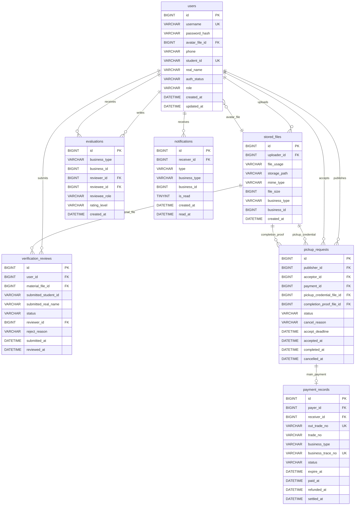

# 数据库设计 — 校园可信代取服务闭环

**版本：** 3.0  
**日期：** 2026-06-03  
**团队：** true就是队  
**状态：** 一致性修正版，按 P1 v2.1、P2 v1.2、P3 类/API 设计和 P4 当前实现范围同步收敛

---

## 一、文档基本信息

| 项目 | 内容 |
|------|------|
| 文档名称 | 数据库设计 — 校园可信代取服务闭环 |
| 数据库 | MySQL 8.x |
| 存储引擎 | InnoDB |
| 字符集 | utf8mb4 |
| 命名风格 | 表名和字段名统一使用 `snake_case` |
| 主键策略 | 业务表主键统一使用 `BIGINT AUTO_INCREMENT` |
| 时间字段 | 统一使用 `created_at`、`updated_at`；业务动作时间按场景使用 `submitted_at`、`reviewed_at`、`accepted_at`、`completed_at` 等 |
| 设计依据 | `docs/P1/srs_ieee830.md`、`docs/P1/use_cases.md`、`docs/P1/user_stories.md`、`docs/P2/architecture_design.md`、`docs/P2/adr.md`、`docs/P3/class_design.md`、`docs/P3/api_design.yaml`、`refs/P1-需求分析.md`、`refs/P2-体系结构设计.md`、`refs/P3-详细设计.md`、`refs/P4-编码开发.md` |

---

## 二、数据库设计目标与范围

### 2.1 设计目标

本数据库设计服务于当前最新项目范围：**校园可信代取/跑腿服务闭环**。核心目标如下：

1. 支撑用户名密码注册登录、个人资料、头像和实名认证状态维护。
2. 支撑学生提交实名认证材料、管理员审核、审核结果追溯。
3. 支撑代取请求从发布、待支付、待接单、接单、上传完成凭证、确认完成、取消和超时取消的完整状态流转。
4. 支撑有报酬代取的支付宝沙箱预付款、关闭、退款和结算记录，保证支付幂等追踪。
5. 支撑完成后双方互评，并按用户在代取服务中的角色分别统计作为发布方和作为接单方的评价表现。
6. 支撑站内通知的记录、未读数量查询和已读状态维护，不引入私聊或 WebSocket 消息表。
7. 支撑头像、认证材料、取件凭证、完成凭证等图片文件的统一元数据记录和上传溯源。
8. 系统不单独建设数据库审计日志表；关键业务操作、异常原因、支付回调失败、退款/结算异常等通过 Spring Boot 应用日志记录和排查。

### 2.2 本版数据库范围

| 范围 | 表 | 说明 |
|------|----|------|
| 用户与认证 | `users`、`verification_reviews` | 注册登录、个人资料、实名信息、认证审核记录 |
| 文件元数据 | `stored_files` | 头像、认证材料、取件凭证、完成凭证的元数据和上传溯源 |
| 代取闭环 | `pickup_requests` | 单表承载发布、支付后可接单、接单、完成、取消、超时等业务状态 |
| 支付记录 | `payment_records` | 记录支付宝沙箱预付款、关闭、退款、结算等状态；代取请求通过唯一的 `payment_id` 指向主支付记录 |
| 评价体系 | `evaluations` | 代取完成后双方互评，通过 `business_type + business_id` 定位评价业务对象，支持按被评价者角色统计 |
| 站内通知 | `notifications` | 认证、接单、完成凭证、确认完成、评价等业务通知 |

### 2.3 明确不纳入本版的旧模块

以下旧版“大而全校园互助平台”模块不属于当前 MVP 数据库范围，必须删除，不再建表：

| 旧模块 | 旧表/模型 | 本版处理 |
|--------|-----------|----------|
| 失物招领 | `lost_found_items` | 删除，不建模 |
| 搭子招募 | `match_recruits`、`match_participants` | 删除，不建模 |
| 二手商品 | `secondhand_items` | 删除，不建模 |
| 咨询问答 | `questions` | 删除，不建模 |
| 评论 | `comments` | 删除，不建模 |
| 即时通讯/私聊 | `messages` | 删除，不建模；站内通知使用 `notifications` |
| 封禁申诉 | `ban_appeals` | 删除，不建模 |
| 旧跑腿任务+订单双表 | `errand_tasks` + `orders` | 删除，统一由 `pickup_requests` 承载代取业务主状态 |
| 旧内容治理/申诉后台 | `admin_actions` 等复杂治理表 | 删除；本版不建设数据库审计日志表 |

---

## 三、核心实体关系说明

### 3.1 实体关系概览

| 实体 | 关系 |
|------|------|
| `users` 与 `verification_reviews` | 一个用户可多次提交实名认证审核记录；审核记录保存当次提交的学号和姓名快照，用户表保存当前有效实名信息；同一用户同一时间只允许一个 `PENDING` 审核记录，由 Service 层在提交认证时校验。 |
| `users` 与 `stored_files` | 一个用户可上传多个文件；用户头像通过 `users.avatar_file_id` 引用 `stored_files.id`。 |
| `verification_reviews` 与 `stored_files` | 每条实名认证审核记录关联一份认证材料文件 `material_file_id`。 |
| `users` 与 `pickup_requests` | 用户可作为发布方发布多个代取请求，也可作为接单方承接多个代取请求。 |
| `pickup_requests` 与 `stored_files` | 代取请求通过 `pickup_credential_file_id` 引用取件凭证，通过 `completion_proof_file_id` 引用完成凭证。 |
| `pickup_requests` 与 `payment_records` | 有报酬代取请求可通过 `payment_id` 关联一条主支付记录；`payment_id` 唯一约束保证一条主支付记录只属于一个代取请求；支付记录侧仅保存业务追踪字段，不反向约束代取请求。 |
| `pickup_requests` 与 `evaluations` | 评价通过 `business_type=PICKUP_REQUEST` 和 `business_id=pickup_requests.id` 定位代取请求，不额外写死代取请求外键。 |
| `users` 与 `evaluations` | 用户既可能是评价者，也可能是被评价者；统计时按被评价者在代取服务中的角色区分。 |
| `users` 与 `notifications` | 一个用户可接收多条站内通知。 |

### 3.2 代取状态由主表统一维护

本版不恢复旧版 `errand_tasks + orders` 双表模型。`pickup_requests` 是代取业务主表，统一维护以下状态：

1. `WAITING_PAYMENT`：有报酬代取已发布，等待发布方在 3 分钟内完成支付宝沙箱预付款。
2. `WAITING_ACCEPT`：服务可展示在代取需求大厅，等待其他认证用户接单。
3. `IN_PROGRESS`：已有接单方承接服务，等待上传完成凭证和发布方确认。
4. `COMPLETED`：发布方确认完成，业务终态。
5. `CANCELLED`：发布方取消、支付超时、接单截止超时或系统取消，业务终态。

支付状态由 `payment_records` 维护，代取业务状态仍以 `pickup_requests.status` 为准。支付模块不直接理解或改写代取状态。支付超时处理由后端根据 `payment_records.expire_at` 和支付状态完成，再由代取服务模块将代取请求流转为取消。

---

## 四、ER 图



---

## 五、表结构设计

### 5.1 `users` 用户表

`users` 保存用户登录信息、公开资料、当前有效实名信息、认证状态和角色。密码字段只保存 BCrypt 哈希，不保存明文密码。好评率和评价统计统一从 `evaluations` 动态聚合计算，不在 `users` 表缓存。

| 字段名 | 类型 | 是否为空 | 默认值 | 约束 | 说明 |
|--------|------|----------|--------|------|------|
| `id` | `BIGINT` | 否 | 自增 | PK | 用户 ID |
| `username` | `VARCHAR(30)` | 否 | 无 | UK | 登录账号，平台内唯一，匹配 API `username` |
| `password_hash` | `VARCHAR(100)` | 否 | 无 |  | BCrypt 密码哈希；不保存明文密码 |
| `nickname` | `VARCHAR(50)` | 否 | `''` |  | 公开展示昵称，可重复 |
| `avatar_file_id` | `BIGINT` | 是 | `NULL` | FK -> `stored_files.id` | 头像文件 ID，不直接保存 URL 字符串 |
| `phone` | `VARCHAR(20)` | 是 | `NULL` |  | 手机号；当前 MVP 不用于短信登录，是普通选填资料字段 |
| `student_id` | `VARCHAR(32)` | 是 | `NULL` | UK | 当前有效学号，认证通过后由业务层从审核快照同步；普通用户页面不公开，仅返回脱敏值 |
| `real_name` | `VARCHAR(50)` | 是 | `NULL` |  | 当前有效真实姓名，认证通过后由业务层从审核快照同步；仅实名认证和管理员审核可见 |
| `college` | `VARCHAR(80)` | 是 | `NULL` |  | 学院，选填公开资料 |
| `contact` | `VARCHAR(100)` | 是 | `NULL` |  | 用户主动填写的公开联系方式，选填 |
| `auth_status` | `VARCHAR(20)` | 否 | `UNVERIFIED` | 枚举约束 | `UNVERIFIED`、`REVIEWING`、`APPROVED`、`REJECTED` |
| `role` | `VARCHAR(20)` | 否 | `USER` | 枚举约束 | `USER`、`ADMIN` |
| `created_at` | `DATETIME` | 否 | `CURRENT_TIMESTAMP` |  | 注册时间 |
| `updated_at` | `DATETIME` | 否 | `CURRENT_TIMESTAMP` | 自动更新 | 更新时间 |

> 评价好评率统计口径由业务层基于 `evaluations` 动态聚合：按 `reviewee_id` 和 `reviewee_role` 分别统计用户作为发布方或接单方收到的好评、中评、差评和评价总数。当分母为 0 时由业务层返回空值或 0，前端展示为“暂无评价”。

### 5.2 `verification_reviews` 实名认证审核记录表

`verification_reviews` 保留多条历史审核记录，用于追溯用户每次认证提交和管理员处理结果。`submitted_student_id`、`submitted_real_name` 仅保存当次实名认证申请提交快照，用于管理员审核和历史追溯；审核通过后，业务层将通过的学号和真实姓名同步到 `users.student_id`、`users.real_name`。`users.student_id`、`users.real_name` 表示用户当前有效实名信息，历史审核快照不参与后续业务身份判断，也不与用户表实名字段形成“双主数据”。同一用户同一时间只能存在一条 `PENDING` 审核记录，由 Service 层在提交认证时查询并拦截；数据库层保留历史记录，不使用复杂部分唯一索引。

| 字段名 | 类型 | 是否为空 | 默认值 | 约束 | 说明 |
|--------|------|----------|--------|------|------|
| `id` | `BIGINT` | 否 | 自增 | PK | 审核记录 ID |
| `user_id` | `BIGINT` | 否 | 无 | FK -> `users.id` | 申请认证的用户 |
| `material_file_id` | `BIGINT` | 否 | 无 | FK -> `stored_files.id` | 认证材料文件，通常为校园卡或学生证照片 |
| `submitted_student_id` | `VARCHAR(32)` | 否 | 无 |  | 当次实名认证申请提交的学号快照，仅用于审核和历史追溯 |
| `submitted_real_name` | `VARCHAR(50)` | 否 | 无 |  | 当次实名认证申请提交的真实姓名快照，仅用于审核和历史追溯 |
| `status` | `VARCHAR(20)` | 否 | `PENDING` | 枚举约束 | `PENDING`、`APPROVED`、`REJECTED` |
| `reviewer_id` | `BIGINT` | 是 | `NULL` | FK -> `users.id` | 审核管理员 |
| `reject_reason` | `VARCHAR(500)` | 是 | `NULL` |  | 驳回原因；与 API `rejectReason` 对应 |
| `submitted_at` | `DATETIME` | 否 | `CURRENT_TIMESTAMP` |  | 提交审核时间 |
| `reviewed_at` | `DATETIME` | 是 | `NULL` |  | 审核处理时间 |
| `created_at` | `DATETIME` | 否 | `CURRENT_TIMESTAMP` |  | 创建时间 |
| `updated_at` | `DATETIME` | 否 | `CURRENT_TIMESTAMP` | 自动更新 | 更新时间 |

### 5.3 `stored_files` 统一文件元数据表

`stored_files` 只负责保存文件元数据和上传溯源，不负责判断业务访问权限。`business_type`、`business_id` 只是文件上传溯源字段，不建立具体业务表外键，不承担业务权限判断，也不在 ER 图中画成业务强关系。头像、认证材料、取件凭证、完成凭证的真实业务关系分别由 `users.avatar_file_id`、`verification_reviews.material_file_id`、`pickup_requests.pickup_credential_file_id`、`pickup_requests.completion_proof_file_id` 这些文件 ID 外键维护；读取权限分别由用户模块、实名审核模块和代取服务模块判断。系统不开放通用文件读取接口。

| 字段名 | 类型 | 是否为空 | 默认值 | 约束 | 说明 |
|--------|------|----------|--------|------|------|
| `id` | `BIGINT` | 否 | 自增 | PK | 文件 ID |
| `uploader_id` | `BIGINT` | 否 | 无 | FK -> `users.id` | 上传者，仅用于上传溯源和审计排查 |
| `file_usage` | `VARCHAR(40)` | 否 | 无 | 枚举约束 | `AVATAR`、`VERIFICATION_MATERIAL`、`PICKUP_CREDENTIAL`、`COMPLETION_PROOF` |
| `original_filename` | `VARCHAR(255)` | 否 | 无 |  | 原始文件名 |
| `storage_path` | `VARCHAR(500)` | 否 | 无 |  | 本地存储路径或对象存储 key |
| `mime_type` | `VARCHAR(100)` | 否 | 无 |  | MIME 类型，例如 `image/jpeg`、`image/png` |
| `file_size` | `BIGINT` | 否 | 无 |  | 文件大小，单位字节 |
| `sha256` | `CHAR(64)` | 是 | `NULL` |  | 文件内容哈希，用于排查重复文件和完整性校验 |
| `business_type` | `VARCHAR(40)` | 是 | `NULL` |  | 上传溯源业务类型，例如 `USER_AVATAR`、`VERIFICATION_REVIEW`、`PICKUP_REQUEST`；不是业务外键 |
| `business_id` | `BIGINT` | 是 | `NULL` |  | 上传溯源业务 ID；上传时可能为空，业务创建成功后可回填；不是业务外键 |
| `created_at` | `DATETIME` | 否 | `CURRENT_TIMESTAMP` |  | 上传时间 |
| `updated_at` | `DATETIME` | 否 | `CURRENT_TIMESTAMP` | 自动更新 | 更新时间 |

### 5.4 `pickup_requests` 代取请求主表

`pickup_requests` 替代旧版 `errand_tasks + orders` 双表模型，是代取业务唯一主表。

| 字段名 | 类型 | 是否为空 | 默认值 | 约束 | 说明 |
|--------|------|----------|--------|------|------|
| `id` | `BIGINT` | 否 | 自增 | PK | 代取请求 ID，对应 API `pickupId` |
| `publisher_id` | `BIGINT` | 否 | 无 | FK -> `users.id` | 发布方用户 ID |
| `acceptor_id` | `BIGINT` | 是 | `NULL` | FK -> `users.id` | 接单方用户 ID，未接单时为空 |
| `campus` | `VARCHAR(80)` | 否 | 无 |  | 校区，用于大厅筛选 |
| `pickup_location` | `VARCHAR(200)` | 否 | 无 |  | 取件地点 |
| `delivery_location` | `VARCHAR(200)` | 否 | 无 |  | 送达地点 |
| `item_description` | `VARCHAR(500)` | 否 | 无 |  | 物品说明，对应 API `itemDescription` |
| `reward_type` | `VARCHAR(20)` | 否 | 无 | 枚举约束 | `PAID`、`UNPAID` |
| `reward_amount` | `DECIMAL(10,2)` | 是 | `NULL` |  | 有报酬服务金额，范围 1-200；无报酬为空 |
| `pickup_credential_file_id` | `BIGINT` | 否 | 无 | FK -> `stored_files.id` | 取件凭证文件；接单前不向非发布方展示 |
| `completion_proof_file_id` | `BIGINT` | 是 | `NULL` | FK -> `stored_files.id` | 完成凭证文件；接单方上传 |
| `payment_id` | `BIGINT` | 是 | `NULL` | FK -> `payment_records.id`；UK | 支付记录 ID；无报酬服务为空；唯一约束保证一条主支付记录只属于一个代取请求 |
| `status` | `VARCHAR(30)` | 否 | 无 | 枚举约束 | `WAITING_PAYMENT`、`WAITING_ACCEPT`、`IN_PROGRESS`、`COMPLETED`、`CANCELLED` |
| `cancel_reason` | `VARCHAR(40)` | 是 | `NULL` | 枚举约束 | `USER_CANCELLED`、`PAYMENT_EXPIRED`、`ACCEPT_DEADLINE_EXPIRED`、`SYSTEM_CANCELLED` |
| `cancel_detail` | `VARCHAR(500)` | 是 | `NULL` |  | 发布方主动取消时填写的补充说明，对应 API `ReasonRequest.reason` |
| `accept_deadline` | `DATETIME` | 否 | 无 |  | 接单截止时间，对应 API `acceptDeadline` |
| `accepted_at` | `DATETIME` | 是 | `NULL` |  | 接单时间 |
| `completed_at` | `DATETIME` | 是 | `NULL` |  | 完成确认时间 |
| `cancelled_at` | `DATETIME` | 是 | `NULL` |  | 取消时间 |
| `created_at` | `DATETIME` | 否 | `CURRENT_TIMESTAMP` |  | 发布时间 |
| `updated_at` | `DATETIME` | 否 | `CURRENT_TIMESTAMP` | 自动更新 | 更新时间 |

### 5.5 `payment_records` 支付记录表

支付记录不保存指向具体代取请求的反向业务外键，也不反向约束代取请求。有报酬代取请求通过 `pickup_requests.payment_id -> payment_records.id` 指向一条主支付记录；无报酬代取请求不关联支付记录。`payment_records.business_type`、`business_trace_no` 只用于支付追踪、幂等、支付宝沙箱回调定位和异常排查，不是指向具体业务表的外键。`out_trade_no` 必须唯一，用于支付宝沙箱回调匹配和幂等处理。

本版 `payment_records` 记录主支付单当前状态及关键时间点，不单独拆分支付流水表；用户支付、退款、结算记录列表由业务层根据用户角色、支付状态和关键时间字段生成。若后续需要完整资金流水，再扩展 `payment_events` 或 `transaction_records`。

| 字段名 | 类型 | 是否为空 | 默认值 | 约束 | 说明 |
|--------|------|----------|--------|------|------|
| `id` | `BIGINT` | 否 | 自增 | PK | 支付记录 ID，对应 API `paymentId` |
| `payer_id` | `BIGINT` | 否 | 无 | FK -> `users.id` | 付款方，代取发布方 |
| `receiver_id` | `BIGINT` | 是 | `NULL` | FK -> `users.id` | 收款方，接单方；结算前可为空 |
| `business_type` | `VARCHAR(40)` | 否 | `PICKUP_REQUEST` | 枚举约束 | 当前仅 `PICKUP_REQUEST`；支付追踪字段，不是业务外键 |
| `business_trace_no` | `VARCHAR(80)` | 否 | 无 | UK | 业务追踪号，用于幂等、日志、回调定位和异常排查；不是业务外键 |
| `amount` | `DECIMAL(10,2)` | 否 | 无 |  | 支付金额，单位元 |
| `out_trade_no` | `VARCHAR(64)` | 否 | 无 | UK | 商户订单号，必须唯一 |
| `trade_no` | `VARCHAR(128)` | 是 | `NULL` | 普通索引 | 第三方交易号，支付宝沙箱回调返回 |
| `status` | `VARCHAR(30)` | 否 | `WAITING_PAY` | 枚举约束 | `WAITING_PAY`、`PAID`、`CLOSED`、`REFUNDED`、`SETTLED` |
| `pay_entry` | `TEXT` | 是 | `NULL` |  | 支付入口/支付链接，由后端保存并通过 `payment-entry` 接口返回 |
| `expire_at` | `DATETIME` | 否 | 无 |  | 支付过期时间；当前 MVP 为创建后 3 分钟 |
| `paid_at` | `DATETIME` | 是 | `NULL` |  | 支付成功时间 |
| `refunded_at` | `DATETIME` | 是 | `NULL` |  | 退款成功时间 |
| `settled_at` | `DATETIME` | 是 | `NULL` |  | 结算/转账成功时间 |
| `closed_at` | `DATETIME` | 是 | `NULL` |  | 待支付关闭时间 |
| `close_reason` | `VARCHAR(100)` | 是 | `NULL` |  | 关闭原因，例如发布方取消或支付超时 |
| `failure_reason` | `VARCHAR(500)` | 是 | `NULL` |  | 第三方支付失败或内部处理失败说明 |
| `status_changed_at` | `DATETIME` | 否 | `CURRENT_TIMESTAMP` |  | 最近一次支付状态变化时间 |
| `created_at` | `DATETIME` | 否 | `CURRENT_TIMESTAMP` |  | 创建时间 |
| `updated_at` | `DATETIME` | 否 | `CURRENT_TIMESTAMP` | 自动更新 | 更新时间 |

> 支付超时由后端定时任务或业务访问时状态检查处理。前端只展示后端返回的 `expire_at` 和支付状态，不直接决定支付是否过期。支付失败、回调失败、退款或结算异常通过 `failure_reason` 或 Spring Boot 应用日志记录，不作为稳定支付状态。

### 5.6 `evaluations` 评价表

评价使用 `business_type + business_id` 定位业务对象。当前业务值为 `business_type=PICKUP_REQUEST`，`business_id` 对应代取请求 ID；该设计用于支持后续业务扩展，不额外写死代取请求外键。

| 字段名 | 类型 | 是否为空 | 默认值 | 约束 | 说明 |
|--------|------|----------|--------|------|------|
| `id` | `BIGINT` | 否 | 自增 | PK | 评价 ID |
| `business_type` | `VARCHAR(40)` | 否 | `PICKUP_REQUEST` | 枚举约束 | 当前仅 `PICKUP_REQUEST`，与 API `BusinessType` 对齐 |
| `business_id` | `BIGINT` | 否 | 无 | 普通索引 | 当前对应代取请求 ID，用于通用业务关联查询 |
| `reviewer_id` | `BIGINT` | 否 | 无 | FK -> `users.id` | 评价者 |
| `reviewee_id` | `BIGINT` | 否 | 无 | FK -> `users.id` | 被评价者 |
| `reviewee_role` | `VARCHAR(20)` | 否 | 无 | 枚举约束 | 被评价者在该代取服务中的角色：`PUBLISHER`、`ACCEPTOR` |
| `rating_level` | `VARCHAR(20)` | 否 | 无 | 枚举约束 | `GOOD`、`NEUTRAL`、`BAD` |
| `content` | `VARCHAR(1000)` | 是 | `NULL` |  | 评价内容；当 `rating_level=BAD` 时业务层要求非空，用于承载差评原因/说明 |
| `created_at` | `DATETIME` | 否 | `CURRENT_TIMESTAMP` |  | 创建时间 |
| `updated_at` | `DATETIME` | 否 | `CURRENT_TIMESTAMP` | 自动更新 | 更新时间 |

> 唯一约束 `uk_evaluations_once (business_type, business_id, reviewer_id)` 保证同一业务对象中同一评价者只能评价一次。当前代取服务完成后双方互评最多两条记录。
> 评价申诉/处理属于后续扩展，本版不建表、不建字段。

### 5.7 `notifications` 站内通知表

| 字段名 | 类型 | 是否为空 | 默认值 | 约束 | 说明 |
|--------|------|----------|--------|------|------|
| `id` | `BIGINT` | 否 | 自增 | PK | 通知 ID，对应 API `notificationId` |
| `receiver_id` | `BIGINT` | 否 | 无 | FK -> `users.id` | 接收人 |
| `type` | `VARCHAR(40)` | 否 | 无 | 枚举约束 | 通知类型，例如 `SYSTEM`、`VERIFICATION`、`PICKUP`、`PAYMENT`、`EVALUATION` |
| `title` | `VARCHAR(100)` | 否 | 无 |  | 通知标题 |
| `content` | `VARCHAR(1000)` | 否 | 无 |  | 通知内容 |
| `business_type` | `VARCHAR(40)` | 是 | `NULL` |  | 关联业务类型，例如 `PICKUP_REQUEST` |
| `business_id` | `BIGINT` | 是 | `NULL` |  | 关联业务 ID，例如 `pickup_requests.id` |
| `is_read` | `TINYINT(1)` | 否 | `0` |  | 是否已读，0=未读，1=已读 |
| `read_at` | `DATETIME` | 是 | `NULL` |  | 已读时间 |
| `created_at` | `DATETIME` | 否 | `CURRENT_TIMESTAMP` |  | 创建时间 |
| `updated_at` | `DATETIME` | 否 | `CURRENT_TIMESTAMP` | 自动更新 | 更新时间 |

## 六、建表 SQL

```sql
CREATE TABLE users (
    id BIGINT AUTO_INCREMENT PRIMARY KEY,
    username VARCHAR(30) NOT NULL COMMENT '登录账号，平台内唯一',
    password_hash VARCHAR(100) NOT NULL COMMENT 'BCrypt密码哈希，禁止明文存储',
    nickname VARCHAR(50) NOT NULL DEFAULT '' COMMENT '公开展示昵称',
    avatar_file_id BIGINT NULL COMMENT '头像文件ID，关联stored_files',
    phone VARCHAR(20) NULL COMMENT '手机号，普通选填资料字段，MVP不用于短信登录',
    student_id VARCHAR(32) NULL COMMENT '当前有效学号，认证通过后同步，普通用户页面不公开',
    real_name VARCHAR(50) NULL COMMENT '当前有效真实姓名，认证通过后同步',
    college VARCHAR(80) NULL COMMENT '学院，选填',
    contact VARCHAR(100) NULL COMMENT '用户主动填写的公开联系方式，选填',
    auth_status VARCHAR(20) NOT NULL DEFAULT 'UNVERIFIED' COMMENT 'UNVERIFIED/REVIEWING/APPROVED/REJECTED',
    role VARCHAR(20) NOT NULL DEFAULT 'USER' COMMENT 'USER/ADMIN',
    created_at DATETIME NOT NULL DEFAULT CURRENT_TIMESTAMP,
    updated_at DATETIME NOT NULL DEFAULT CURRENT_TIMESTAMP ON UPDATE CURRENT_TIMESTAMP,
    CONSTRAINT uk_users_username UNIQUE (username),
    CONSTRAINT uk_users_student_id UNIQUE (student_id),
    CONSTRAINT chk_users_auth_status CHECK (auth_status IN ('UNVERIFIED','REVIEWING','APPROVED','REJECTED')),
    CONSTRAINT chk_users_role CHECK (role IN ('USER','ADMIN')),
    INDEX idx_users_auth_status (auth_status),
    INDEX idx_users_role (role),
    INDEX idx_users_created_at (created_at)
) ENGINE=InnoDB DEFAULT CHARSET=utf8mb4 COLLATE=utf8mb4_unicode_ci COMMENT='用户表';

CREATE TABLE stored_files (
    id BIGINT AUTO_INCREMENT PRIMARY KEY,
    uploader_id BIGINT NOT NULL COMMENT '上传者用户ID，仅用于上传溯源',
    file_usage VARCHAR(40) NOT NULL COMMENT 'AVATAR/VERIFICATION_MATERIAL/PICKUP_CREDENTIAL/COMPLETION_PROOF',
    original_filename VARCHAR(255) NOT NULL COMMENT '原始文件名',
    storage_path VARCHAR(500) NOT NULL COMMENT '本地存储路径或对象存储key',
    mime_type VARCHAR(100) NOT NULL COMMENT 'MIME类型',
    file_size BIGINT NOT NULL COMMENT '文件大小，单位字节',
    sha256 CHAR(64) NULL COMMENT '文件SHA-256哈希',
    business_type VARCHAR(40) NULL COMMENT '关联业务类型，仅用于追踪',
    business_id BIGINT NULL COMMENT '关联业务ID，仅用于追踪',
    created_at DATETIME NOT NULL DEFAULT CURRENT_TIMESTAMP,
    updated_at DATETIME NOT NULL DEFAULT CURRENT_TIMESTAMP ON UPDATE CURRENT_TIMESTAMP,
    CONSTRAINT fk_stored_files_uploader FOREIGN KEY (uploader_id) REFERENCES users(id),
    CONSTRAINT chk_stored_files_usage CHECK (file_usage IN ('AVATAR','VERIFICATION_MATERIAL','PICKUP_CREDENTIAL','COMPLETION_PROOF')),
    INDEX idx_stored_files_uploader (uploader_id, created_at),
    INDEX idx_stored_files_usage (file_usage, created_at),
    INDEX idx_stored_files_business (business_type, business_id),
    INDEX idx_stored_files_sha256 (sha256)
) ENGINE=InnoDB DEFAULT CHARSET=utf8mb4 COLLATE=utf8mb4_unicode_ci COMMENT='统一文件元数据表';

ALTER TABLE users
    ADD CONSTRAINT fk_users_avatar_file
    FOREIGN KEY (avatar_file_id) REFERENCES stored_files(id);

CREATE TABLE verification_reviews (
    id BIGINT AUTO_INCREMENT PRIMARY KEY,
    user_id BIGINT NOT NULL COMMENT '申请认证用户ID',
    material_file_id BIGINT NOT NULL COMMENT '认证材料文件ID',
    submitted_student_id VARCHAR(32) NOT NULL COMMENT '当次实名认证申请提交的学号快照',
    submitted_real_name VARCHAR(50) NOT NULL COMMENT '当次实名认证申请提交的真实姓名快照',
    status VARCHAR(20) NOT NULL DEFAULT 'PENDING' COMMENT 'PENDING/APPROVED/REJECTED',
    reviewer_id BIGINT NULL COMMENT '审核管理员ID',
    reject_reason VARCHAR(500) NULL COMMENT '驳回原因',
    submitted_at DATETIME NOT NULL DEFAULT CURRENT_TIMESTAMP COMMENT '提交时间',
    reviewed_at DATETIME NULL COMMENT '审核时间',
    created_at DATETIME NOT NULL DEFAULT CURRENT_TIMESTAMP,
    updated_at DATETIME NOT NULL DEFAULT CURRENT_TIMESTAMP ON UPDATE CURRENT_TIMESTAMP,
    CONSTRAINT fk_verification_reviews_user FOREIGN KEY (user_id) REFERENCES users(id),
    CONSTRAINT fk_verification_reviews_material_file FOREIGN KEY (material_file_id) REFERENCES stored_files(id),
    CONSTRAINT fk_verification_reviews_reviewer FOREIGN KEY (reviewer_id) REFERENCES users(id),
    CONSTRAINT chk_verification_reviews_status CHECK (status IN ('PENDING','APPROVED','REJECTED')),
    INDEX idx_verification_reviews_status_created (status, created_at),
    INDEX idx_verification_reviews_user_status_created (user_id, status, created_at),
    INDEX idx_verification_reviews_reviewer (reviewer_id)
) ENGINE=InnoDB DEFAULT CHARSET=utf8mb4 COLLATE=utf8mb4_unicode_ci COMMENT='实名认证审核记录表';

CREATE TABLE payment_records (
    id BIGINT AUTO_INCREMENT PRIMARY KEY,
    payer_id BIGINT NOT NULL COMMENT '付款方，代取发布方',
    receiver_id BIGINT NULL COMMENT '收款方，代取接单方，结算前可为空',
    business_type VARCHAR(40) NOT NULL DEFAULT 'PICKUP_REQUEST' COMMENT '当前仅PICKUP_REQUEST，仅用于支付追踪',
    business_trace_no VARCHAR(80) NOT NULL COMMENT '业务追踪号，用于幂等、回调定位和异常排查',
    amount DECIMAL(10,2) NOT NULL COMMENT '支付金额，单位元',
    out_trade_no VARCHAR(64) NOT NULL COMMENT '商户订单号，必须唯一',
    trade_no VARCHAR(128) NULL COMMENT '第三方交易号',
    status VARCHAR(30) NOT NULL DEFAULT 'WAITING_PAY' COMMENT 'WAITING_PAY/PAID/CLOSED/REFUNDED/SETTLED',
    pay_entry TEXT NULL COMMENT '支付宝沙箱支付入口',
    expire_at DATETIME NOT NULL COMMENT '支付过期时间',
    paid_at DATETIME NULL COMMENT '支付成功时间',
    refunded_at DATETIME NULL COMMENT '退款成功时间',
    settled_at DATETIME NULL COMMENT '结算成功时间',
    closed_at DATETIME NULL COMMENT '待支付关闭时间',
    close_reason VARCHAR(100) NULL COMMENT '关闭原因',
    failure_reason VARCHAR(500) NULL COMMENT '失败原因',
    status_changed_at DATETIME NOT NULL DEFAULT CURRENT_TIMESTAMP COMMENT '最近状态变化时间',
    created_at DATETIME NOT NULL DEFAULT CURRENT_TIMESTAMP,
    updated_at DATETIME NOT NULL DEFAULT CURRENT_TIMESTAMP ON UPDATE CURRENT_TIMESTAMP,
    CONSTRAINT uk_payment_records_out_trade_no UNIQUE (out_trade_no),
    CONSTRAINT uk_payment_records_business_trace_no UNIQUE (business_trace_no),
    CONSTRAINT fk_payment_records_payer FOREIGN KEY (payer_id) REFERENCES users(id),
    CONSTRAINT fk_payment_records_receiver FOREIGN KEY (receiver_id) REFERENCES users(id),
    CONSTRAINT chk_payment_records_business_type CHECK (business_type IN ('PICKUP_REQUEST')),
    CONSTRAINT chk_payment_records_status CHECK (status IN ('WAITING_PAY','PAID','CLOSED','REFUNDED','SETTLED')),
    INDEX idx_payment_records_payer_created (payer_id, created_at),
    INDEX idx_payment_records_receiver_created (receiver_id, created_at),
    INDEX idx_payment_records_status_expire (status, expire_at),
    INDEX idx_payment_records_trade_no (trade_no)
) ENGINE=InnoDB DEFAULT CHARSET=utf8mb4 COLLATE=utf8mb4_unicode_ci COMMENT='支付记录表';

CREATE TABLE pickup_requests (
    id BIGINT AUTO_INCREMENT PRIMARY KEY,
    publisher_id BIGINT NOT NULL COMMENT '发布方用户ID',
    acceptor_id BIGINT NULL COMMENT '接单方用户ID',
    campus VARCHAR(80) NOT NULL COMMENT '校区',
    pickup_location VARCHAR(200) NOT NULL COMMENT '取件地点',
    delivery_location VARCHAR(200) NOT NULL COMMENT '送达地点',
    item_description VARCHAR(500) NOT NULL COMMENT '物品说明',
    reward_type VARCHAR(20) NOT NULL COMMENT 'PAID/UNPAID',
    reward_amount DECIMAL(10,2) NULL COMMENT '有报酬金额，1-200元；无报酬为空',
    pickup_credential_file_id BIGINT NOT NULL COMMENT '取件凭证文件ID',
    completion_proof_file_id BIGINT NULL COMMENT '完成凭证文件ID',
    payment_id BIGINT NULL COMMENT '支付记录ID；无报酬为空',
    status VARCHAR(30) NOT NULL COMMENT 'WAITING_PAYMENT/WAITING_ACCEPT/IN_PROGRESS/COMPLETED/CANCELLED',
    cancel_reason VARCHAR(40) NULL COMMENT 'USER_CANCELLED/PAYMENT_EXPIRED/ACCEPT_DEADLINE_EXPIRED/SYSTEM_CANCELLED',
    cancel_detail VARCHAR(500) NULL COMMENT '取消补充说明',
    accept_deadline DATETIME NOT NULL COMMENT '接单截止时间',
    accepted_at DATETIME NULL COMMENT '接单时间',
    completed_at DATETIME NULL COMMENT '完成时间',
    cancelled_at DATETIME NULL COMMENT '取消时间',
    created_at DATETIME NOT NULL DEFAULT CURRENT_TIMESTAMP,
    updated_at DATETIME NOT NULL DEFAULT CURRENT_TIMESTAMP ON UPDATE CURRENT_TIMESTAMP,
    CONSTRAINT fk_pickup_requests_publisher FOREIGN KEY (publisher_id) REFERENCES users(id),
    CONSTRAINT fk_pickup_requests_acceptor FOREIGN KEY (acceptor_id) REFERENCES users(id),
    CONSTRAINT fk_pickup_requests_pickup_file FOREIGN KEY (pickup_credential_file_id) REFERENCES stored_files(id),
    CONSTRAINT fk_pickup_requests_completion_file FOREIGN KEY (completion_proof_file_id) REFERENCES stored_files(id),
    CONSTRAINT fk_pickup_requests_payment FOREIGN KEY (payment_id) REFERENCES payment_records(id),
    CONSTRAINT uk_pickup_requests_payment_id UNIQUE (payment_id),
    CONSTRAINT chk_pickup_requests_reward_type CHECK (reward_type IN ('PAID','UNPAID')),
    CONSTRAINT chk_pickup_requests_status CHECK (status IN ('WAITING_PAYMENT','WAITING_ACCEPT','IN_PROGRESS','COMPLETED','CANCELLED')),
    CONSTRAINT chk_pickup_requests_cancel_reason CHECK (cancel_reason IS NULL OR cancel_reason IN ('USER_CANCELLED','PAYMENT_EXPIRED','ACCEPT_DEADLINE_EXPIRED','SYSTEM_CANCELLED')),
    CONSTRAINT chk_pickup_requests_reward_amount CHECK ((reward_type = 'PAID' AND reward_amount BETWEEN 1.00 AND 200.00) OR (reward_type = 'UNPAID' AND reward_amount IS NULL)),
    CONSTRAINT chk_pickup_requests_not_self_accept CHECK (acceptor_id IS NULL OR acceptor_id <> publisher_id),
    INDEX idx_pickup_hall (status, campus, reward_type, created_at),
    INDEX idx_pickup_status_created (status, created_at),
    INDEX idx_pickup_publisher_status (publisher_id, status, created_at),
    INDEX idx_pickup_acceptor_status (acceptor_id, status, created_at),
    INDEX idx_pickup_accept_deadline (status, accept_deadline)
) ENGINE=InnoDB DEFAULT CHARSET=utf8mb4 COLLATE=utf8mb4_unicode_ci COMMENT='代取请求主表';

CREATE TABLE evaluations (
    id BIGINT AUTO_INCREMENT PRIMARY KEY,
    business_type VARCHAR(40) NOT NULL DEFAULT 'PICKUP_REQUEST' COMMENT '当前仅PICKUP_REQUEST',
    business_id BIGINT NOT NULL COMMENT '当前对应代取请求ID',
    reviewer_id BIGINT NOT NULL COMMENT '评价者ID',
    reviewee_id BIGINT NOT NULL COMMENT '被评价者ID',
    reviewee_role VARCHAR(20) NOT NULL COMMENT 'PUBLISHER/ACCEPTOR',
    rating_level VARCHAR(20) NOT NULL COMMENT 'GOOD/NEUTRAL/BAD',
    content VARCHAR(1000) NULL COMMENT '评价内容；rating_level=BAD时业务层要求非空，用于承载差评原因说明',
    created_at DATETIME NOT NULL DEFAULT CURRENT_TIMESTAMP,
    updated_at DATETIME NOT NULL DEFAULT CURRENT_TIMESTAMP ON UPDATE CURRENT_TIMESTAMP,
    CONSTRAINT uk_evaluations_once UNIQUE (business_type, business_id, reviewer_id),
    CONSTRAINT fk_evaluations_reviewer FOREIGN KEY (reviewer_id) REFERENCES users(id),
    CONSTRAINT fk_evaluations_reviewee FOREIGN KEY (reviewee_id) REFERENCES users(id),
    CONSTRAINT chk_evaluations_business_type CHECK (business_type IN ('PICKUP_REQUEST')),
    CONSTRAINT chk_evaluations_reviewee_role CHECK (reviewee_role IN ('PUBLISHER','ACCEPTOR')),
    CONSTRAINT chk_evaluations_rating_level CHECK (rating_level IN ('GOOD','NEUTRAL','BAD')),
    INDEX idx_evaluations_business (business_type, business_id),
    INDEX idx_evaluations_reviewee_role_created (reviewee_id, reviewee_role, created_at),
    INDEX idx_evaluations_reviewer_created (reviewer_id, created_at),
    INDEX idx_evaluations_rating_level (rating_level)
) ENGINE=InnoDB DEFAULT CHARSET=utf8mb4 COLLATE=utf8mb4_unicode_ci COMMENT='评价表';

CREATE TABLE notifications (
    id BIGINT AUTO_INCREMENT PRIMARY KEY,
    receiver_id BIGINT NOT NULL COMMENT '接收人用户ID',
    type VARCHAR(40) NOT NULL COMMENT 'SYSTEM/VERIFICATION/PICKUP/PAYMENT/EVALUATION',
    title VARCHAR(100) NOT NULL COMMENT '通知标题',
    content VARCHAR(1000) NOT NULL COMMENT '通知内容',
    business_type VARCHAR(40) NULL COMMENT '关联业务类型，例如PICKUP_REQUEST',
    business_id BIGINT NULL COMMENT '关联业务ID',
    is_read TINYINT(1) NOT NULL DEFAULT 0 COMMENT '0未读，1已读',
    read_at DATETIME NULL COMMENT '已读时间',
    created_at DATETIME NOT NULL DEFAULT CURRENT_TIMESTAMP,
    updated_at DATETIME NOT NULL DEFAULT CURRENT_TIMESTAMP ON UPDATE CURRENT_TIMESTAMP,
    CONSTRAINT fk_notifications_receiver FOREIGN KEY (receiver_id) REFERENCES users(id),
    CONSTRAINT chk_notifications_type CHECK (type IN ('SYSTEM','VERIFICATION','PICKUP','PAYMENT','EVALUATION')),
    INDEX idx_notifications_receiver_read_created (receiver_id, is_read, created_at),
    INDEX idx_notifications_receiver_created (receiver_id, created_at),
    INDEX idx_notifications_business (business_type, business_id)
) ENGINE=InnoDB DEFAULT CHARSET=utf8mb4 COLLATE=utf8mb4_unicode_ci COMMENT='站内通知表';

```

---

## 七、枚举字段说明

### 7.1 用户认证状态 `users.auth_status`

| 值 | 含义 | 对应 API |
|----|------|----------|
| `UNVERIFIED` | 未认证 | `AuthStatus.UNVERIFIED` |
| `REVIEWING` | 审核中 | `AuthStatus.REVIEWING` |
| `APPROVED` | 已通过 | `AuthStatus.APPROVED` |
| `REJECTED` | 已驳回 | `AuthStatus.REJECTED` |

### 7.2 实名审核状态 `verification_reviews.status`

| 值 | 含义 | 对应 API |
|----|------|----------|
| `PENDING` | 待审核 | `ReviewStatus.PENDING` |
| `APPROVED` | 审核通过 | `ReviewStatus.APPROVED` |
| `REJECTED` | 审核驳回 | `ReviewStatus.REJECTED` |

### 7.3 代取请求状态 `pickup_requests.status`

| 值 | 含义 | 可进入方式 |
|----|------|------------|
| `WAITING_PAYMENT` | 有报酬服务已发布，等待预付款 | 发布有报酬代取 |
| `WAITING_ACCEPT` | 可在大厅展示，等待接单 | 无报酬发布成功；有报酬支付成功 |
| `IN_PROGRESS` | 已接单，服务进行中 | 接单成功 |
| `COMPLETED` | 发布方确认完成 | 上传完成凭证后发布方确认 |
| `CANCELLED` | 已取消 | 发布方取消、支付超时、接单截止超时、系统取消 |

### 7.4 取消原因 `pickup_requests.cancel_reason`

| 值 | 含义 | 说明 |
|----|------|------|
| `USER_CANCELLED` | 发布方主动取消 | 仅允许待支付或待接单状态 |
| `PAYMENT_EXPIRED` | 支付超时取消 | 有报酬服务 3 分钟内未完成预付款 |
| `ACCEPT_DEADLINE_EXPIRED` | 接单截止超时取消 | 待接单服务超过接单截止时间无人接单 |
| `SYSTEM_CANCELLED` | 系统取消 | 后端异常处理或人工修正使用，不作为常规业务入口 |

### 7.5 支付状态 `payment_records.status`

| 值 | 含义 | 说明 |
|----|------|------|
| `WAITING_PAY` | 待支付 | 已创建支付入口，等待支付宝沙箱付款 |
| `PAID` | 已支付 | 预付款成功，代取服务可进入待接单 |
| `CLOSED` | 已关闭 | 待支付未完成付款时由发布方取消或超时关闭 |
| `REFUNDED` | 已退款 | 已支付服务在待接单阶段取消或接单截止超时后退款 |
| `SETTLED` | 已结算 | 发布方确认完成后结算给接单方 |

支付稳定状态只保留以上五类。支付失败、回调失败、退款异常或结算异常不写入 `payment_records.status` 的稳定枚举，而是通过 `failure_reason` 或 Spring Boot 应用日志记录，便于用户重试和后续排查。

### 7.6 文件用途 `stored_files.file_usage`

| 值 | 含义 | 读取权限归属 |
|----|------|--------------|
| `AVATAR` | 头像 | 用户模块 |
| `VERIFICATION_MATERIAL` | 实名认证材料 | 实名审核模块/管理员权限 |
| `PICKUP_CREDENTIAL` | 取件凭证 | 代取服务模块；接单前不向非发布方展示 |
| `COMPLETION_PROOF` | 完成凭证 | 代取服务模块；仅服务参与者可读 |

### 7.7 评价等级 `evaluations.rating_level`

| 值 | 含义 | 统计口径 |
|----|------|----------|
| `GOOD` | 好评 | 计入好评数 |
| `NEUTRAL` | 中评 | 计入中评数 |
| `BAD` | 差评 | 计入差评数，业务层要求填写差评原因或评价内容 |

### 7.8 被评价者角色 `evaluations.reviewee_role`

| 值 | 含义 | 统计口径 |
|----|------|----------|
| `PUBLISHER` | 被评价者在该代取服务中是发布方 | 计入用户作为发布方收到的评价表现 |
| `ACCEPTOR` | 被评价者在该代取服务中是接单方 | 计入用户作为接单方收到的评价表现 |

### 7.9 通知类型 `notifications.type`

| 值 | 含义 | 典型触发事件 |
|----|------|--------------|
| `SYSTEM` | 系统通知 | 通用系统提示 |
| `VERIFICATION` | 实名认证通知 | 认证通过/驳回 |
| `PICKUP` | 代取业务通知 | 被接单、完成凭证上传、确认完成 |
| `PAYMENT` | 支付通知 | 支付成功、关闭、退款、结算 |
| `EVALUATION` | 评价通知 | 收到评价 |

---

## 八、外键与约束说明

1. `users.username` 唯一，保证登录账号唯一。
2. `users.student_id` 唯一，保证每个学号最终只能绑定一个账号；MySQL 允许多个 `NULL`，未提交认证的用户不受该唯一约束影响。`users.student_id`、`users.real_name` 是用户当前有效实名信息。
3. `users.avatar_file_id` 外键关联 `stored_files.id`，头像不直接保存 URL。
4. `verification_reviews.user_id`、`material_file_id`、`reviewer_id` 分别关联用户、认证材料文件和审核管理员；`submitted_student_id`、`submitted_real_name` 是当次实名认证申请提交快照，不参与后续业务身份判断。
5. `stored_files.uploader_id` 关联上传者，但不表示最终业务权限；`stored_files.business_type`、`business_id` 只是上传溯源字段，不建立具体业务外键。
6. `pickup_requests.publisher_id` 和 `acceptor_id` 均关联 `users.id`；`acceptor_id <> publisher_id` 通过 CHECK 约束和业务层双重保证。
7. `pickup_requests.pickup_credential_file_id` 和 `completion_proof_file_id` 分别关联取件凭证和完成凭证文件。
8. `pickup_requests.payment_id` 关联 `payment_records.id`；无报酬服务为空。这是代取请求到主支付记录的真实外键。外键只保证支付记录存在，唯一约束 `uk_pickup_requests_payment_id` 保证一条主支付记录只属于一个代取请求；MySQL 唯一约束允许多个 `NULL`，不影响无报酬代取请求。
9. `payment_records.business_type`、`business_trace_no` 仅用于支付追踪、幂等、回调定位和异常排查，不反向约束 `pickup_requests`；`out_trade_no` 唯一保证支付宝回调幂等。
10. `evaluations.business_type + business_id + reviewer_id` 唯一，保证同一业务对象中同一评价者只能评价一次；当前 `business_type=PICKUP_REQUEST` 且 `business_id` 对应代取请求 ID。
11. `notifications.receiver_id` 关联接收用户；站内通知不设计发送者外键，业务模块通过 `business_type + business_id` 回溯上下文。

> MySQL 8.x 支持 `CHECK` 约束，但实际业务仍应在 Service 层进行参数校验和状态校验，数据库约束用于最后一道防线。
> 代取支付关联采用业务层约束：`reward_type = 'PAID'` 的有报酬代取应关联支付记录，`reward_type = 'UNPAID'` 的无报酬代取不关联支付记录。本版暂不增加 `reward_type` 与 `payment_id` 的复杂 `CHECK` 约束，由 Service 层校验。

---

## 九、索引设计说明

| 表 | 索引 | 用途 |
|----|------|------|
| `users` | `uk_users_username` | 注册登录唯一性校验和登录查询 |
| `users` | `uk_users_student_id` | 实名认证学号唯一性校验 |
| `users` | `idx_users_auth_status` | 管理端按认证状态筛选用户 |
| `verification_reviews` | `idx_verification_reviews_status_created` | 管理端查询待审核记录，按提交时间分页 |
| `verification_reviews` | `idx_verification_reviews_user_status_created` | 用户认证历史查询、提交认证前检查该用户是否已有 `PENDING` 审核记录、按用户和状态查询最近审核记录 |
| `stored_files` | `idx_stored_files_business` | 按业务类型和业务 ID 排查、清理文件 |
| `pickup_requests` | `idx_pickup_hall(status, campus, reward_type, created_at)` | 代取大厅只查询 `WAITING_ACCEPT`，支持校区、报酬类型筛选和发布时间倒序 |
| `pickup_requests` | `idx_pickup_publisher_status` | “我的发布”按状态查询 |
| `pickup_requests` | `idx_pickup_acceptor_status` | “我的接单”按状态查询 |
| `pickup_requests` | `idx_pickup_accept_deadline` | 定时任务扫描待接单超时 |
| `pickup_requests` | `uk_pickup_requests_payment_id` | 通过代取请求定位主支付记录，并防止一条主支付记录被多个代取请求复用 |
| `payment_records` | `uk_payment_records_out_trade_no` | 支付宝沙箱回调匹配和幂等处理 |
| `payment_records` | `uk_payment_records_business_trace_no` | 支付追踪、幂等和异常排查 |
| `payment_records` | `idx_payment_records_status_expire` | 扫描待支付过期记录 |
| `payment_records` | `idx_payment_records_payer_created` | 查询我的付款/交易记录 |
| `payment_records` | `idx_payment_records_receiver_created` | 查询我的收款/结算记录 |
| `evaluations` | `uk_evaluations_once` | 防止同一评价者重复评价同一业务对象 |
| `evaluations` | `idx_evaluations_reviewee_role_created` | 查询用户收到的评价，并按发布方/接单方角色统计 |
| `notifications` | `idx_notifications_receiver_read_created` | 查询未读通知数量和通知列表 |

---

## 十、隐私与安全数据处理

1. **密码安全：** `users.password_hash` 只保存 BCrypt 哈希结果，不保存明文密码，不保存可逆加密密码。
2. **实名信息最小暴露：** `users.student_id`、`users.real_name` 表示当前有效实名信息，仅当前用户本人、管理员审核流程和必要业务校验可见；普通用户公开主页不展示学号和真实姓名。`verification_reviews.submitted_student_id`、`submitted_real_name` 只保存审核提交快照，用于管理员审核和历史追溯，不参与后续业务身份判断。
3. **学号脱敏展示：** API `studentIdMasked` 由业务层基于 `student_id` 动态生成，例如保留前后若干位，中间用 `*` 替代。
4. **头像文件引用：** 头像使用 `avatar_file_id` 关联 `stored_files`，不直接保存外部 URL，便于统一访问控制和文件迁移。
5. **文件访问边界：** `stored_files` 只保存元数据和上传溯源，不判断访问权限；`business_type`、`business_id` 不作为权限依据、不建立业务外键。文件读取必须经过用户模块、实名审核模块或代取服务模块。
6. **取件凭证保护：** 取件凭证 `pickup_credential_file_id` 不在代取详情 API 中直接返回；接单成功后接单方可通过受保护接口读取，发布方可读取自己上传的凭证。
7. **完成凭证保护：** 完成凭证仅服务发布方和接单方可读取，非参与者禁止访问。
8. **支付信息保护：** 普通支付详情不暴露支付宝交易号、业务追踪号和支付入口；支付入口只通过待支付代取请求的受保护接口返回给发布方。
9. **联系方式展示：** `contact` 是用户主动填写的公开资料；未填写时不展示。
10. **应用日志：** 系统不单独建设数据库审计日志表；登录、实名认证、发布代取、支付回调、接单、上传凭证、确认完成、取消、退款、结算、评价和通知等关键业务操作、异常原因、支付回调失败、退款/结算异常通过 Spring Boot 应用日志记录和排查。

---

## 十一、与前置文档/API/类设计的对应关系

| 前置文档需求/设计 | 数据库承接 |
|-------------------|------------|
| FR-UM-01 用户名密码注册登录 | `users.username`、`users.password_hash` |
| FR-UM-02 个人资料编辑 | `users.nickname`、`users.avatar_file_id`、`users.college`、`users.contact` |
| FR-UM-03 实名信息隐私 | `users.student_id`、`users.real_name` 表示当前有效实名信息；`verification_reviews.submitted_student_id/submitted_real_name` 表示历史提交快照；业务层脱敏和权限控制 |
| FR-UM-04 提交实名认证 | `verification_reviews.submitted_student_id`、`submitted_real_name`、`material_file_id`，以及 `stored_files.file_usage=VERIFICATION_MATERIAL` |
| FR-UM-05 学号唯一 | `users.student_id` 唯一约束 |
| FR-UM-06 管理员审核实名认证 | `verification_reviews.status`、`reviewer_id`、`reject_reason`、`reviewed_at`；审核通过后业务层同步到 `users.student_id`、`users.real_name` |
| FR-HALL-01~06 代取大厅 | `pickup_requests.status/campus/reward_type/created_at` 复合索引 |
| FR-PU-01 发布代取字段 | `pickup_requests.campus`、`pickup_location`、`delivery_location`、`item_description`、`pickup_credential_file_id`、`reward_type`、`reward_amount`、`accept_deadline` |
| FR-PU-03 有报酬待支付 | `pickup_requests.status=WAITING_PAYMENT`、`payment_records.status=WAITING_PAY`、`expire_at` |
| FR-PU-04 无报酬待接单 | `pickup_requests.reward_type=UNPAID`、`status=WAITING_ACCEPT` |
| FR-PU-05 接单 | `pickup_requests.acceptor_id`、`accepted_at`、`status=IN_PROGRESS` |
| FR-PU-07 上传完成凭证 | `pickup_requests.completion_proof_file_id`、`stored_files.file_usage=COMPLETION_PROOF` |
| FR-PU-08 确认完成和结算 | `pickup_requests.completed_at/status=COMPLETED`、`payment_records.status=SETTLED`、`settled_at` |
| FR-PU-09~10 取消和退款 | `pickup_requests.cancel_reason/cancelled_at`、`payment_records.status=CLOSED/REFUNDED` |
| FR-PU-12 我的代取记录 | `pickup_requests.publisher_id`、`acceptor_id`、`status` 索引 |
| FR-CR-01~04 双方互评与好评率 | `evaluations.business_type/business_id/reviewer_id/reviewee_id/reviewee_role/rating_level`，好评率和评价统计动态聚合计算 |
| FR-NT-01~02 站内通知 | `notifications`、`is_read`、`read_at` |
| P2 文件模块边界 | `stored_files` 只存元数据和上传溯源，权限由业务模块判断，溯源字段不作为业务外键 |
| P2 支付模块边界 | `payment_records` 保存支付状态和追踪字段，代取状态由 `pickup_requests` 维护；代取请求通过 `payment_id` 指向主支付记录 |
| P3 `User.avatarFileId` | `users.avatar_file_id` |
| P3 `PickupRequest.paymentId` | `pickup_requests.payment_id` |
| P3 `PaymentRecord.outTradeNo` | `payment_records.out_trade_no` 唯一 |
| P3 `PaymentRecord.businessType/businessTraceNo` | `payment_records.business_type`、`business_trace_no`，仅用于追踪和幂等，不作为业务外键 |
| P3 `Evaluation.businessType/businessId` | `evaluations.business_type`、`business_id` |
| API `PickupCancelReason` | `pickup_requests.cancel_reason` |
| API `NotificationItem.readStatus` | `notifications.is_read` 转换为 `UNREAD`/`READ` |

---

## 十二、AI 辅助审查记录

### 12.1 审查目标

本次重构的 AI 辅助审查重点为：

1. 是否删除旧版失物招领、搭子、二手、问答、评论、私聊、封禁申诉等非当前范围表。
2. 是否用 `pickup_requests` 作为代取业务主表，避免恢复旧版 `errand_tasks + orders` 双表模型。
3. 是否覆盖当前 API 的核心接口：注册登录、用户资料、实名认证、审核、代取大厅、发布、支付入口、接单、凭证、确认完成、取消、评价、通知、支付记录。
4. 是否体现文件元数据表只做上传溯源，不负责业务权限判断。
5. 是否避免把支付、评价和文件的追踪字段误建为双向外键或业务强关系。
6. 是否用唯一约束和索引支撑学号唯一、支付幂等、重复评价拦截、代取大厅查询和超时扫描。

### 12.2 审查结论

#### 12.2.1 第三范式检查说明

AI 辅助审查确认，当前数据库整体按用户、实名认证审核、文件元数据、代取主业务、支付记录、评价和通知等职责拆分，大部分非主键字段都直接描述本表主对象，整体基本满足第三范式要求。好评率和评价统计统一从 `evaluations` 动态聚合计算，不在 `users` 表缓存，避免评价统计冗余。

少数快照、追踪和扩展字段具有明确业务语义，不属于无意义冗余：`verification_reviews.submitted_student_id`、`submitted_real_name` 保存当次实名认证申请提交快照，用于管理员审核和历史追溯；`stored_files.business_type`、`business_id` 是文件上传溯源字段；`payment_records.business_type`、`business_trace_no` 用于支付幂等、回调定位和异常排查；`evaluations.business_type`、`business_id` 是为评价体系后续扩展保留的多态业务定位字段。这些字段不作为重复主数据使用，也不应错误理解为双向外键或业务强关系。

#### 12.2.2 潜在性能瓶颈检查说明

AI 辅助审查确认，在当前 MVP/课程项目数据量下，暂不需要分表、缓存统计表、独立消息队列或复杂归档机制。现有索引已经覆盖手机号登录/登录账号查询、学号唯一校验、实名认证审核查询、代取大厅筛选、我的发布/我的接单记录、支付回调和支付状态查询、超时任务扫描、未读通知查询、评价唯一性与好评率统计等高频路径。

后续如果数据量明显增长，可再考虑通知归档、支付事件流水、评价统计缓存等扩展；当前版本不新增日志表、支付流水表、通知归档表，也不改变追踪字段不作为业务外键的边界。

| 审查项 | AI 审查结论 | 人工判断与处理 |
|---|---|---|
| 第三范式 | 基本满足 | 表职责拆分清晰；少数快照、追踪和扩展字段有明确业务语义，不属于无意义冗余 |
| 索引合理性 | 基本合理 | 高频查询路径均有索引支撑，能够覆盖当前 MVP 的主要查询场景 |
| 潜在性能瓶颈 | 当前可接受 | MVP 数据量下无需分表或缓存统计表，后续可扩展归档和统计缓存 |

| 检查项 | 结论 | 说明 |
|--------|------|------|
| 第三范式 | 基本满足 | 用户、文件、代取、支付、评价、通知职责分离；好评率和评价统计统一由 `evaluations` 动态聚合，不在 `users` 表冗余缓存 |
| 旧业务范围清理 | 通过 | 未保留旧表 `lost_found_items`、`match_recruits`、`match_participants`、`secondhand_items`、`questions`、`comments`、`messages`、`ban_appeals`、`orders`、`errand_tasks` |
| 实名审核追溯 | 通过 | `verification_reviews` 保存当次提交的学号和姓名快照，`users` 保存当前有效实名信息，二者职责边界清晰 |
| 代取闭环覆盖 | 通过 | `pickup_requests` 覆盖待支付、待接单、进行中、已完成、已取消和取消原因 |
| 支付幂等 | 通过 | `out_trade_no` 和 `business_trace_no` 均唯一 |
| 支付关系边界 | 通过 | 仅保留 `pickup_requests.payment_id -> payment_records.id` 真实外键，并通过 `uk_pickup_requests_payment_id` 保证主支付记录不被多个代取请求复用；支付记录侧追踪字段不反向约束代取请求 |
| 文件权限边界 | 通过 | 文档明确 `stored_files` 不负责业务权限判断，溯源字段不建立业务外键 |
| 评价扩展边界 | 通过 | `evaluations` 使用 `business_type + business_id` 定位业务对象，不额外写死代取请求外键 |
| 业务类型命名一致性 | 通过 | 支付、评价、文件溯源和通知上下文中的代取业务类型统一采用 `PICKUP_REQUEST`；通知类型枚举中的 `PICKUP` 仍表示通知类别 |
| 索引合理性 | 基本通过 | 实名审核状态查询、用户待审核检查、代取大厅、我的记录、超时扫描、支付回调、通知未读、评价动态聚合均有对应索引或唯一约束支撑 |
| 潜在风险 | 需实现层控制 | 实名认证同一用户同一时间只能有一条 `PENDING` 审核记录，由 Service 层校验；支付异常通过失败原因和日志追踪，不写入稳定支付状态 |

---

## 十三、待确认问题

1. `verification_reviews` 允许用户在 `REJECTED` 后重新提交新审核记录，数据库层保留历史；同一用户同一时间只能有一条 `PENDING` 记录，由 Service 层在提交时校验。
